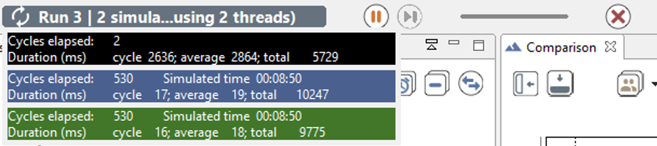
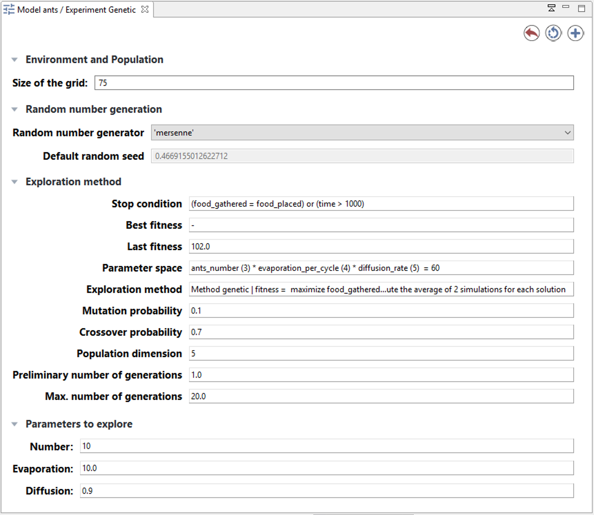

# Batch Specific UI

When an [experiment of type Batch](BatchExperiments) is run, a dedicated UI is displayed, depending on the parameters to explore and of the exploration methods.


## Table of contents 

* [Batch Specific UI](#batch-specific-ui)
	* [Information bar](#information-bar)
	* [Batch UI](#batch-ui)

## Information bar

In batch mode, the top information bar displays 3 distinct information (instead of only the cycle number in the GUI experiment):
  * The **run** number: One run corresponds to X executions of simulation with one given parameters values (X is an integer given by the facet `repeat` in the definition of the [exploration method](ExplorationMethods));
  * The **simulation** number: the number of replications done (and the number of replications specified with the `repeat` facet);
  * The number of **thread**: the number of threads used for the simulation.




## Batch UI

The parameters view is also a bit different in the case of a Batch UI. The following interface is generated given the following model part:
```
experiment Batch type: batch repeat: 2 keep_seed: true until: (food_gathered = food_placed) or (time > 400) {
   parameter 'Size of the grid:' var: gridsize init: 75 unit: 'width and height';
   parameter 'Number:' var: ants_number init: 200 unit: 'ants';
   parameter 'Evaporation:' var: evaporation_rate among: [0.1, 0.2, 0.5, 0.8, 1.0] unit: 'rate every cycle (1.0 means 100%)';
   parameter 'Diffusion:' var: diffusion_rate min: 0.1 max: 1.0 unit: 'rate every cycle (1.0 means 100%)' step: 0.3;

   method exhaustive maximize: food_gathered;
```




The interface summarizes all model parameters and the parameters given to the exploration method:
  * **Environment and Population**: displays all the model parameters that should not be explored;
  * **Parameters to explore**: the parameters to explore are the parameters defined in the experiment with a range of values (with `among` facet or `min`, `max` and `step` facets);
  * **Exploration method**: it summarizes the Exploration method and the stop condition. For exhaustive method it also evaluates the parameter space. For other methods, it also displays the method parameters (e.g. mutation or crossover probability...). Finally the best fitness found and the last fitness found are displayed (with the associated parameter set).
