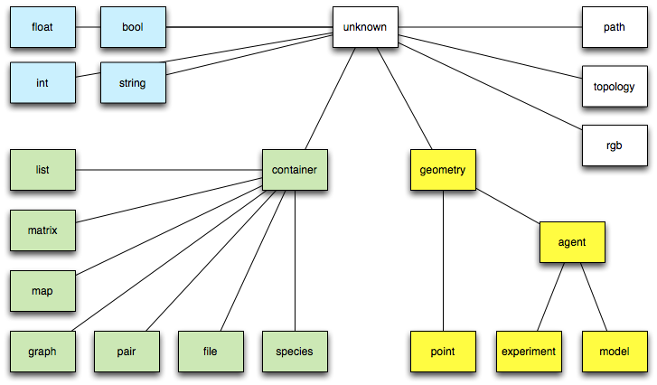

# Types

A variable's or expression's *type* (or *data type*) determines the values it can take, plus the operations that can be performed on or with it. GAML is a statically-typed language, which means that the type of an expression is always known at compile time, and is even enforced with casting operations.
There are 4 categories of types:

* primitive types, declared as keyword in the language,
* complex types, also declared as keyword in the language,
* parametric types, a refinement of complex types (mainly children of container) that is dynamically constructed using an enclosing type, a contents type and a key type,
* species types, dynamically constructed from the species declarations made by the modeler (and the built-in species present).

The hierarchy of types in GAML (only primitive and complex types are displayed here, of course, as the other ones are model-dependent) is the following:




## Table of contents 

* [Types (Under Construction)](#types-under-construction)
	* [Primitive built-in types](#primitive-built-in-types)
		* [bool](#bool)
		* [float](#float)
		* [int](#int)
		* [string](#string)
	* [Complex built-in types](#complex-built-in-types)
		* [agent](#agent)
		* [container](#container)
		* [file](#file)
		* [geometry](#geometry)
		* [graph](#graph)
		* [list](#list)
		* [map](#map)
		* [matrix](#matrix)
		* [pair](#pair)
		* [path](#path)
		* [point](#point)
		* [rgb](#rgb)
		* [species](#species)
		* [Species names as types](#species-names-as-types)
		* [topology](#topology)
	* [Defining custom types](#defining-custom-types)


## Primitive built-in types

### bool
  * **Definition:** primitive datatype providing two values: `true` or `false`.
  * **Litteral declaration:** both `true` or `false` are interpreted as boolean constants.
  * **Other declarations:** expressions that require a boolean operand often directly apply a casting to bool to their operand. It is a convenient way to directly obtain a bool value.

```
bool (0) -> false
```
[Top of the page](#table-of-contents)

[//]: # (keyword|type_float)
### float
  * **Definition:** primitive datatype holding floating point values, its absolute value is comprised between 4.9E-324 and 1.8E308.
  * **Comments:** this datatype is internally backed up by the Java double datatype.
  * **Litteral declaration:** decimal notation 123.45 or exponential notation 123e45 are supported.
  * **Other declarations:** expressions that require an integer operand often directly apply a casting to float to their operand. Using it is a way to obtain a float constant.

```
float (12) -> 12.0
```
[Top of the page](#table-of-contents)

[//]: # (keyword|type_int)
### int
  * **Definition:** primitive datatype holding integer values comprised between -2147483648 and 2147483647 (i.e. between `-2^31` and `2^31 - 1`.
  * **Comments:** this datatype is internally backed up by the Java int datatype.
  * **Litteral declaration:** decimal notation like 1, 256790 or hexadecimal notation like #1209FF are automatically interpreted.
  * **Other declarations:** expressions that require an integer operand often directly apply a casting to int to their operand. Using it is a way to obtain an integer constant.

```
int (234.5) -> 234.
```
[Top of the page](#table-of-contents)

[//]: # (keyword|type_string)
### string
  * **Definition:** a datatype holding a sequence of characters.
  * **Comments:** this datatype is internally backed up by the Java String class. However, contrary to Java, strings are considered as a primitive type, which means they do not contain character objects. This can be seen when casting a string to a list using the list operator: the result is a list of one-character strings, not a list of characters.
  * **Litteral declaration:** a sequence of characters enclosed in quotes, like 'this is a string' . If one wants to literally declare strings that contain quotes, one has to double these quotes in the declaration. Strings accept escape characters like `\n` (newline), `\r` (carriage return), `\t` (tabulation), as well as any Unicode character (`\uXXXX`).
  * **Other declarations:** see string
  * **Example:** see [string operators](OperatorsSplitted#strings-related-operators).

[Top of the page](#table-of-contents)


## Complex built-in types

Contrarily to primitive built-in types, complex types have often various attributes. They can be accessed in the same way as attributes of agents:
```
complex_type nom_var <- init_var;
ltype_attr attr_var <- nom_var.attr_name;
```
For example:
```
file fileText <- file("../data/cell.Data");
bool fileTextReadable <- fileText.readable;
```

[//]: # (keyword|type_agent)
### agent
  * **Definition:** a generic datatype that represents an agent whatever its actual species.
  * **Comments:** This datatype is barely used, since species can be directly used as datatypes themselves.
  * **Declaration:** the agent casting operator can be applied to an int (to get the agent with this unique index), a string (to get the agent with this name).

[Top of the page](#table-of-contents)


[//]: # (keyword|type_container)
### container
  * **Definition:** a generic datatype that represents a collection of data.
  * **Comments:**  a container variable can be a list, a matrix, a map... Conversely each list, matrix and map is a kind of container. In consequence every container can be used in container-related operators.
  * **See also:** [Container operators](OperatorsSplitted#containers-related-operators)
  * **Declaration:**
```
container c  <- [1,2,3];
container c  <- matrix [[1,2,3],[4,5,6]];
container c  <- map ["x"::5, "y"::12];
container c  <- list species1;
```
[Top of the page](#table-of-contents)

[//]: # (keyword|type_file)
### file
  * **Definition:** a datatype that represents a file.
  * **Built-in attributes:**
    * name (type = string): the name of the represented file (with its extension)
    * extension(type = string): the extension of the file
    * path (type = string): the absolute path of the file
    * readable (type = bool, read-only): a flag expressing whether the file is readable
    * writable (type = bool, read-only): a flag expressing whether the file is writable
    * exists (type = bool, read-only): a flag expressing whether the file exists
    * is\_folder (type = bool, read-only): a flag expressing whether the file is folder
    * contents (type = container): a container storing the content of the file
  * **Comments:** a variable with the `file` type can handle any kind of file (text, image or shape files...). The type of the `content` attribute will depend on the kind of file. Note that the allowed kinds of file are the followings:
    * text files: files with the extensions .txt, .data, .csv, .text, .tsv, .asc. The `content` is by default a list of string.
    * image files: files with the extensions .pgm, .tif, .tiff, .jpg, .jpeg, .png, .gif, .pict, .bmp. The `content` is by default a matrix of int.
    * shapefiles: files with the extension .shp. The `content` is by default a list of geometry.
    * properties files: files with the extension .properties. The `content` is by default a map of string::string.
    * folders. The `content` is by default a list of string.
  * **Remark:** Files are also a particular kind of container and can thus be read, written or iterated using the container operators and commands.
  * **See also:** [File operators](OperatorsSplitted#files-related-operators)
  * **Declaration:** a file can be created using the generic `file` (that opens a file in read only mode and tries to determine its contents), `folder` or the `new_folder` (to open an existing folder or create a new one) unary operators. But things can be specialized with the combination of the `read`/`write` and `image`/`text`/`shapefile`/`properties` unary operators.

```
folder(a_string)  // returns a file managing a existing folder
file(a_string) // returns any kind of file in read-only mode
read(text(a_string)) // returns a text file in read-only mode
read(image(a_string)) // does the same with an image file.
write(properties(a_string)) // returns a property file which is available for writing 
                            // (if it exists, contents will be appended unless it is cleared 
                            // using the standard container operations).

```

[Top of the page](#table-of-contents)


[//]: # (keyword|type_geometry)
### geometry
  * **Definition:** a datatype that represents a vector geometry, i.e. a list of georeferenced points.
  * **Built-in attributes:**
    * location (type = point): the centroid of the geometry
    * area (type = float): the area of the geometry
    * perimeter (type = float): the perimeter of the geometry
    * holes (type = list of geometry): the list of the hole inside the given geometry
    * contour (type = geometry): the exterior ring of the given geometry and of his holes
    * envelope (type = geometry): the geometry bounding box
    * width (type = float): the width of the bounding box
    * height (type = float): the height of the bounding box
    * points (type = list of point): the set of the points composing the geometry
  * **Comments:** a geometry can be either a point, a polyline or a polygon. Operators working on geometries handle transparently these three kinds of geometry. The envelope (a.k.a. the bounding box) of the geometry depends on the kind of geometry:
    * If this Geometry is the empty geometry, it is an empty point.
    * If the Geometry is a point, it is a non-empty point.
    * Otherwise, it is a Polygon whose points are (minx, miny), (maxx, miny), (maxx, maxy), (minx, maxy), (minx, miny).
  * **See also:** [Spatial operators](OperatorsSplitted#spatial-operators)
  * **Declaration:** geometries can be built from a point, a list of points or by using specific operators (circle, square, triangle...).

```
geometry varGeom <- circle(5);
geometry polygonGeom <- polygon([{3,5}, {5,6},{1,4}]);
```

[Top of the page](#table-of-contents)


[//]: # (keyword|type_graph)
### graph
  * **Definition:** a datatype that represents a graph composed of vertices linked by edges.
  * **Built-in attributes:**
    * edges(type = list of agent/geometry): the list of all edges
    * vertices(type = list of agent/geometry): the list of all vertices
    * circuit (type = path): an approximate minimal traveling salesman tour (hamiltonian cycle)
    * spanning\_tree (type = list of agent/geometry): minimum spanning tree of the graph, i.e. a sub-graph such as every vertex lies in the tree, and as much edges lies in it but no cycles (or loops) are formed.
    * connected(type = bool): test whether the graph is connected
  * **Remark:**
    * graphs are also a particular kind of container and can thus be manipulated using the container operators and commands.
    * This algorithm used to compute the circuit requires that the graph be complete and the triangle inequality exists (if x,y,z are vertices then d(x,y)+d(y,z)<d(x,z) for all x,y,z) then this algorithm will guarantee a hamiltonian cycle such that the total weight of the cycle is less than or equal to double the total weight of the optimal hamiltonian cycle.
    * The computation of the spanning tree uses an implementation of  the Kruskal's minimum spanning tree algorithm. If the given graph is connected it computes the minimum spanning tree, otherwise it computes the minimum spanning forest.
  * **See also:** [Graph operators](OperatorsSplitted#graph-related-operators)
  * **Declaration:** graphs can be built from a list of vertices (agents or geometries) or from a list of edges (agents or geometries) by using specific operators. They are often used to deal with a road network and are built from a shapefile.

```
create road from: shape_file_road;
graph the_graph <- as_edge_graph(road);

graph([1,9,5])        --: ([1: in[] + out[], 5: in[] + out[], 9: in[] + out[]], [])
graph([node(0), node(1), node(2)]      // if node is a species
graph(['a'::345, 'b'::13])  --:  ([b: in[] + out[b::13], a: in[] + out[a::345], 13: in[b::13] + out[], 345: in[a::345] + out[]], [a::345=(a,345), b::13=(b,13)])
graph(a_graph)  --: a_graph
graph(node1)    --: null
```

[Top of the page](#table-of-contents)


[//]: # (keyword|type_list)
### list
  * **Definition:** a composite datatype holding an ordered collection of values.
  * **Comments:** lists are more or less equivalent to instances of ArrayList in Java (although they are backed up by a specific class). They grow and shrink as needed, can be accessed via an index (see @ or index\_of), support set operations (like union and difference), and provide the modeller with a number of utilities that make it easy to deal with collections of agents (see, for instance, shuffle, reverse,where,sort\_by,...).
  * **Remark:** lists can contain values of any datatypes, including other lists. Note, however, that due to limitations in the current parser, lists of lists cannot be declared litteraly; they have to be built using assignments. Lists are also a particular kind of container and can thus be manipulated using the container operators and commands.
  * **Litteral declaration:** a set of expressions separated by commas, enclosed in square brackets, like [12, 14, 'abc', self]. An empty list is noted []().
  * **Other declarations:** lists can be build litteraly from a point, or a string, or any other element by using the list casting operator.

```
list (1) -> [1]
```
```
list<int> myList <- [1,2,3,4]; 
myList[2] => 3
```
[Top of the page](#table-of-contents)


[//]: # (keyword|type_map)
### map
  * **Definition:** a composite datatype holding an ordered collection of pairs (a key, and its associated value).
  * **Built-in attributes:**
    * keys (type = list): the list of all keys
    * values (type = list): the list of all values
    * pairs (type = list of pairs): the list of all pairs key::value
  * **Comments:** maps are more or less equivalent to instances of Hashtable in Java (although they are backed up by a specific class).
  * **Remark:** maps can contain values of any datatypes, including other maps or lists. Maps are also a particular kind of container and can thus be manipulated using the container operators and commands.
  * **Litteral declaration:** a set of pair expressions separated by commas, enclosed in square brackets; each pair is represented by a key and a value sperarated by '::'. An example of map is [agentA::'big', agentB::'small', agentC::'big']. An empty map is noted []().
  * **Other declarations:** lists can be built litteraly from a point, or a string, or any other element by using the map casting operator.

```
map (1) -> [1::1]
map ({1,5}) -> [x::1, y::5]
[]   // empty map 
```
[Top of the page](#table-of-contents)


[//]: # (keyword|type_matrix)
### matrix
  * **Definition:** a composite datatype that represents either a two-dimension array (matrix) or a one-dimension array (vector), holding any type of data (including other matrices).
  * **Comments:** Matrices are fixed-size structures that can be accessed by index (point for two-dimensions matrices, integer for vectors).
  * **Litteral declaration:** Matrices cannot be defined literally. One-dimensions matrices can be built by using the matrix casting operator applied on a list. Two-dimensions matrices need to to be declared as variables first, before being filled.

```
//builds a one-dimension matrix, of size 5
matrix mat1 <- matrix ([10, 20, 30, 40, 50]);
//  builds a two-dimensions matrix with 10 columns and 5 rows, where each cell is initialized to 0.0
matrix mat2 <- 0.0 as_matrix({10,5}); 
// builds a two-dimensions matrix with 2 columns and 3 rows, with initialized cells
matrix mat3 <- matrix([["c11","c12","c13"],["c21","c22","c23"]]);     
    -> c11;c21
       c12;c22
       c13;c23
```
[Top of the page](#table-of-contents)


[//]: # (keyword|type_pair)
### pair
  * **Definition:** a datatype holding a key and its associated value.
  * **Built-in attributes:**
    * key (type = string): the key of the pair, i.e. the first element of the pair
    * value (type = string): the value of the pair, i.e. the second element of the pair
  * **Remark:** pairs are also a particular kind of container and can thus be manipulated using the container operators and commands.
  * **Litteral declaration:** a pair is defined by a key and a value sperarated by '::'.
  * **Other declarations:** a pair can also be built from:
    * a point,
    * a map (in this case the first element of the pair is the list of all the keys of the map and the second element is the list of all the values of the map),
    * a list (in this case the two first element of the list are used to built the pair)

```
pair testPair <- "key"::56;
pair testPairPoint <- {3,5};             // 3::5
pair testPairList2 <- [6,7,8];           // 6::7
pair testPairMap <- [2::6,5::8,12::45];  // [12,5,2]::[45,8,6]
```
[Top of the page](#table-of-contents)


[//]: # (keyword|type_path)
### path
  * **Definition:** a datatype representing a path linking two agents or geometries in a graph.
  * **Built-in attributes:**
    * source (type = point): the source point, i.e. the first point of the path
    * target (type = point): the target point, i.e. the last point of the path
    * graph (type = graph): the current topology (in the case it is a spatial graph), null otherwise
    * edges (type = list of agents/geometries) :  the edges of the graph composing the path
    * vertices (type = list of agents/geometries) :  the vertices of the graph composing the path
    * segments (type = list of geometries): the list of the geometries composing the path
    * shape (type = geometry) : the global geometry of the path (polyline)
  * **Comments:** the path created between two agents/geometries or locations will strongly depends on the topology in which it is created.
  * **Remark:** a path is **immutable**, i.e. it can not be modified after it is created.
  * **Declaration:** paths are very barely defined litterally. We can nevertheless use the `path` unary operator on a list of points to build a path. Operators dedicated to the computation of paths (such as path\_to or path\_between) are often used to build a path.

```
path([{1,5},{2,9},{5,8}]) // a path from {1,5} to {5,8} through {2,9}
       
geometry rect <- rectangle(5);
geometry poly <- polygon([{10,20},{11,21},{10,21},{11,22}]);
path pa <- rect path_to poly;  // built a path between rect and poly, in the topolopy   
                                            // of the current agent (i.e. a line in a& continuous topology, 
                                            // a path in a graph  in a graph topology )

a_topology path_between a_container_of_geometries // idem with an explicit topology and the possiblity 
                                                  // to have more than 2 geometries 
                                                  // (the path is then built incrementally)


path_between (a_graph, a_source, a_target) // idem with a the given graph as topology

```

[Top of the page](#table-of-contents)


[//]: # (keyword|type_point)
### point
  * **Definition:** a datatype normally holding two positive float values. Represents the absolute coordinates of agents in the model.
  * **Built-in attributes:**
    * x (type = float): coordinate of the point on the x-axis
    * y (type = float): coordinate of the point on the y-axis
  * **Comments:** point coordinates should be positive, if a negative value is used in its declaration, the point is built with the absolute value.
  * **Remark:** points are particular cases of geometries and containers. Thus they have also all the built-in attributes of both the geometry and the container datatypes and can be used with every kind of operator or command admitting geometry and container.
  * **Litteral declaration:** two numbers, separated by a comma, enclosed in braces, like {12.3, 14.5}
  * **Other declarations:** points can be built litteraly from a list, or from an integer or float value by using the point casting operator.

```
point ([12,123.45]) -> {12.0, 123.45} 
point (2) -> {2.0, 2.0}
```
[Top of the page](#table-of-contents)

[//]: # (keyword|type_rgb)
### rgb
  * **Definition:** a datatype that represents a color in the RGB space.
  * **Built-in attributes:**
    * red(type = int): the red component of the color
    * green(type = int): the green component of the color
    * blue(type = int): the blue component of the color
    * darker(type = rgb): a new color that is a darker version of this color
    * brighter(type = rgb): a new color that is a brighter version of this color
  * **Remark:** rgbs are also a particular kind of container and can thus be manipulated using the container operators and commands.
  * **Litteral declaration:** there exist lot of ways to declare a color. We use the `rgb` casting operator applied to:
    * a string. The allowed color names are the constants defined in the Color Java class, i.e.: black, blue, cyan, darkGray, lightGray, gray, green, magenta, orange, pink, red, white, yellow.
    * a list. The integer value associated to the three first elements of the list are used to define the three red (element 0 of the list), green (element 1 of the list) and blue (element 2 of the list) components of the color.
    * a map. The red, green, blue compoenents take the value associated to the keys "r", "g", "b" in the map.
    * an integer <- the decimal integer is translated into a hexadecimal <- OxRRGGBB. The red (resp. green, blue) component of the color take the value RR (resp. GG, BB) translated in decimal.
    * Since GAMA 1.6.1, colors can be directly obtained like units, by using the ° or # symbol followed by the name in lowercase of one of the 147 CSS colors (see http://www.cssportal.com/css3-color-names/).
  * **Declaration:**

```
rgb cssRed <- #red;   // Since 1.6.1
rgb testColor <- rgb('white');                 // rgb [255,255,255]
rgb test <- rgb(3,5,67);                     // rgb [3,5,67]
rgb te <- rgb(340);                            // rgb [0,1,84]
rgb tete <- rgb(["r"::34, "g"::56, "b"::345]); // rgb [34,56,255]
```
[Top of the page](#table-of-contents)


[//]: # (keyword|type_species)
### species
  * Definition: a generic datatype that represents a species
  * **Built-in attributes:**
    * topology (type=topology): the topology is which lives the population of agents
  * Comments: this datatype is actually a "meta-type". It allows to manipulate (in a rather limited fashion, however) the species themselves as any other values.
  * Litteral declaration: the name of a declared species is already a litteral declaration of species.
  * Other declarations: the species casting operator, or its variant called species\_of can be applied to an agent in order to get its species.

[Top of the page](#table-of-contents)


### Species names as types

Once a species has been declared in a model, it automatically becomes a datatype. This means that :
  * It can be used to declare variables, parameters or constants,
  * It can be used as an operand to commands or operators that require species parameters,
  * It can be used as a casting operator (with the same capabilities as the built-in type agent)

In the simple following example, we create a set of "humans" and initialize a random "friendship network" among them. See how the name of the species, human, is used in the create command, as an argument to the list casting operator, and as the type of the variable named friend.

```
global {
    init {
         create human number: 10;
         ask human {
               friend <- one_of (human - self);
         }
     }
}
entities {
    species human {
        human friend <- nil;
    }
}
```

[Top of the page](#table-of-contents)


[//]: # (keyword|type_topology)
### topology
  * **Definition:** a topology is basically on neighborhoods, distance,... structures in which agents evolves. It is the environment or the context in which all these values are computed. It also provides the access to the spatial index shared by all the agents. And it maintains a (eventually dynamic) link with the 'environment' which is a geometrical border.
  * **Built-in attributes:**
    * places(type = container): the collection of places (geometry) defined by this topology.
    * environment(type = geometry): the environment of this topology (i.e. the geometry that defines its boundaries)
  * **Comments:** the attributes `places` depends on the kind of the considered topolopy.  For continuous topologies, it is a list with their environment. For discrete topologies, it can be any of the container supporting the inclusion of geometries (list, graph, map, matrix)
  * **Remark:** There exist various kinds of topology: continuous topology and discrete topology (e.g. grid, graph...)
  * **Declaration:** To create a topology, we can use the `topology` unary casting operator applied to:
    * an agent: returns a continuous topology built from the agent's geometry
    * a species name: returns the topology defined for this species population
    * a geometry: returns a continuous topology built on this geometry
    * a geometry container (list, map, shapefile): returns an half-discrete (with corresponding places), half-continuous topology (to compute distances...)
    * a geometry matrix (i.e. a grid): returns a grid topology which computes specifically neighborhood and distances
    * a geometry graph: returns a graph topology which computes specifically neighborhood and distances
More complex topologies can also be built using dedicated operators, e.g. to decompose a geometry...

[Top of the page](#table-of-contents)


## Defining custom types

Sometimes, besides the species of agents that compose the model, it can be necessary to declare custom datatypes. Species serve this purpose as well, and can be seen as "classes" that can help to instantiate simple "objects". In the following example, we declare a new kind of "object", bottle, that lacks the skills habitually associated with agents (moving, visible, etc.), but can nevertheless group together attributes and behaviors within the same closure. The following example demonstrates how to create the species:

```
species bottle {
    float volume <- 0.0 max:1 min:0.0;
    bool is_empty -> {volume = 0.0};
    action fill {
         volume <- 1.0;
    }
}
```

How to use this species to declare new bottles :

```
create bottle {
    volume <- 0.5;
}
```

And how to use bottles as any other agent in a species (a drinker owns a bottle; when he gets thirsty, it drinks a random quantity from it; when it is empty, it refills it):

```
species drinker {
     ...
    bottle my_bottle<- nil;
    float quantity <- rnd (100) / 100;
    bool thirsty <- false update: flip (0.1);
    ...
    action drink {
         if condition: ! bottle.is_empty {
              bottle.volume <-bottle.volume - quantity;
              thirsty <- false;
         }
    }
    ...
    init {
          create bottle return: created_bottle;
              volume <- 0.5;
          }
          my_bottle <- first(created_bottle);
    }
    ...
    reflex filling_bottle when: bottle.is_empty {
         ask  my_bottle {
              do fill;
         }
    }
    ...
    reflex drinking when: thirsty {
         do drink;
    }
}
```
[Top of the page](#table-of-contents)
