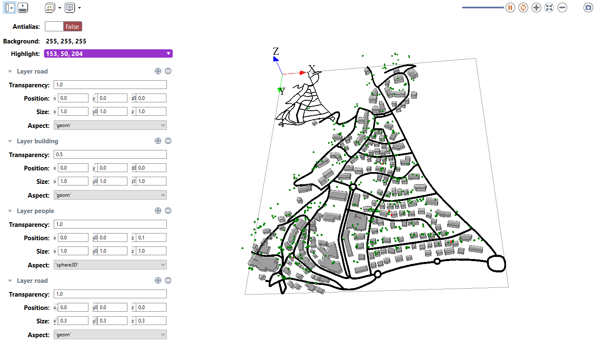

[//]: # (startConcept|3d_displays)
[//]: # (keyword|concept_3d)
# Defining 3D Displays

## Table of contents 

* [OpenGL display](#opengl-display)
	* [Position](#position)
	* [Size](#size)
* [Camera](#camera)
* [Dynamic camera](#dynamic-camera)
	* [Camera position](#camera-position)
	* [Camera direction (Look Position)](#camera-direction-look-position)
	* [Camera orientation (Up Vector)](#camera-orientation-up-vector)
		* [Default view](#default-view)
		* [First person view](#first-person-view)
		* [Third Person view](#third-person-view)
* [Lighting](#lighting)

[//]: # (keyword|concept_opengl)
## OpenGL display

* Define the attribute type of the display with `type:opengl` in the output of your model (or use the preferences->display windows to use it by default):
```
output {
  display DisplayName type:opengl {
    species mySpecies;
  }
```

The opengl display share most of the feature that the java2D offers and that are described [here](DefiningDisplaysGeneralities).

Using 3D display offers many way to represent a simulation. A layer can be positioned and scaled in a 3D world. It is possible to superpose layer on different z value and display different information on the model at different position on the screen.

### Position
Layer can be drawn on different position (x,y and z)  value using the _position_ facet

### Size
Layer can be drawn with different size (x,y and z) using the _size_ facet

Here is an example of display using all the previous facet (experiment factice to add to the model _Incremental Model 5_). You can also dynamically change those value by showing the side bar in the display.

```
experiment expe_test type:gui {
	output {
		display city_display type: opengl{
			species road aspect: geom refresh:false;
			species building aspect: geom transparency:0.5 ;
			species people aspect: sphere3D position:{0,0,0.1};
			species road aspect: geom size:{0.3,0.3,0.3};
		}
	}
}
```




[//]: # (keyword|concept_camera)
## Camera

<a href='http://www.youtube.com/watch?feature=player_embedded&v=rMIVQlul1Ag' target='_blank'></a>

[Arcball Camera](Displays#arcball-camera-commands)

[FreeFly Camera](Displays#freefly-camera-commands)


## Dynamic camera

User have the possibility to set dynamically the parameter of the camera (observer). The basic camera properties are its **position**, the **direction** in which is pointing, and its **orientation**. Those 3 parameters can be set dynamically at each iteration of the simulation.

### Camera position
The facet `camera_pos(x,y,z)` places the camera at the given position.
The default camera positon is _(world.width/2,world/height/2,world.maxDim`*`1.5)_ to place the camera at the middle of the environement at an altitude that enables to see the entire environment.

### Camera direction (Look Position)
The facet `camera_look_pos(x,y,z)` points the camera toward the given position.  The default look position is _(world.width/2,world/height/2,0)_ to look at the center of the environment.

### Camera orientation (Up Vector)
The camera `camera_up_vector(x,y,z)` sets the _up vector_ of the camera.
The _up vector_ direction in your scene is the _up_ direction on your display screen.
The default value is (0,1,0)

Here are some examples that can be done using those 3 parameters. You can test it by running the following model:


<a href='http://www.youtube.com/watch?feature=player_embedded&v=lQVGD8aDKZY' target='_blank'></a>

#### Default view
```
display RealBoids   type:opengl{
...		
}
```

#### First person view
You can set the position as a first person shooter video game using:
```
display FirstPerson  type:opengl 
camera_pos:{boids(1).location.x,-boids(1).location.y,10} 
camera_look_pos:{cos(boids(1).heading)*world.shape.width,-sin(boids(1).heading)*world.shape.height,0} 
camera_up_vector:{0.0,0.0,1.0}{
...
}
```

#### Third Person view
You can follow an agent during a simulation by positioning the camera above it using:

```
display ThirdPerson  type:opengl camera_pos:{boids(1).location.x,-boids(1).location.y,250}  camera_look_pos:{boids(1).location.x,-boids(1).location.y,boids(1).location.z}{
...
} 
```


[//]: # (keyword|concept_light)
## Lighting

In a 3D scene once can define light sources. The way how light sources and 3D object interact is called lighting. Lighting is an important factor to render realistic scenes.

In a real world, the color that we see depend on the interaction between color material surfaces, the light sources and the position of the viewer. There are four kinds of lighting called _ambient_, _diffuse_, _specular_ and _emissive_.

Gama handle _ambient_ and _diffuse_ light.


* **ambient\_light**: Allows to define the value of the ambient light either using an int (ambient\_light:(125)) or a rgb color ((ambient\_light:rgb(255,255,255)). default is rgb(125,125,125).
* **diffuse\_light**: Allows to define the value of the diffuse light either using an int (diffuse\_light:(125)) or a rgb color ((diffuse\_light:rgb(255,255,255)). default is rgb(125,125,125).
* **diffuse\_light\_pos**: Allows to define the position of the diffuse light either using an point (diffuse\_light\_pos:{x,y,z}). default is {world.shape.width/2,world.shape.height/2,world.shape.width`*`2}.
* **is\_light\_on**: Allows to enable/disable the light. Default is true.
* **draw\_diffuse\_light**: Allows to enable/disable the drawing of the diffuse light. Default is false")),


Here is an example using all the available facet to define a diffuse light that rotate around the world.

<a href='http://www.youtube.com/watch?feature=player_embedded&v=op56elmEEYs' target='_blank'></a>

```
display View1  type:opengl draw_diffuse_light:true ambient_light:(0) diffuse_light:(255) diffuse_light_pos:{50+ 150*sin(time*2),50,150*cos(time*2){
...
}
```

[//]: # (endConcept|3d_displays)
