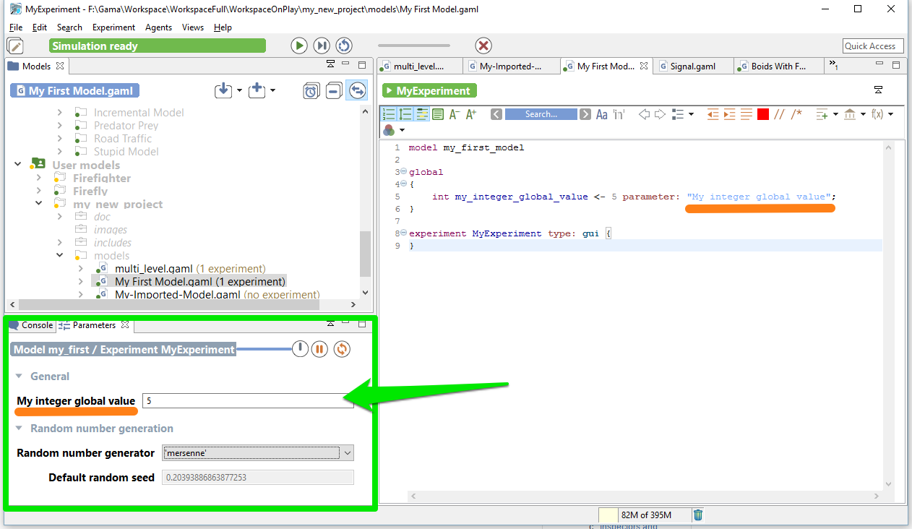
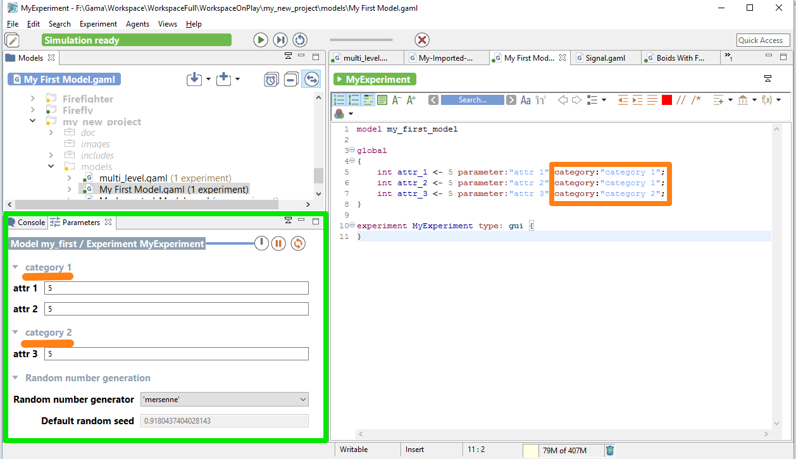
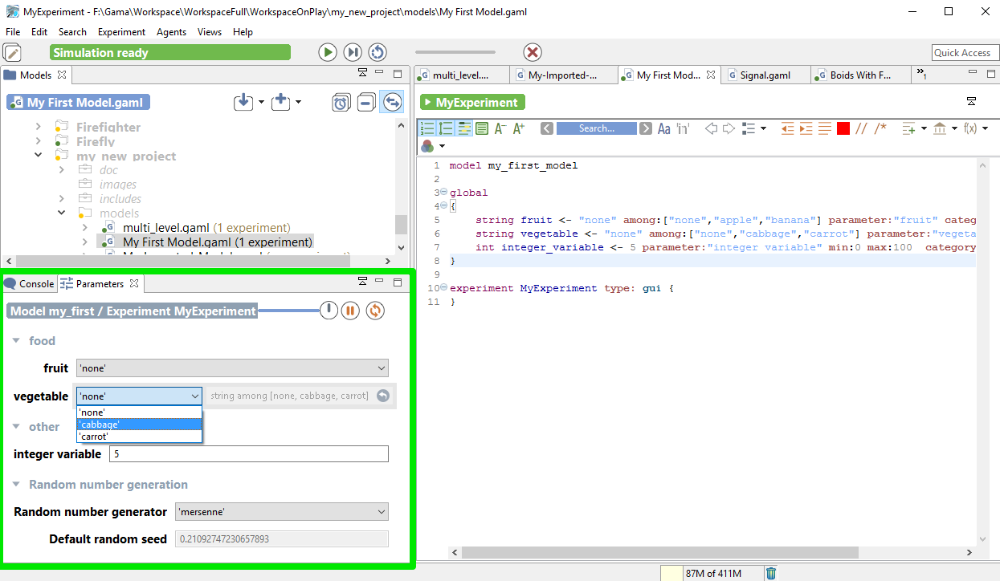

[//]: # (startConcept|define_parameters)
[//]: # (keyword|concept_parameter)
# Defining Parameters
[//]: # (keyword|concept_gui)

When playing simulation, you have the possibility to define input parameters, in order to change them and replay the simulation. Defining parameters allows to make the value of a global variable definable by the user through the user graphic interface.

## Index

* [Defining parameters](#defining-parameters)
* [Additional facets](#additional-facets)

## Defining parameters

You can define parameters inside the global scope, when defining your global variables with the facet `parameter`:

```
global
{
	int my_integer_global_value <- 5 parameter: "My integer global value";
}
```

When launching your experiment, the parameter will appear in your "Parameters" panel, with the name you chose for the `parameter` facet.



You can also define your parameter inside the experiment, using the statement parameter. You have to specify first the name of your parameter, then the name of the global variable through the facet `var`.

```
global
{
	int my_integer_global_value <- 5;
}
```

experiment MyExperiment type: gui {
	parameter "My integer global value" var:my_integer_global_value;
}

NB: This variable has to be initialized with a value. If you don't want to initialize your value on the `global` scope, you can initialize the value directly on the parameter statement, using the facet `init`.

```
global
{
	int my_integer_global_value;
}

experiment MyExperiment type: gui {
	parameter "My integer global value" var:my_integer_global_value init:5;
}
```

## Additional facets

You can use some facets to arrange your parameters. For example, you can categorize your parameters under a label, using the facet `category`:

```
global
{
	int attr_1 <- 5 parameter:"attr 1" category:"category 1";
	int attr_2 <- 5 parameter:"attr 2" category:"category 1";
	int attr_3 <- 5 parameter:"attr 3" category:"category 2";
}
```



You also can add some facets such as `min`, `max` or `among` to improve the declaration of the parameter.

```
global
{
	string fruit <- "none" among:["none","apple","banana"] parameter:"fruit" category:"food";
	string vegetable <- "none" among:["none","cabbage","carrot"] parameter:"vegetable" category:"food";
	int integer_variable <- 5 parameter:"integer variable" min:0 max:100  category:"other";
}

experiment MyExperiment type: gui {
}
```


[//]: # (endConcept|define_parameters)
