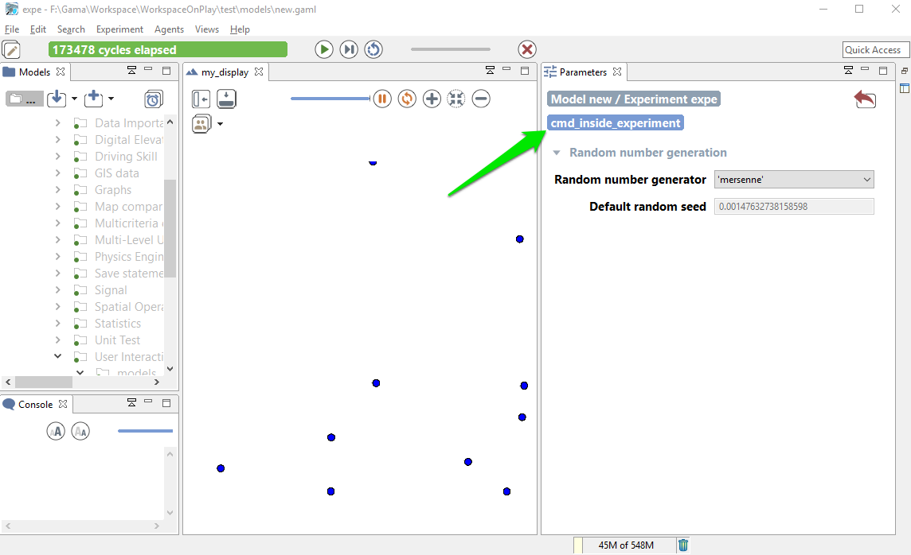
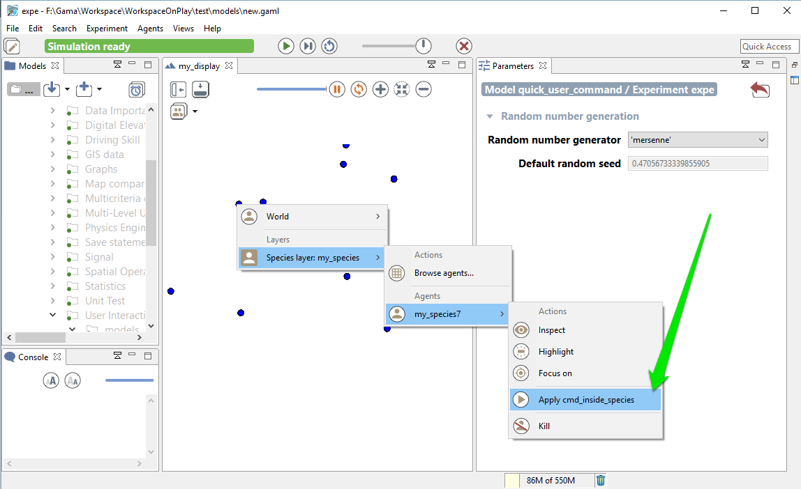

[//]: # (keyword|concept_gui)
# Defining user interaction

During the simulation, GAML provides you the possibility to define some function the user can execute during the execution. In this chapter, we will see how to define buttons to execute action during the simulation, how to catch click event, and how to use the user control architecture.

## Index

* [Catch Mouse Event](#catch-mouse-event)
* [Define User command](#define-user-command)
  * [... in the GUI Experiment scope](#defining-user-command-in-gui-experiment-scope)
  * [... in global or regular species](#defining-user-command-in-a-global-or-regular-species)
  * [user_location](#user_location)
  * [user_input](#user_input)
* [User Control Architecture](#user-control-architecture)

## Catch Mouse Event

[//]: # (keyword|statement_event)
You can catch mouse event during the simulation using the statement `event`. This statement has 2 required facets:
* **`name`** (identifier) : Specify which event do you want to trigger (among the following values : `mouse_down`, `mouse_up`, `mouse_move`, `mouse_enter`, `mouse_exit` or any alphanumeric symbol/key of the keyboard, such as, `'a'`, `'b'`...).
* **`action`** (identifier) : Specify the name of the global action to call.

```
event mouse_down action: my_action;
```

The `event` statement has to be defined in the `experiment`/`output`/`display` scope. Once the event is triggered, the global action linked will be called. The action linked cannot have arguments. To get the location of the mouse click, the `#user_location` can be used; to get the agents on which the mouse has clicked, you can use spatial query (e.g. `my_species overlapping #user_location`).

```
global
{
	action my_action
	{
		write "do action";
	}

}

species my_species
{
}

experiment my_experiment type: gui
{
	output
	{
		display my_display
		{
			species my_species;
			event mouse_down action: my_action;
		}
	}
}
```

## Define User command

[//]: # (keyword|statement_user_command)
Anywhere in the global block, in a species or in an (GUI) experiment, `user_command` statements can be implemented. They can either call directly an existing action (with or without arguments) or be followed by a block that describes what to do when this command is run.

Their syntax can be (depending of the modeler needs) either:

```
user_command cmd_name action: action_without_arg_name;
//or
user_command cmd_name action: action_name with: [arg1::val1, arg2::val2];
//or
user_command cmd_name {
   // statements
}
```

For instance:

```
user_command kill_myself action: die;
//or
user_command kill_myself action: some_action with: [arg1::5, arg2::3];
//or
user_command kill_myself {
    do die;
}
```

### Defining User command in GUI Experiment scope

The user command can be defined directly inside the GUI experiment scope. In that case, the implemented action appears as a button in the top of the parameter view.

Here is a very short code example :

```
model quick_user_command_model

global {
	action createAgent
	{
		create my_species;
	}
}

species my_species {
	aspect base {
		draw circle(1) color:#blue;
	}
}

experiment expe type:gui {
	user_command cmd_inside_experiment action:createAgent;
	output {
		display my_display {
			species my_species aspect:base;
		}
	}
}
```

And here is screenshots of the execution :



### Defining User command in a global or regular species

The user command can also be defined inside a species scope (either global or regular one). Here is a quick example of model :

```
model quick_user_command_model

global {
	init {
		create my_species number:10;
	}
}

species my_species {
	user_command cmd_inside_experiment action:die;
	aspect base {
		draw circle(1) color:#blue;
	}
}

experiment expe type:gui {
	output {
		display my_display {
			species my_species aspect:base;
		}
	}
}
```

During the execution, you have 2 ways to access to the action :
* When the agent is inspected, they appear as buttons above the agents' attributes


* When the agent is selected by a right-click in a display, these command appear under the usual "Inspect", "Focus" and "Highlight" commands in the pop-up menu.




Remark: The execution of a command obeys the following rules:
* when the command is called from right-click pop-menu, it is executed immediately
* when the command is called from panels, its execution is postponed until the end of the current step and then executed at that time.

### user_location

In the special case when the `user_command` is called from the pop-up menu (from a right-click on an agent in a display), the location chosen by the user (translated into the model coordinates) is passed to the execution scope under the name `user_location`.

Example:

```
global {
   user_command "Create agents here" {
      create my_species number: 10 with: [location::user_location];
   }
}
```

This will allow the user to click on a display, choose the world (always present now), and select the menu item "Create agents here".

Note that if the world is inspected (this `user_command` appears thus as a button) and the user chooses to push the button, the agent will be created at a random location.

### user_input

[//]: # (keyword|operator_user_input)
As it is also, sometimes, necessary to ask the user for some values (not defined as parameters), the `user_input` unary operator has been introduced. This operator takes a map [string::value] as argument (the key is the name of the chosen parameter, the value is the default value), displays a dialog asking the user for these values, and returns the same map with the modified values (if any). You can also add a text as first argument of the operator, which will be displayed as a title for your dialog popup. The dialog is modal and will interrupt the execution of the simulation until the user has either dismissed or accepted it. It can be used, for instance, in an init section like the following one to force the user to input new values instead of relying on the initial values of parameters.

Here is an example of implementation:

```
model quick_user_command_model

global {
   init {
      map values <- user_input("Choose a number of agent to create",["Number" :: 100]);
      create my_species number: int(values at "Number");
   }
}

species my_species {
	aspect base {
		draw circle(1) color:#blue;
	}
}

experiment expe type:gui {
	output {
		display my_display {
			species my_species aspect:base;
		}
	}
}
```

When running this model, you will first have to input a number:


## User Control Architecture

An other way to define user interaction is to use the user control architecture. Please jump directly to the section [user control architecture](ControlArchitecture#user-control-architecture) if you want to learn more about this point.
