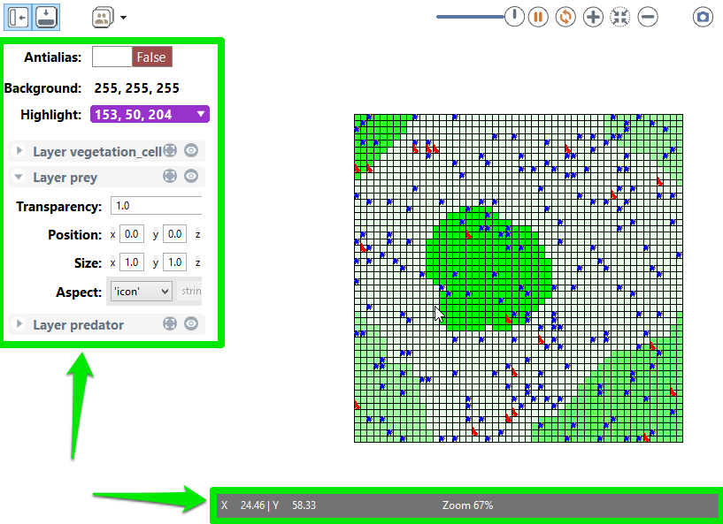
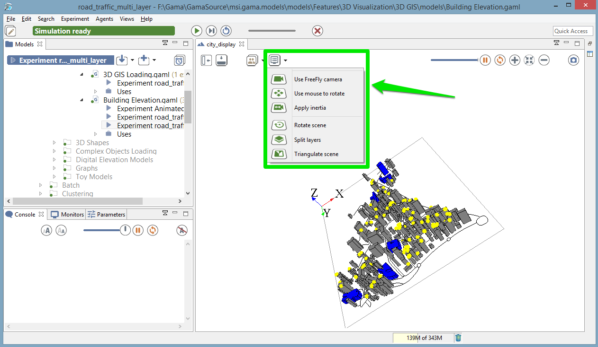

# Displays

GAMA allows modelers to [define several and several kinds of displays](DefiningDisplaysGeneralities) in a [GUI experiment](DefiningGUIExperiment):
  * java 2D displays
  * OpenGL displays

These 2 kinds of display allows the modeler to display the same objects (agents, charts, texts ...). The OpenGL display offers extended features in particular in terms of 3D visualisation.
The OpenGL displays offers in addition better performance when zooming in and out.

## Table of contents 

* [Displays](#displays)
	* [Classical displays (java2D)](#classical-displays-java2d)
	* [OpenGL displays](#opengl-displays)

## Classical displays (java2D)

The classical displays displaying any kind of content can be manipulated via the mouse (if no mouse event has been defined):
* the **mouse left** press and move allows to move the camera (in 2D),
* the **mouse right** click opens a context menu allowing the modeler to inspect displayed agents,
* the **wheel** allows the modeler to zoom in or out.

Each display provides several buttons to manipulate the display (from left to right):
  * **Show/hide side bar**,
  * **Show/hide overlay**,
  * **Browse through all displayed agents**: open a context menu to inspect agents,
  * **Update every X step**: configure the refresh frequence of the display,
  * **Pause the-display**: when pressed, the display will not be displayed anymore, the simulation is still running,
  * **Synchronize the display and the execution of the model**,
  * **Zoom in**,
  * **Zoom to fit view**,
  * **Zoom out**,
  * **Take a snapshot**: take a snapshot saved as a png image in the `snapshots` folder of the models folder.

The Show/Hide side bar button opens a side panel in the display allowing the modeler to configure:
  * **Properties** of the display: background and highlight color, display the scale bar
  * For each layer, we can configure visibility, transparency, position and size of the layer. For grid layers, we can in addition show/hide grids. For species layers, we can also configure the displayed aspect. For text layers, we can the expression displayed with the color and the font.

The bottom overlay bar displays information about the way it is displayed:
  * the position of the mouse in the display,
  * the zoom ratio,
  * the scale of the display (depending on the zoom).

## OpenGL displays

The OpenGL display has an additional button **3D Options** providing 3D features:
  * **Use FreeFly camera**/**Use Arcball camera**: switch between cameras, the default camera is the Arcball one,
  * **Use mouse to rotate**/**Use mouse to drag** (only with Arcball camera): use left click for one of the 2 actions, left click + Ctrl for the other of the 2 actions.
  * **Apply inertia** (only with Arcball camera): in inertia mode, when the modeler stops moving the camera, there is no straight halt but a kind of inertia.
  * **Rotate scene**: rotate the scene around an axis orthogonal to the scene,
  * **Split layers**/**Merge layers**: display each layer at a distinct height,
  * **Triangulate scene**: display the polygon primitives.

In addition, the bottom overlay bar provides the Camera position in 3D.

### FreeFly camera commands

| **Key** | **Function** |
|:--------------------------|:-----------------------------------------------------------|
| **Double Click** | Zoom Fit     |
| **+**   | Zoom In      |
| **-**   | Zoom Out     |
| **Up**  | Move forward |
| **Down**| Move backward|
| **Left**| Strafe left  |
| **Right**| Strafe right |
| **SHIFT+Up**| Look up      |
| **SHIFT+Down**| Look down    |
| **SHIFT+Left**| Look left    |
| **SHIFT+Right**| Look right   |
| **MOUSE**| Makes the camera look up, down, left and right |
| **MouseWheel**| Zoom-in/out to the current target (center of the screen)|

### ArcBall camera commands

| **Key** | **Function** |
|:--------------------------|:-----------------------------------------------------------|
| **Double Click** | Zoom Fit     |
| **+**   | Zoom In      |
| **-**   | Zoom Out     |
| **Up**  | Horizontal movement to the top|
| **Down**| Horizontal movement to the bottom|
| **Left**| Horizontal movement to the left |
| **Right**| Horizontal movement to the right|
| **SHIFT+Up**| Rotate the model up (decrease the phi angle of the spherical coordinates)|
| **SHIFT+Down**| Rotate the model down (increase the phi angle of the spherical coordinates)|
| **SHIFT+Left**| Rotate the model left (increase the theta angle of the spherical coordinates)|
| **SHIFT+Right**| Rotate the model right (decrease the theta angle of the spherical coordinates)|
| **SPACE** | Reset the pivot to the center of the envelope |
| **KEYPAD 2,4,6,8**| Quick rotation (increase/decrease phi/theta by 30°)|
| **CMD+MOUSE1** | Makes the camera rotate around the model |
| **ALT+LEFT_MOUSE**| Enables ROI Agent Selection |
| **SHIFT+LEFT_MOUSE**| Enables ROI Zoom |
| **SCROLL**| Zoom-in/out to the current target (center of the sphere)|
| **WHEEL CLICK** | Reset the pivot to the center of the envelope |
