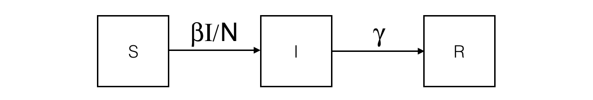
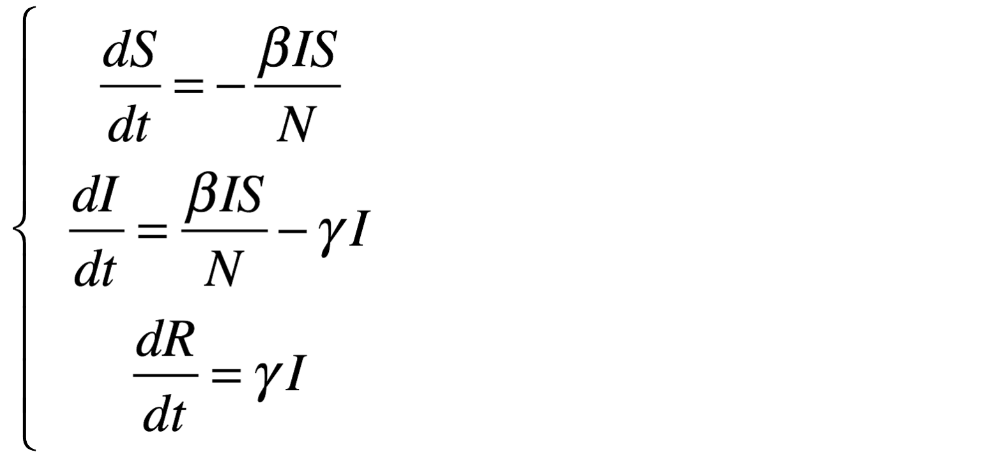
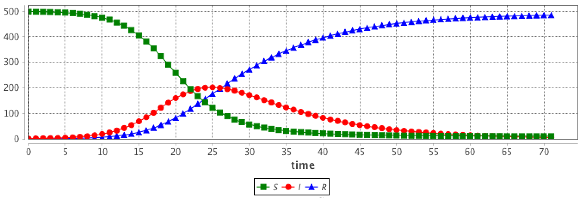
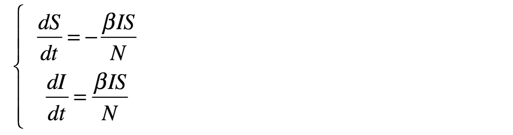
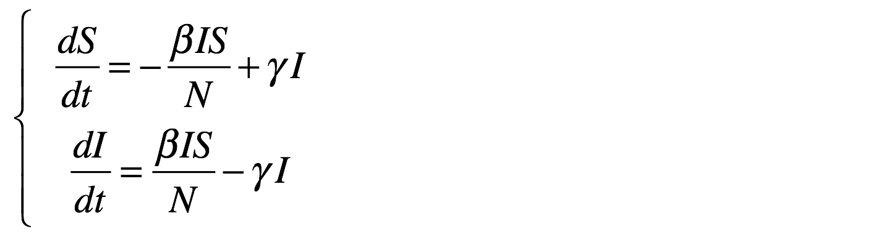
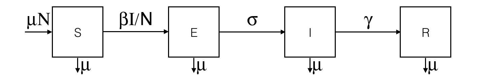
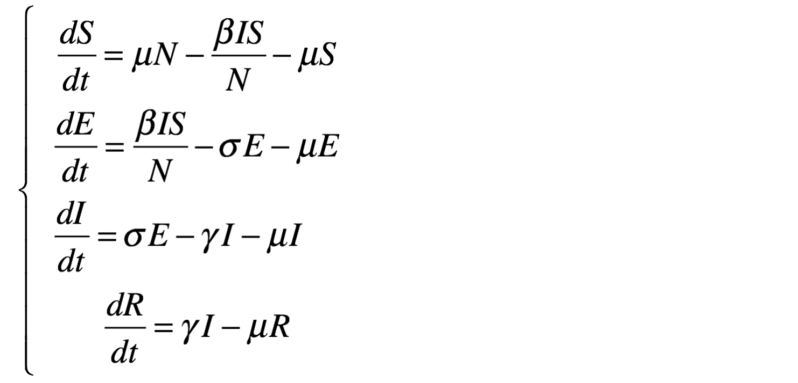
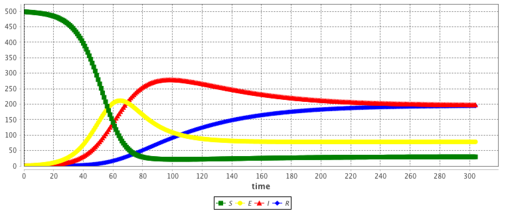
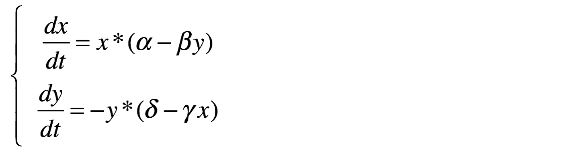

[//]: # (startConcept|equation)
[//]: # (keyword|concept_equation)
# Using Equations
[//]: # (endConcept|concept_math)

## Introduction

ODEs (Ordinary Differential Equations) are often used in ecology or in epidemiology to describe the macroscopic evolution over time of a population. Generally the whole population is split into several compartments. The state of the population is described by the number of individuals in each compartment. Each equation of the ODE system describes the evolution of the number of individual in a compartment. In such an approach individuals are not taken into account individually, with own features and behaviors. In contrary they are aggregated in a compartment and reduced to a number.

A classical example is the SIR epidemic model representing the spreading of a disease in a population. The population is split into 3 compartments: S (Susceptible), I (Infected), R (Recovered). (see below for the equation)

In general the ODE systems cannot be analytically solved, i.e. it is not possible to find the equation describing the evolution of the number of S, I or R. But these systems can be numerically integrated in order to get the evolution. A numerical integration computes step after step the value of S, I and R. Several integration methods exist (e.g. Euler, Runge-Kutta...), each of them being a compromise between accuracy and computation time. The length of the integration step has also a huge impact on precision. These models are deterministic.

This approach makes a lot of strong hypotheses. The model does not take into account space. The population is considered has infinite and homogeneously mixed, so that any agent can interact with any other one.

## Example of a SIR model 

In the SIR model, the population is split into 3 compartments: S (Susceptible), I (Infected), R (Recovered). This can be represented by the following Forrester diagram: boxes represent stocks (i.e. compartments) and arrows are flows. Arrows hold the rate of a compartment population flowing to another compartment.



The corresponding ODE system contains one equation per stock. For example, the I compartment evolution is influenced by an inner (so positive) flow from the S compartment and an outer (so negative) flow to the R compartment.



Integrating this system using the Runge-Kutta 4 method provides the evolution of S, I and R over time. The initial values are:
* S = 499
* I = 1
* R = 0
* beta = 0.4
* gamma = 0.1 
* h = 0.1




## Why and when can we use ODE in agent-based models ?

These hypotheses are very strong and cannot be fulfilled in agent-based models. 

But in some multi-scale models, some entities can be close. For example if we want to implement a model describing the worldwide epidemic spread and the impact of air traffic on it, we cannot simulate the 7 billions people. But we can represent only cities with airports and airplanes as agents. In this case, cities are entities with a population of millions inhabitants, that will not been spatially located. As we are only interested in the disease spread, we are only interested in the number of infected people in the cities (and susceptibles and recovered too). As a consequence, it appears particularly relevant to describe the evolution of the disease in the city using a ODE system.

In addition these models have the advantage to not be sensible to population size in the integration process. Dozens or billions people does not bring a computation time increase, contrarily to agent-based models.

## Use of ODE in a GAML model

A stereotypical use of ODE in a GAMA agent-based model is to describe species where some agents attributes evolution is described using an ODE system.

As a consequence, the GAML language has been increased by two main concepts (as two statements):
* equations can be written with the ``equation`` statement. An ``equation`` block is composed of a set of ``diff`` statement describing the evolution of species attributes.
* an equation can be numerically integrated using the ``solve`` statement

## ``equation``
### Defining an ODE system
Defining a new ODE system needs to define a new ``equation`` block in a species. As example, the following ``eqSI`` system describes the evolution of a population with 2 compartments (S and I) and the flow from S to I compartment: 
``` 
species userSI {
	float t ;
	float I ; 
	float S ; 
	int N ;
	float beta<-0.4 ;
	float h ;
	
	equation eqSI {
		diff(S,t) = -beta * S * I / N ;
		diff(I,t) = beta * S * I / N ;
	}
}			
```
This equation has to be defined in a species with ``t``, ``S`` and ``I`` attributes. ``beta`` (and other similar parameters) can be defined either in the specific species (if it is specific to each agents) or in the ``global`` if it is a constant.

Note: the ``t`` attribute will be automatically updated using the ``solve`` statement ; it contains the time elapsed in the equation integration.

### Using a built-in ODE system
In order to ease the use of very classical ODE system, some built-in systems have been implemented in GAMA. For example, the previous SI system can be written as follows. Three additional facets are used to define the system:
* `type`: the identifier of the built-in system (here SI) (the list of all built-in systems are described below),
* `vars`: this facet is expecting a list of variables of the species, that will be matched with the variables of the system,
* `params`: this facet is expecting a list of variables of the species (of of the global), that will be matched with the parameters of the system.
```
equation eqBuiltInSI type: SI vars: [S,I,t] params: [N,beta] ;
```

### Split a system into several agents

An equation system can be split into several species and each part of the system are synchronized using the `simultaneously` facet of `equation`. The system split into several agents can be integrated using a single call to the `solve` statement. Notice that all the `equation` definition must have the same name.

For example the SI system presented above can be defined in two different species `S_agt` (containing the equation defining the evolution of the S value) and `I_agt` (containing the equation defining the evolution of the I value). These two equations are linked using the `simultaneously` facet of the `equation` statement. This facet expects a set of agents. The integration is called only once in a simulation step, e.g. in the `S_agt` agent.
```
species S_agt {
	float t ;		
	float Ssize ;
	
	equation evol simultaneously: [ I_agt ] {
		diff(Ssize, t) = (- sum(I_agt accumulate [each.beta * each.Isize]) * self.Ssize / N);
	}
	
	reflex solving {solve evol method : rk4 step : hKR4 ;}	
}

species I_agt {
	float t ;
	float Isize ; // number of infected	
	float beta ;

	equation evol simultaneously : [ S_agt ] {
		diff(Isize, t) = (beta * first(S_agt).Ssize * Isize / N);
	}
}
```
The interest is that the modeler can create several agents for each compartment, which different values. For example in the SI model, the modeler can choose to create 1 agent `S_agt` and 2 agents `I_agt`. The `beta` attribute will have different values in the two agents, in order to represent 2 different strains.

```
global {
	int number_S <- 495 ; // The number of susceptible
	int number_I <- 5   ; // The number of infected
	int nb_I <- 2;
	float gbeta  <- 0.3  ; // The parameter Beta
	
	int N <- number_S + nb_I * number_I ;
	float hKR4 <- 0.1 ;

	init {
		create S_agt {
			Ssize <- float(number_S) ;
		}
		create I_agt number: nb_I {
			Isize <- float(number_I) ;
			self.beta <- myself.gbeta + rnd(0.5) ;
		}
	}
}
``` 

The results are computed using the RK4 method with:
* number_S = 495 
* number_I = 5  
* nb_I = 2
* gbeta = 0.3 
* hKR4 = 0.1 


## ``solve`` an equation
The `solve` statement has been added in order to integrate numerically the equation system. It should be add into a reflex. At each simulation step, a step of the integration is executed, the length of the integration step is defined in the `step` facet. The `solve` statement will update the variables used in the equation system. The chosen integration method (defined in `method`) is Runge-Kutta 4 (which is very often a good choice of integration method in terms of accuracy).
```
reflex solving {
	solve eqSI method:rk4 step:h;
}
```
With a smaller integration step, the integration will be faster but less accurate.


## More details

### Details about the `solve` statement

The `solve` statement can have a huge set of facets (see [S_Statements#solve] for more details). The basic use of the `solve` statement requiers only the equation identifier. By default, the integration method is Runge-Kutta 4 with an integration step of `1`, which means that at each simulation step the equation integration is made over 1 unit of time (which is implicitly defined by the system parameter value).

``` 
solve eqSI ;
```

2 integration methods can be used: 
* `method: rk4` will use [the Runge-Kutta 4 integration method](https://en.wikipedia.org/wiki/Runge%E2%80%93Kutta_methods)
* `method: dp853` will use [the Dorman-Prince 8(5,3) integration method](https://en.wikipedia.org/wiki/Dormand%E2%80%93Prince_method). The advantage of this method compared to Runge-Kutta is that it has an evaluation of the error and can use it to adapt the integration step size.

In order to synchronize the simulation step and the equation integration step, 2 facets can be used:
* `step: number`
* `cycle_length: number` 


cycle_length (int): length of simulation cycle which will be synchronize with step of integrator (default value: 1)
step (float): integration step, use with most integrator methods (default value: 1)

time_final (float): target time for the integration (can be set to a value smaller than t0 for backward integration)
time_initial (float): initial time
discretizing_step (int): number of discret beside 2 step of simulation (default value: 0)
integrated_times (list): time interval inside integration process
integrated_values (list): list of variables's value inside integration process


Some facets are specific to the DP853 integration methods: `max_step`, `min_step`, `scalAbsoluteTolerance` and `scalRelativeTolerance`.

### Example of the influence of the integration step

The `step` and `cycle_length` facets of the integration method may have a huge influence on the results. `step` has an impact on the result accuracy. In addition, it is possible to synchronize the step of the (agent-based) simulation and the (equation) integration step in various ways (depending on the modeler purpose) using the `cycle_length` facet: e.g. `cycle_length: 10` means that 10 simulation steps are equivalent to 1 unit of time of the integration method.

* `solve SIR method: "rk4" step: 1.0 cycle_length: 1.0 ; `


* `solve SIR method: "rk4" step: 0.1 cycle_length: 10.0 ; `


* `solve SIR method: "rk4" step: 0.01 cycle_length: 100.0 ; `


### List of built-in ODE systems
Several built-in equations have been defined.
#### `equation eqBuiltInSI type: SI vars: [S,I,t] params: [N,beta];`

This system is equivalent to:
```
equation eqSI {
	diff(S,t) = -beta * S * I / N ;
	diff(I,t) = beta * S * I / N ;
}
```	




The results are provided using the Runge-Kutta 4 method using following initial values:
* S = 499
* I = 1
* beta = 0.4
* h = 0.1


#### `equation eqSIS type: SIS vars: [S,I,t] params: [N,beta,gamma];`

This system is equivalent to:
```
equation eqSIS {
	diff(S,t) = -beta * S * I / N + gamma * I;
	diff(I,t) = beta * S * I / N - gamma * I;
}
```




The results are provided using the Runge-Kutta 4 method using following initial values:
* S = 499
* I = 1
* beta = 0.4
* gamma = 0.1 
* h = 0.1


#### `equation eqSIR type:SIR vars:[S,I,R,t] params:[N,beta,gamma] ;`

This system is equivalent to:
```
equation eqSIR {
	diff(S,t) = (- beta * S * I / N);
	diff(I,t) = (beta * S * I / N) - (gamma * I);
	diff(R,t) = (gamma * I);
}
```


The results are provided using the Runge-Kutta 4 method using following initial values:
* S = 499
* I = 1
* R = 0
* beta = 0.4
* gamma = 0.1 
* h = 0.1


#### `equation eqSIRS type: SIRS vars: [S,I,R,t] params: [N,beta,gamma,omega,mu] ;`

This system is equivalent to:
```
equation eqSIRS {
	 diff(S,t) = mu * N + omega * R + - beta * S * I / N - mu * S ;
	 diff(I,t) = beta * S * I / N - gamma * I - mu * I ;
	 diff(R,t) = gamma * I - omega * R - mu * R ;
}
```


The results are provided using the Runge-Kutta 4 method using following initial values:
* S = 499
* I = 1
* R = 0
* beta = 0.4
* gamma = 0.01
* omega = 0.05
* mu = 0.01 
* h = 0.1


#### `equation eqSEIR type: SEIR vars: [S,E,I,R,t] params: [N,beta,gamma,sigma,mu] ;`

This system is equivalent to:
```
equation eqSEIR {
	diff(S,t) = mu * N - beta * S * I / N - mu * S ;
	diff(E,t) = beta * S * I / N - mu * E - sigma * E ;
	diff(I,t) = sigma * E - mu * I - gamma * I;
	diff(R,t) = gamma * I - mu * R ;
}
```





The results are provided using the Runge-Kutta 4 method using following initial values:
* S = 499
* E = 0
* I = 1
* R = 0
* beta = 0.4
* gamma = 0.01
* sigma = 0.05
* mu = 0.01 
* h = 0.1




#### `equation eqLV type: LV vars: [x,y,t] params: [alpha,beta,delta,gamma] ;`

This system is equivalent to:
```
equation eqLV { 
	diff(x,t) =   x * (alpha - beta * y);
	diff(y,t) = - y * (delta - gamma * x);
}	
```



The results are provided using the Runge-Kutta 4 method using following initial values:
* x = 2
* y = 2
* alpha = 0.8
* beta = 0.3
* gamma = 0.2
* delta = 0.85
* h = 0.1


[//]: # (endConcept|equation)
