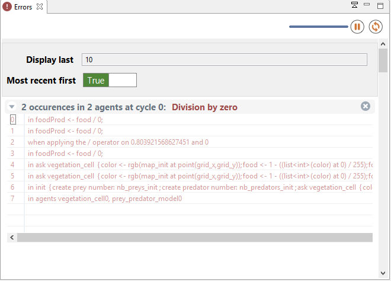

# Errors View

Whenever a runtime error, or a warning, is issued by the currently running experiment, a view called "Errors" is opened automatically. This view provides, together with the error/warning itself, some contextual information about who raised the error (i.e. which agent(s)) and where (i.e. in which portion of the model code). As with other "status" in GAMA, errors will appear in red color and warnings in orange.

Since an error appearing in the code is likely to be raised by several agents at once, GAMA groups similar errors together, simply indicating which agent(s) raised them. Note that, unless the error is raised by the experiment agent itself, its message will indicate that at least 2 agents raised it: the original agent and the experiment in which it is plunged.

