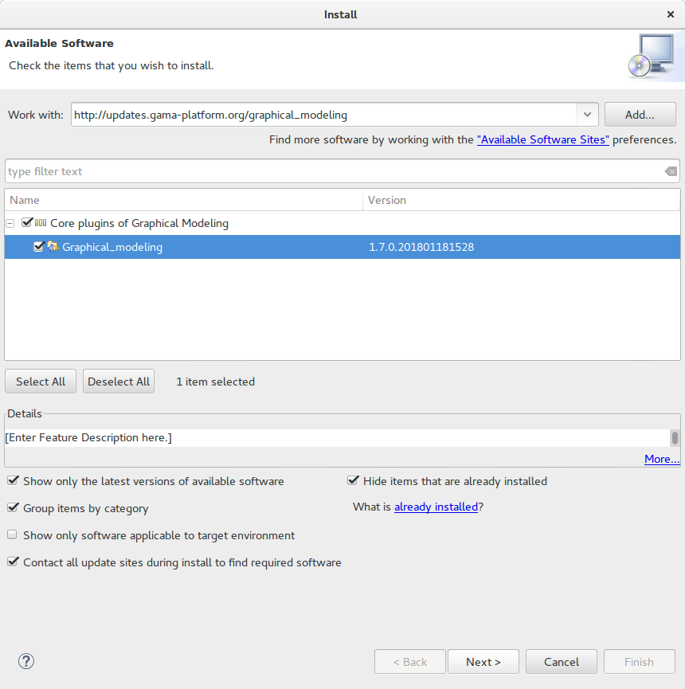
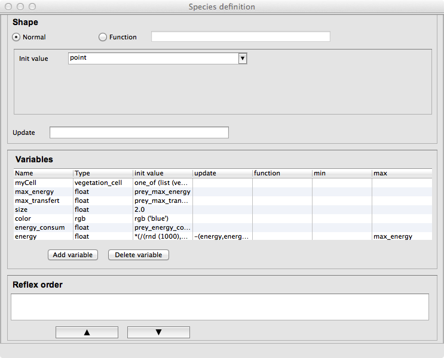

# The Graphical Editor

The graphical editor that allow to build diagram (gadl files) is based on the [Graphiti](http://www.eclipse.org/graphiti/) Eclipse plugin. It allows to define a GAMA model through a graphical interface. It a allows as well to produce a graphical model (diagram) from a gaml model.

## Table of contents 

* [The Graphical Editor](#the-graphical-editor)
	* [Installing the graphical editor](#installing-the-graphical-editor)
	* [Creating a first model](#creating-a-first-model)
	* [Status of models in editors](#status-of-models-in-editors)
	* [Diagram definition framework](#diagram-definition-framework)
	* [Features](#features)
		* [agents](#agents)
			* [species](#species)
			* [grid](#grid)
			* [Inheriting link](#inheriting-link)
			* [world](#world)
		* [agent features](#agent-features)
			* [action](#action)
			* [reflex](#reflex)
			* [aspect](#aspect)
		* [experiment](#experiment)
			* [GUI experiment](#gui-experiment)
			* [display](#display)
			* [batch experiment](#batch-experiment)
	* [Pictogram color modification](#pictogram-color-modification)
	* [GAML Model generation](#gaml-model-generation)

## Installing the graphical editor
Using the graphical editor requires to install the graphical modeling plug-in. See [here](InstallingPlugins) for information about plug-ins and their installation.

The graphical editor plug-in is called **Graphical\_modeling** and is directly available from the GAMA update site **http://updates.gama-platform.org/graphical_modeling**

Note that the graphical editor is still under development. Updates of the plug-in will be add to the GAMA website. After installing the plug-in (and periodically), check for updates for this plug-in: in the "Help" menu, choose "Check for Updates" and install the proposed updates for the graphical modeling plug-in.

## Creating a first model

A new diagram can be created in a new GAMA project. First, right click on a project, then select "New" on the contextual menu.
In the New Wizard, select "GAMA -> Model Diagram", then "Next>"

In the next Wizard dialog, select the type of diagram (Empty, Skeleton or Example) then the name of the file and the author.

 

Skeleton and Example diagram types allow to add to the diagram some basic features.

## Status of models in editors

Similarly to GAML editor, the graphical editor proposes a live display of errors and model statuses. A graphical model can actually be in three different states, which are visually accessible above the editing area: **Functional** (orange color), **Experimentable** (green color) and **InError** (red color). See [the section on model validation](ValidationOfModels) for more precise information about these statuses.

In its initial state, a model is always in the **Functional** state, which means it compiles without problems, but cannot be used to launch experiments. The **InError** state occurs when the file contains errors (syntactic or semantic ones).

Reaching the **Experimentable** state requires that all errors are eliminated and that at least one experiment is defined in the model. The experiment is immediately displayed as a button in the toolbar, and clicking on it will allow to launch this experiment on your model.

Experiment buttons are updated in real-time to reflect what's in your code. If more than one experiment is defined, corresponding buttons will be displayed in addition to the first one.

## Diagram definition framework

The following figure presents the editing framework:

## Features

### agents
#### species

The species feature allows to define a species with a continuous topology. A species is always a micro-species of another species. The top level (macro-species of all species) is the world species.

  * **source**: a species (macro-species)
  * **target**: -

#### grid

The grid feature allows to define a [species](Species151) with a [grid topology](Sections151#environment). A grid is always a micro-species of another species.

  * **source**: a species (macro-species)
  * **target**: -

#### Inheriting link
The inheriting link feature allows to define an inheriting link between two species.

  * **source**: a species (parent)
  * **target**: a species (child)

#### world

When a model is created, a world species is always defined. It represent the global part of the model. The world species, which is unique, is the top level species. All other species are micro-species of the world species.

### agent features

#### action

The action feature allows to define an action for a species.

  * **source**: a species (owner of the action)
  * **target**: -

#### reflex

The reflex feature allows to define a reflex for a species.

  * **source**: a species (owner of the reflex)
  * **target**: -

#### aspect

The aspect feature allows to define an aspect for a species.

  * **source**: a species (owner of the aspect)
  * **target**: -

### experiment
#### GUI experiment

The GUI Experiment feature allows to define a GUI experiment.

  * **source**: world species
  * **target**: -

#### display

The display feature allows to define a display.

  * **source**: GUI experiment
  * **target**: -

#### batch experiment

The Batch Experiment feature allows to define a Batch experiment.

  * **source**: world species
  * **target**: -

## Pictogram color modification
It is possible to change the color of a pictogram.
  * Right click on a pictogram, then select the "Chance the color".

## GAML Model generation
It is possible to automatically generate a Gaml model from a diagram.
  * Right click on the graphical framework (where the diagram is defined), then select the "Generate Gaml model".
A new GAML model with the same name as the diagram is created (and open).
