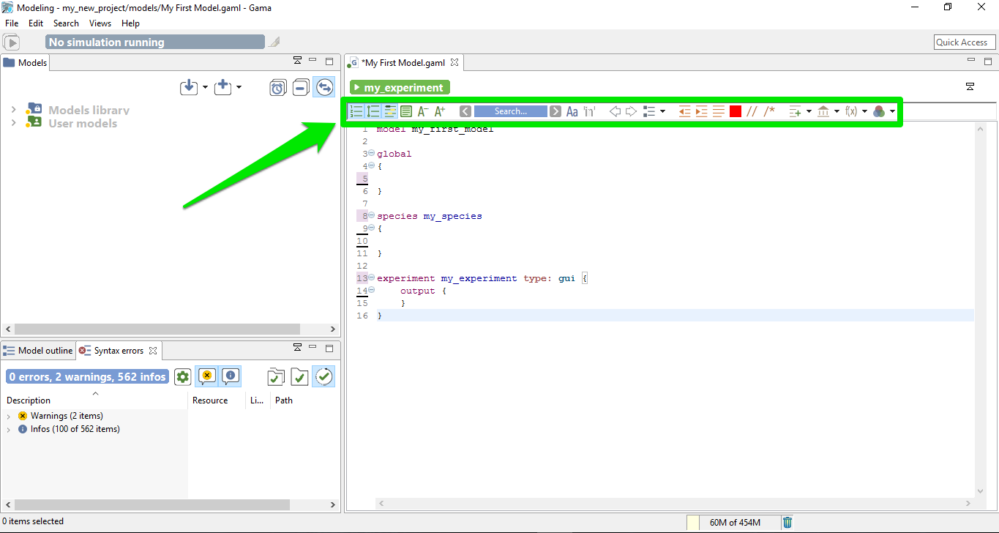
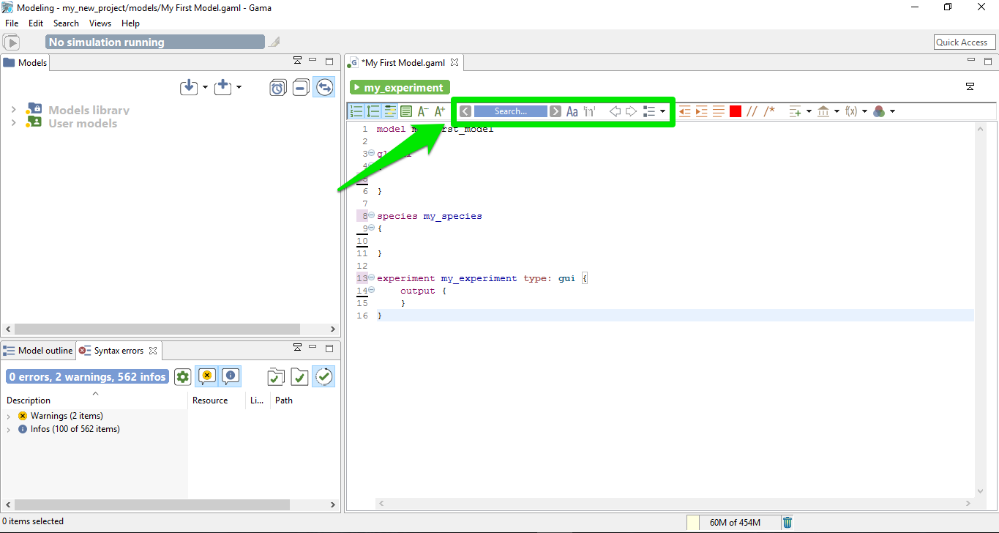
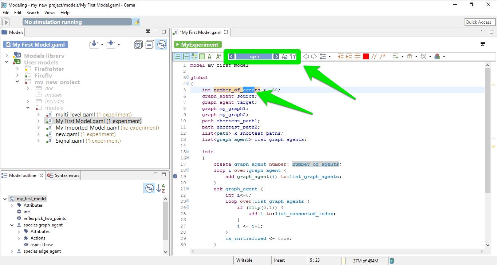
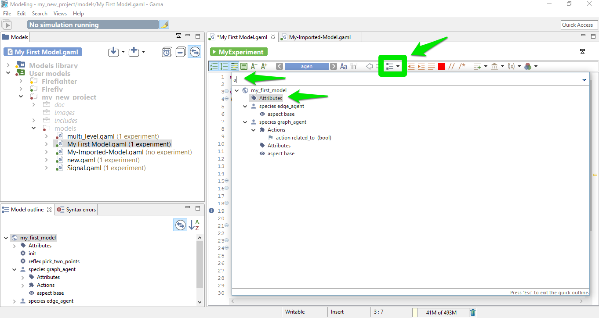
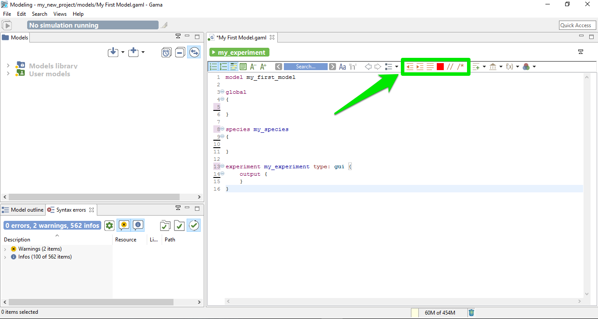
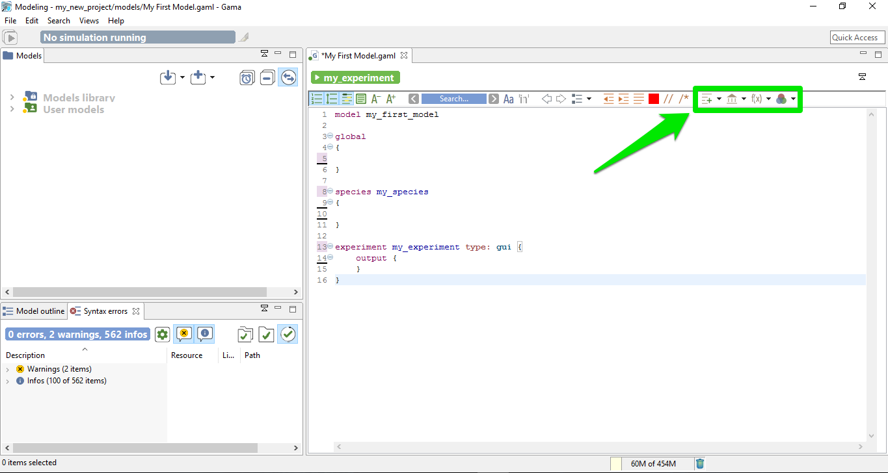
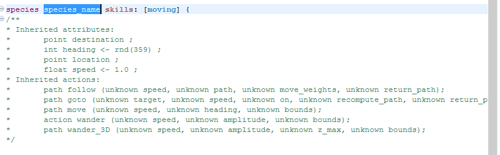
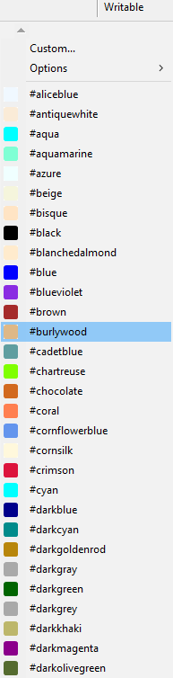

# The GAML Editor Toolbar

The GAML Editor provide some tools to make the editing easier, covering a lot of functionalities, such as tools for changes of visualization, tools for navigation through your model, tools to format your code, or also tools to help you finding the correct keywords to use in a given context.

## Table of contents

* [The GAML Editor Toolbar](#the-gaml-editor-toolbar)
    	* [Visualization tools in the editor](#visualization-tools-in-the-editor)
    	* [Navigation tools in the editor](#navigation-tools-in-the-editor)
    	* [Format tools in the editor](#format-tools-in-the-editor)
    	* [Vocabulary tools in the editor](#vocabulary-tools-in-the-editor)

## Visualization tools in the editor

You can choose to display or not some informations in your Editor. Here are the different features for this part:

### Display the number of lines

The first toggle is used to show / hide the number of lines.

### Expand / Collapse lines

The second toggle provides you the possibility to expand or collapse lines in your model depending on the indentation. This feature can be very useful for big models, to collapse the part you have already finished.

### Mark the occurrences

This third toggle is used to show occurrences when your cursor is pointing on one word.

### Display colorization of code section

One particular option, shipped by default with GAMA, is the possibility to not only highlight the code of your model, but also its structure (complementing, in that sense, the *Outline* view). It is a slightly modified version of a plugin called [EditBox](http://sourceforge.net/projects/editbox/), which can be activated by clicking on the "green square" icon in the toolbar.

The Default theme of [EditBox](http://sourceforge.net/projects/editbox/) might not suit everyone's tastes, so the preferences allow to entirely customize how the "boxes" are displayed and how they can support the modeler in better understanding "where" it is in the code. The "themes" defined in this way are stored in the workspace, but can also be exported for reuse in other workspaces, or sharing them with other modelers.

### Change the font size

The two last tools of this section are used to increase / decrease the size of the displayed text.

## Navigation tools in the editor

In the Editor toolbar, you have some tools for search and navigation through the code. Here are the explanation for each functionalities:

### The search engine

In order to search an occurrence of a word (or the part of a word), you can type your search in the field, and the result will be highlighted automatically in the text editor.

With the left / right arrows, you can highlight the previous / next occurrence of the word. The two toggles just in the right side of the search field are used to constraint the results as "case sensitive" or "whole word". If you prefer the eclipse interface for the search engine, you can also access to the tool by taping Ctrl+F.

### Previous / Next location

The two arrow shape buttons that are coming after are used to jump from the current location of your cursor to the last position, even if the last position was in an other file (and even if this file has been closed !).

### Show outline

This last tool of this section is used to show the global architecture of your model, with explicit icons for each section. A search field is also available, if you want to search a specific section. By double clicking one line of the outline, you can jump directly to the chosen section. This feature can be useful if you have big model to manipulate.

## Format tools in the editor

Some other tools are available in the toolbar to help for the indentation of the model:

### Shift left / shift right

Those two first buttons are used to shift a line (or a group of lines) on the left or the right.

### Format

This useful feature re-indent automatically all your model.

### Re-serialize

Re-serialize your model.

### Comment

The two last buttons of this section are useful to comment a line (or a group of lines).

## Vocabulary tools in the editor

The last group of buttons are used to search the correct way to write a certain keyword.

### Templates

The templates button is used to insert directly a code snippet in the current position of the cursor. Some snippets are already available, ordered by scope. You can custom the list of template as much as you want, it is very easy to add a new template.

### Built-in attributes, built-in actions

With this feature, you can easily know the list of built-in attributes and built-in actions you can use in such or such context. With this feature, you can also insert some templates to help you, for example to insert a pre-made species using a particular skill, as it is shown it the following screenshot:

... will generate the following code:

All the comments are generated automatically from the current documentation.

### Operators

Once again, this powerful feature is used to generate example of structures for all the operators, ordered by categories.

### Colors

Here is the list of the name for the different pre-made colors you can use. You can also add some custom colors.

