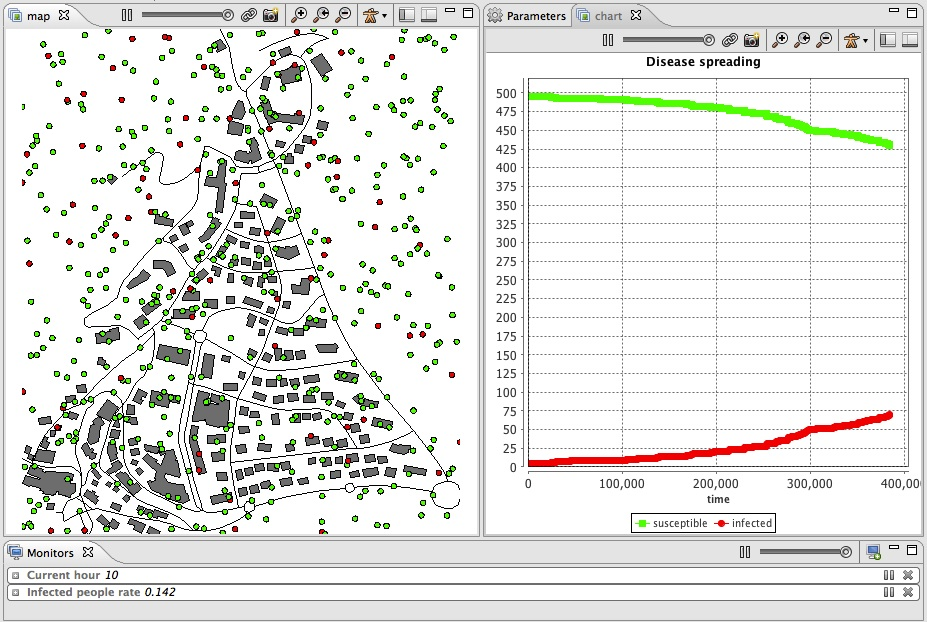

# 3. Integration of GIS Data
This step Illustrates how load and agentry GIS data.


## Formulation
  * Load, agentify and display two layers of GIS data (building and road)
  * Modify the initialization of the people agents to put them inside buildings




## Model Definition

### species
We have to define two species of agents: the **building** agents and the **road** ones. These agents will not have a particular behavior, they will just be displayed.
We define an aspect for these species. In this model, we want to represent the geometry of the agent, we then use the keyword **draw** that allow to draw a given geometry. In order to draw the geometry of the agent we use the attribute **shape** (which is a built-in attribute of all agents).

```
species building {
	aspect geom {
		draw shape color: #gray;
	}
}

species road {
	aspect geom {
		draw shape color: #black;
	}
}
```


### parameters
GAMA allows to automatically read GIS data that are formatted as shapefiles. In order to let the user chooses his/her shapefiles, we define two parameters. One allowing the user to choose the road shapefile, one allowing him/her to choose the building shapefile.

Definition of the two global variables of type _file_ concerning the GIS files:
```
global {
   file shape_file_buildings <- file("../includes/building.shp");
   file shape_file_roads <- file("../includes/road.shp");
}
```

### agentification of GIS data

In GAMA, the agentification of GIS data is very straightforward: it only requires to use the **create** command with the **from** facet to pass the shapefile. Each object of the shapefile will be directly used to instantiate an agent of the specified species.

We modify the init section of the global block in order to create road and building agents from the shape files. Then, we define the initial location of people as a point inside one of the building.
```
global {
  ...
       init {
		create road from: roads_shapefile;
		create building from: buildings_shapefile;
		create people number:nb_people {
			speed <- 5.0 #km/#h;
			building bd <- one_of(building);
			location <- any_location_in(bd);
		}
		ask nb_infected_init among people {
			is_infected <- true;
		}
        }
} 
```
We defined here a local variable called **bd** of type building that is a one of the building (randomly chosen). Note that the name of a species can be used to obtain all the agents of this species (here **building** returns the list of all the buildings). The **any\_location\_in** returns a random point inside a geometry or an agent geometry.

### environment
Building a GIS environment in GAMA requires nothing special, just to define the bounds of the environment, i.e. the geometry of the world agent. It is possible to use a shapefile to automatically define it by computing its envelope. In this model, we use the road shapefile to define it.

```
global {
  ...
  geometry shape <- envelope(shape_file_roads); 
  ...
}
```

### display
We add to the **map** display the road and building agents.

In the **experiment** block:
```
output {
   display map {
	species road aspect:geom;
	species building aspect:geom;
	species people aspect:circle;			
    }
    ...
}
```


## Complete Model

```
model model3 
 
global {
	int nb_people <- 500;
	float step <- 1 #minutes;
	float infection_distance <- 2.0 #m;
	float proba_infection <- 0.05;
	int nb_infected_init <- 5;
	file roads_shapefile <- file("../includes/road.shp");
	file buildings_shapefile <- file("../includes/building.shp");
	geometry shape <- envelope(roads_shapefile);
	int current_hour update: (cycle / 60) mod 24;
	int nb_people_infected <- nb_infected_init update: people count (each.is_infected);
	int nb_people_not_infected <- nb_people - nb_infected_init update: nb_people - nb_people_infected;
	
	float infected_rate update: nb_people_infected/length(people);
	init {
		create road from: roads_shapefile;
		create building from: buildings_shapefile;
		create people number:nb_people {
			speed <- 5.0 #km/#h;
			building bd <- one_of(building);
			location <- any_location_in(bd);
		}
		ask nb_infected_init among people {
			is_infected <- true;
		}
	}
	reflex end_simulation when: infected_rate = 1.0 {
		do halt;
	}
}

species people skills:[moving]{		
	bool is_infected <- false;
		
	reflex move{
		do wander;
	}
	reflex infect when: is_infected{
		ask people at_distance infection_distance {
			if flip(proba_infection) {
				is_infected <- true;
			}
		}
	}
	aspect circle{
		draw circle(5) color:is_infected ? #red : #green;
	}
}

species road {
	aspect geom {
		draw shape color: #black;
	}
}

species building {
	aspect geom {
		draw shape color: #gray;
	}
}

experiment main_experiment type:gui{
	parameter "Infection distance" var: infection_distance;
	parameter "Proba infection" var: proba_infection min: 0.0 max: 1.0;
	parameter "Nb people infected at init" var: nb_infected_init ;
	output {
		monitor "Current hour" value: current_hour;
		monitor "Infected people rate" value: infected_rate;
		display map {
			species road aspect:geom;
			species building aspect:geom;
			species people aspect:circle;			
		}
		display chart refresh:every(10) {
			chart "Disease spreading" type: series {
				data "susceptible" value: nb_people_not_infected color: #green;
				data "infected" value: nb_people_infected color: #red;
			}
		}
	}
}
```
