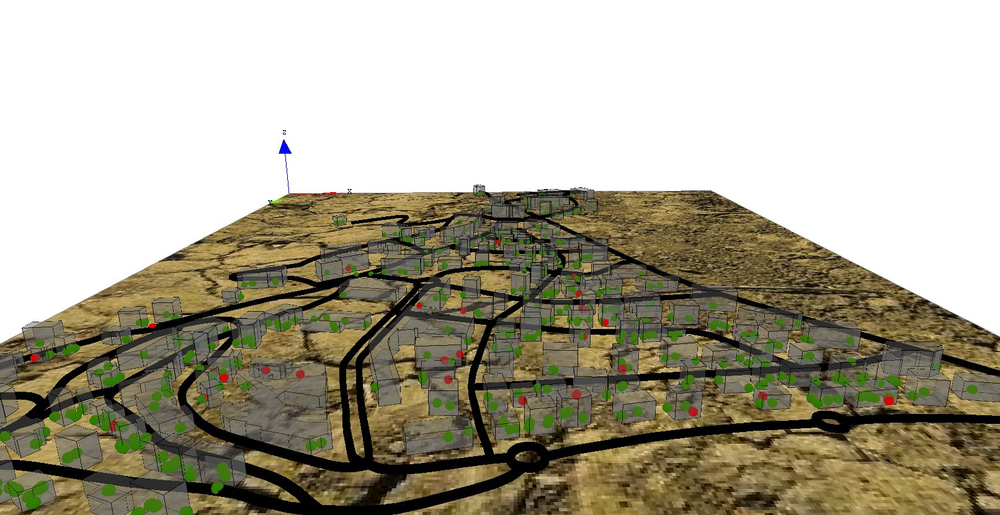

# 5. Visualizing in 3D
This step Illustrates how to define a 3D display


## Formulation
  * add a variable (height: int from 10m to 20m) and modify the aspect of buildings to display them in 3D
  * add a variable (display\_shape: geometry; shape with a buffer of 2m) and modify the aspect of the roads to display them with this new shape.
  * add a new global variable that indicate if it is night or not (bool: night before 7h and after 20h).
  * define a new aspect (sphere3D) for people to display them as sphere.
  * modify the display to use this new aspect.




## Model Definition

### building
First, we add a new variable for buildings (**height**) of type float from 10m to 20m. Then we modify the aspect in order to specify a depth for the geometry (using the **depth** facet).
```
species building {
	float height <- 10#m + rnd(10) #m;
	aspect geom {
		draw shape color: #gray depth: height;
	}
}
```

### road
Concerning the road,  we add a new variable (**display\_shape**) of type geometry that correspond to the shape of the road with a buffer of 2 meters. Then we modify the aspect in order to display this geometry instead of the shape of the agent. In order to avoid "z-fighting" problems, we add a depth to the geometry (of 3 meters).
```
species road {
	geometry display_shape <- shape + 2.0;
	aspect geom {
		draw display_shape color: #black depth: 3.0;
	}
}
```

### global variable
We define a new global variable called **is\_night** of type _bool_ to indicate if it is night or not. This variable will be update at each simulation step and will be _true_ if the **current\_hour** is lower than 7h or higher than 20h.
```
global{
	...
        bool is_night <- true update: current_hour < 7 or current_hour > 20;
       ...
}
```

### people
We define a new aspect for the people agent called **sphere3D**. This aspect draw people agent as a 3m sphere. In order to avoid to cut the sphere in half, we translate the centroid of the drawn sphere to 3m along the z axis.
```
species people skills:[moving]{		
	...
	aspect sphere3D{
		draw sphere(3) at: {location.x,location.y,location.z + 3} color:is_infected ? #red : #green;
	}
}
```

### display
The element that we have to modify is the display. We change its name to **map\_3D** to better reflect its visual aspect.

In order to get a 3D aspect, we specify that this display will be an opengl one. For that, we just have to add the facet **type: opengl**. In addition, to get a different light between night and day : 
The statement `light` allows us to declare a light. We can change up to 7 lights, called through the facet "id". The default light is a white light, directional, with the id=1. You can set the intensity of the light through the facet "color" (you can pass a color, or an integer between 0 and 255). To have a nice effect night / day, we will set the intensity of the light to 50 during the night, and 255 for the day. To learn more about light, please read this [page](ManipulateLight).

Then, we add a new layer that consists in an image (soil.jpg) by using the **image** statement.
In order to see the people inside the building, we add transparency to the building (0.5). The transparency of a layer is a float value between 0 (solid) and 1 (totally transparent). In order to be able to manage this transparency aspect, opengl has to draw the people agents before the building, thus we modify the order of drawing of the different layers (people agents before building agents). At last, we modify the aspect of the people agents by the new one: **sphere3D**.

```
experiment main_experiment type:gui{
	...
	output {
		...
		display map_3D type: opengl {
			light 1 color:(is_night ? 50 : 255);
			image "../includes/soil.jpg";
			species road aspect:geom;
			species people aspect:sphere3D;			
			species building aspect:geom transparency: 0.5;
		}
		...
	}
}
```


## Complete Model

```
model model5 
 
global {
	int nb_people <- 500;
	float step <- 1 #minutes;
	float infection_distance <- 2.0 #m;
	float proba_infection <- 0.05;
	int nb_infected_init <- 5;
	file roads_shapefile <- file("../includes/road.shp");
	file buildings_shapefile <- file("../includes/building.shp");
	geometry shape <- envelope(roads_shapefile);
	graph road_network;
	int current_hour update: (cycle / 60) mod 24;
	float staying_coeff update: 10.0 ^ (1 + min([abs(current_hour - 9), abs(current_hour - 12), abs(current_hour - 18)]));
	int nb_people_infected <- nb_infected_init update: people count (each.is_infected);
	int nb_people_not_infected <- nb_people - nb_infected_init update: nb_people - nb_people_infected;
	bool is_night <- true update: current_hour < 7 or current_hour > 20;
	
	float infected_rate update: nb_people_infected/length(people);
	init {
		create road from: roads_shapefile;
		road_network <- as_edge_graph(road);
		create building from: buildings_shapefile;
		create people number:nb_people {
			speed <- 5.0 #km/#h;
			building bd <- one_of(building);
			location <- any_location_in(bd);
		}
		ask nb_infected_init among people {
			is_infected <- true;
		}
	}
	reflex end_simulation when: infected_rate = 1.0 {
		do halt;
	}
}

species people skills:[moving]{		
	bool is_infected <- false;
	point target;
	int staying_counter;
	reflex stay when: target = nil {
		staying_counter <- staying_counter + 1;
		if flip(staying_counter / staying_coeff) {
			target <- any_location_in (one_of(building));
		}
	}
		
	reflex move when: target != nil{
		do goto target:target on: road_network;
		if (location = target) {
			target <- nil;
			staying_counter <- 0;
		} 
	}
	reflex infect when: is_infected{
		ask people at_distance infection_distance {
			if flip(proba_infection) {
				is_infected <- true;
			}
		}
	}
	aspect circle{
		draw circle(5) color:is_infected ? #red : #green;
	}
	aspect sphere3D{
		draw sphere(3) at: {location.x,location.y,location.z + 3} color:is_infected ? #red : #green;
	}
}

species road {
	geometry display_shape <- shape + 2.0;
	aspect geom {
		draw display_shape color: #black depth: 3.0;
	}
}

species building {
	float height <- 10#m + rnd(10) #m;
	aspect geom {
		draw shape color: #gray depth: height;
	}
}

experiment main_experiment type:gui{
	parameter "Infection distance" var: infection_distance;
	parameter "Proba infection" var: proba_infection min: 0.0 max: 1.0;
	parameter "Nb people infected at init" var: nb_infected_init ;
	output {
		monitor "Current hour" value: current_hour;
		monitor "Infected people rate" value: infected_rate;
		display map_3D type: opengl {
			light 1 color:(is_night ? 50 : 255);
			image "../includes/soil.jpg";
			species road aspect:geom;
			species people aspect:sphere3D;			
			species building aspect:geom transparency: 0.5;
		}
		display chart refresh:every(10) {
			chart "Disease spreading" type: series {
				data "susceptible" value: nb_people_not_infected color: #green;
				data "infected" value: nb_people_infected color: #red;
			}
		}
	}
}
```
