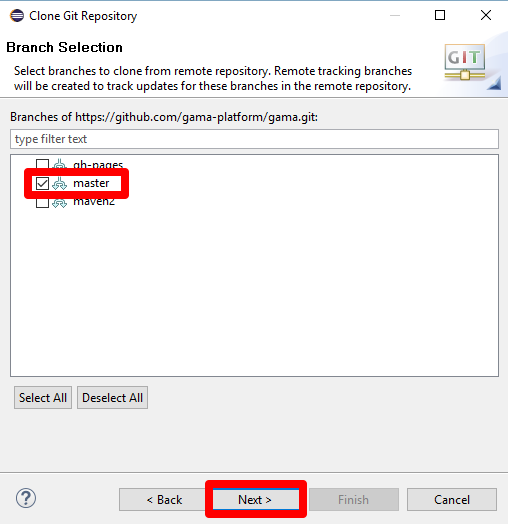
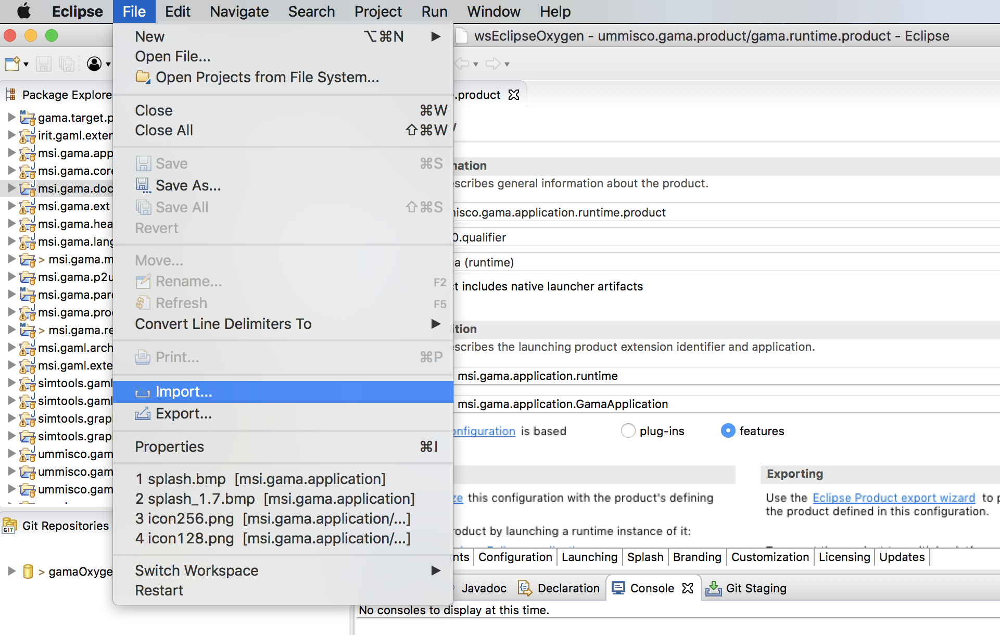
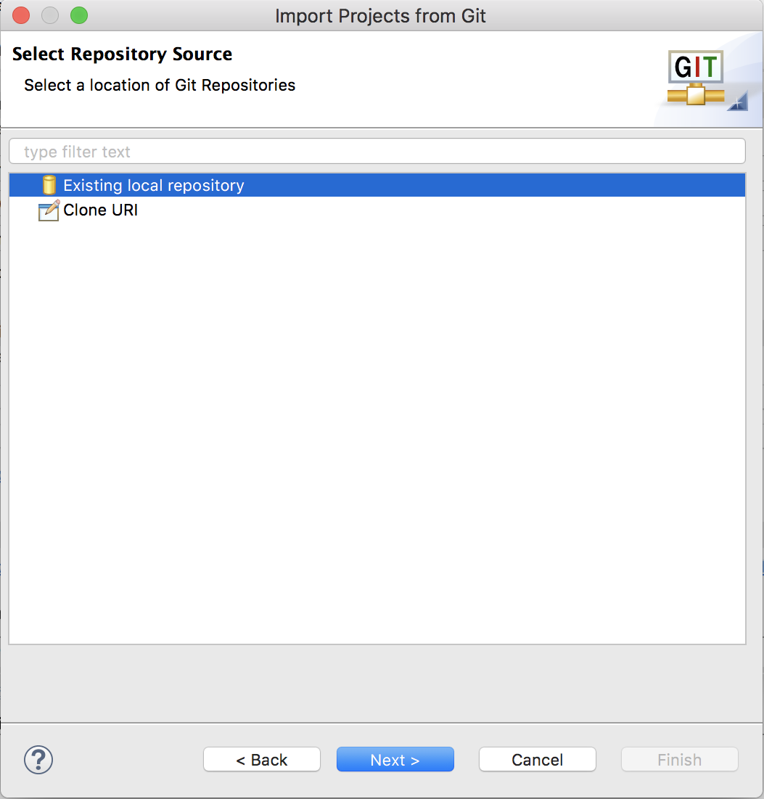
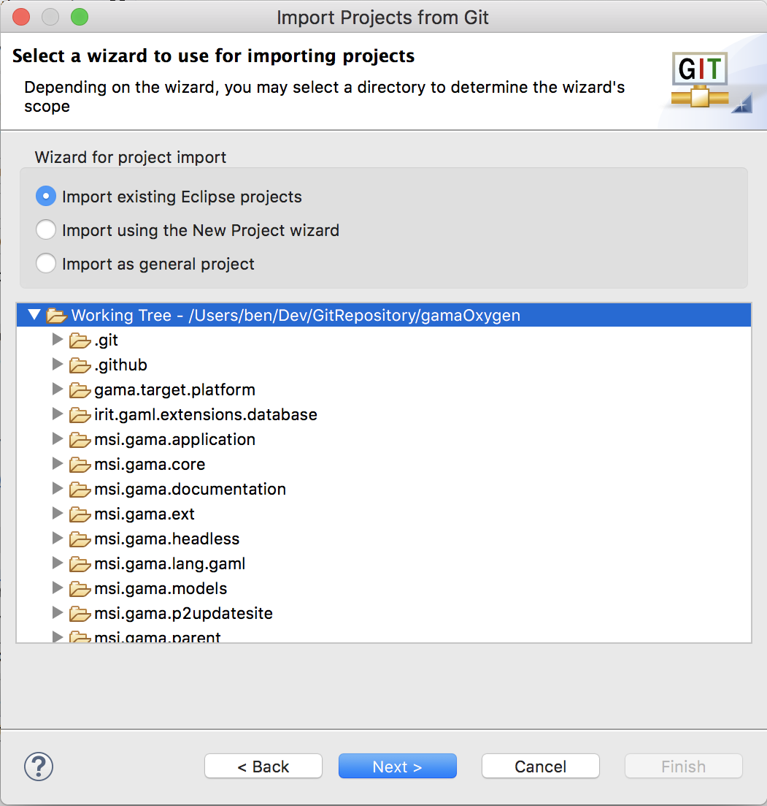

# Installing the GIT version

Tested on MacOS X (10.14.4)

_**Important note:** the current Git version is **not** compatible with the **GAMA 1.6.1 release**: if you plan to create plugins for this release, please download the source at revision r11988 (on Google Code) and [Eclipse following this procedure](InstallingSvnOldVersions). It is **neither** compatible with the **GAMA 1.7RC2 release**: if you plan to create plugins for this release, please [download the source on the branch mars on the GitHub and install Eclipse Mars SR2](InstallingGitVersionMars17)._

## Install Eclipse **2019-03**

Download the ["Installer of 2019-03"](https://www.eclipse.org/downloads/). This is the latest version under which GAMA is certified to work. Regarding Java, we **strongly** recommend to install the Java Oracle 1.8 JDK [that can be downloaded here](http://www.oracle.com/technetwork/java/javase/downloads/jdk8-downloads-2133151.html). 

Unpack the installer and launch it. When asked, choose to install the **Eclipse DSL TOOLS** version. 
Launch Eclipse.

## Install GAMA source code

The source is to be downloaded from GitHub in two steps: by creating a local clone of the GitHub repository and then importing the different projects that constitute GAMA into the Eclipse workspace.

1. Open the Git perspective:
  * Windows > Perspective > Open Perspective > Other...
  * Choose `Git`

2. Click on "Clone a Git repository"

  * In **Source Git repository** window: 
    * Fill in the URI label with: `https://github.com/gama-platform/gama.git`
    * Other fields will be automatically filled in.
    
  * In **Branch Selection** windows, 
    * check the master branch 
    * Next

  * In **Local Destination** windows,
    * Choose a Directory (where the source files will be downloaded).
    * Everything else should be unchecked 
    * Finish

This can take a while...

### Import projects into workspace
You have now to import projects into the workspace (notice that the folders downloaded during the clone will neither be copied nor moved).

_**Note:** contrarily to previous Eclipse versions, import project from the Git perspective does not work properly for GAMA._

1. In the **Java perspective**, choose:
  * `File` / `Import...`,

  * In the install window, select `Git` / `Projects from Git`,
  * Click on Next,
  * In the `Project from Git` window, select `Existing local repository.`,

  * Click on Next,
  * In the newt window, select your Git repository,
  * Click on Next,
  * In the **Select a wizard to used to import projects**, check that 
    * Import existing Eclipse projects is selected
    * Working Tree is selected

    

  * Click on Next,
  * In the **Import project** window,
    * **Uncheck Search for nested projects**
    * Select all the projects

  * Finish
3. Clean project (Project menu > Clean ...)

### If you have errors...
If errors continue to show on in the different projects, be sure to correctly set the JDK used in the Eclipse preferences. GAMA is targeting JDK 1.8, and Eclipse will produce errors if it not found in your environment. So, either you set the compatibility to 1.8 by default (in Preferences > Java > Compiler > Compiler Compliance Level) or you change the error produced by Eclipse to a warning only (in Preferences > Java > Compiler > Building > "No strictly compatible JRE for execution environment available).

### Run GAMA
1. In the `ummisco.gama.product` plugin, open the `gama.runtime.product` file (`gama.product` is used to produce the release).
3. Go to "Overview" tab and click on Synchronize
4. Click on Launch an Eclipse Application

### GIT Tutorials
For those who want learn more about Git and Egit, please consult the following tutorials/papers

1. EGIT/User Guide http://wiki.eclipse.org/EGit/User_Guide
2. Git version control with Eclipse (EGIT) - Tutorial http://www.vogella.com/tutorials/EclipseGit/article.html
3. 10 things I hate about Git http://stevebennett.me/2012/02/24/10-things-i-hate-about-git/
4. Learn Git and GitHub Tutorial https://www.youtube.com/playlist?list=PL1F56EA413018EEE1
