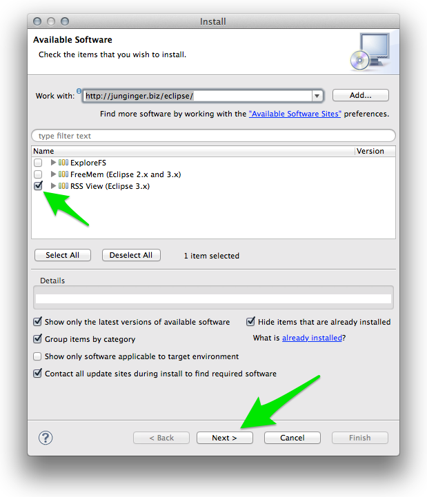
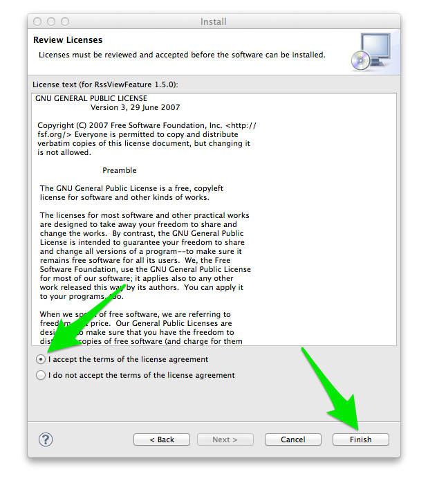
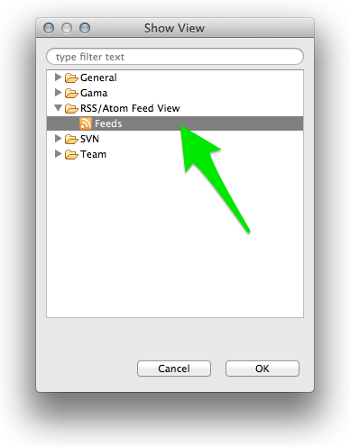
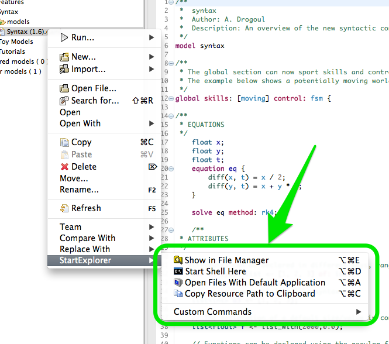
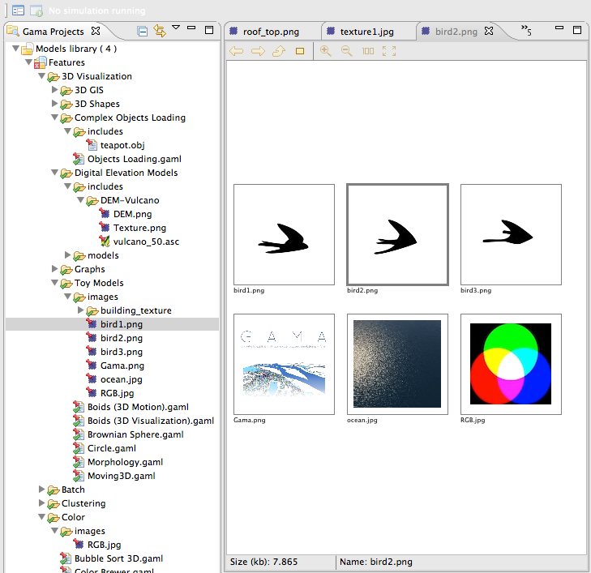

# Installing Plugins

Besides the plugins delivered by the developers of the GAMA platform, which can be installed and updated as explained [here](Updating), there are a number of additional plugins that can be installed to add new functionalities to GAMA or enhance the existing ones. GAMA being based on Eclipse, a number of plugins developed for Eclipse are then available (a complete listing of Eclipse plugins can be found in the so-called [Eclipse MarketPlace](http://marketplace.eclipse.org)).

There are, however, three important restrictions:

1. The current version of GAMA is based on Eclipse Juno (version number 3.8.2), which excludes de facto all the plugins targeting solely the 4.3 (Kepler) or 4.4 (Luna) versions of Eclipse. These will refuse to install anyway.
2. The Eclipse foundations in GAMA are only a subset of the complete Eclipse platform, and a number of libraries or frameworks (for example the Java Development Toolkit) are not (and will never be) installed in GAMA. So plugins relying on their existence will refuse to install as well.
3. Some components of GAMA rely on a specific version of other plugins and will refuse to work with other versions, essentially because their compatibility will not be ensured anymore. For instance, the parser and validator of the GAML language in GAMA 1.6.1 require [XText v. 2.4.1](http://www.eclipse.org/Xtext/) to be installed (and neither XText 2.5.4 nor XText 2.3 will satisfy this dependency).

With these restrictions in mind, it is however possible to install interesting additional plugins. We propose here a list of some of these plugins (known to work with GAMA), but feel free to either add a comment if you have tested plugins not listed here or [create an issue](Troubleshooting) if a plugin does not work, in order for us to see what the requirements to make it work are and how we can satisfy them (or not) in GAMA.

## Table of contents 

* [Installing Plugins](#installing-plugins)
	* [Installation](#installation)
	* [Selected Plugins](#selected-plugins)
		* [Overview](#overview)
		* [Git](#git)
		* [CKEditor] (#ckeditor)
		* [Startexplorer](#startexplorer)
		* [Pathtools](#pathtools)
		* [CSV Edit](#csv-edit)
		* [Quickimage](#quickimage)

## Installation
Installing new plugins is a process identical to the one described when [updating GAMA](Updating), with one exception: the _update site_ to enter is normally provided by the vendor of the additional plugin and must be entered instead of GAMA's one in the dialog. Let us suppose, for instance, that we want to install a RSS feed reader available on this [site](http://junginger.biz/eclipse/).
An excerpt from the page reads that :

> All plugins are installed with the standard update manager of Eclipse. It will guide you through the installation process and also eases keeping your plugins up-to-date. Just add the update site: http://www.junginger.biz/eclipse/

So we just have to follow these instructions, which leads us to the following dialog, in which we select "RSS view" and click "Next".

The initial dialog is followed by two other ones, a first to report that the plugin satisfies all the dependencies, a second to ask the user to accept the license agreement.

|||
|---|---|

Once we dismiss the warning that the plugin is not signed and accept to restart GAMA, we can test the new plugin by going to the "Views" menu.

The new RSS view is available in the list of views that can be displayed in GAMA.

And we can enjoy (after setting some preferences available in its local menu) monitoring the Issues of GAMA from within GAMA itself !

## Selected Plugins
In addition to the RSS reader described above, below is a list of plugins that have been tested to work with GAMA. There are many others so take the time to explore them !

### Overview
  * A very useful plugin for working with large model files. It renders an overview of the file in a separate view (with a user selectable font size), allowing to know where the edition takes place, but also to navigate very quickly and efficiently to different places in the model.
  * Update site: http://sandipchitaleseclipseplugins.googlecode.com/svn/trunk/text.overview.updatesite/site.xml
  * After installing the plugin, an error might happen when closing GAMA. It is harmless. After restarting GAMA, go to Views > Open View > Others... > Overview >.

### Git
  * Git is a version control system (like CVS or SVN, extensively used in GAMA) http://git-scm.com/. Free sharing space are provided on [GitHub](https://github.com/) among others. Installing Git allows to share or gather models that are available in Git repositories.
  * Update site (general): `http://download.eclipse.org/releases/mars/` (Alternatively, you can use `http://download.eclipse.org/egit/updates`)
  * Select the two following plugins:
    * Eclipse EGit
    * Git Team Provider Core
    
### CKEditor
  * CKEditor is a lightweight and powerful web-based editor, perfect for almost WYSIWYG edition of HTML files. It can be installed, directly in GAMA, in order to edit .html, .htm, .xml, .svg, etc. files directly without leaving the platform. No other dependencies are required. A must ! 
  * Update site: `http://kosz.bitbucket.org/eclipse-ckeditor/update-site`

### Startexplorer
  * A nice utility that allows the user to select files, folders or projects in the [Navigator](NavigatingWorkspace) and open them in the filesystem (either the UI Explorer, Finder, whatever, or in a terminal).
  * Update site: `http://basti1302.github.com/startexplorer/update/`

### Pathtools
  * Same purpose as StartExplorer, but much more complete, and additionally offers the possibility to add new commands to handle files (open them in specific editors, execute external programs on them, etc.). Very nice and professional. Works flawlessly in GAMA except that contributions to the toolbar are not accepted (so you have to rely on the commands present in the [Navigator](NavigatingWorkspace) pop-up menu).
  * Update site: `http://pathtools.googlecode.com/svn/trunk/PathToolsUpdateSite/site.xml`
  * Website: `https://pathtools.googlecode.com`

### CSV Edit

  * An editor for CSV files. Quite handy if you do not want to launch Excel every time you need to inspect or change the CSV data files used in models.
  * Update site: `http://csvedit.googlecode.com/svn/trunk/csvedit.update`

### TM Terminal

  * A powerful, yet simple, terminal which can connect locally or via ssh or other methods. 
  * Update site (general): `http://download.eclipse.org/releases/mars/`
  * Select the following plugin: TM Terminal

### Quickimage

  * A lightweight viewer of images, which can be useful when several images are used in a model.
  * Update site: `http://psnet.nu/eclipse/updates`

