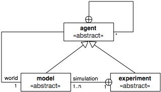
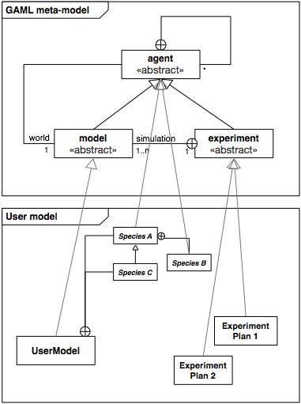

# Introduction

GAML is an _agent-oriented_ language dedicated to the definition of _agent-based_ simulations. It takes its roots in _object-oriented_ languages like Java or Smalltalk, but extends the object-oriented programming approach with powerful concepts (like skills, declarative definitions or agent migration) to allow for a better expressivity in models.

It is of course very close to _agent\_based_ modeling languages like, e.g., [NetLogo](http://ccl.northwestern.edu/netlogo/), but, in addition to enriching the traditional representation of agents with modern computing notions like inheritance, type safety or multi-level agency, and providing the possibility to use different behavioral architectures for programming agents, GAML extends the agent-based paradigm to eliminate the boundaries between the domain of a model (which, in ABM, is represented with agents) and the experimental processes surrounding its simulations (which are usually not represented with agents), including, for example, _visualization_ processes. This [paper](http://citeseerx.ist.psu.edu/viewdoc/download?doi=10.1.1.104.7241&rep=rep1&type=pdf) (_Drogoul A., Vanbergue D., Meurisse T., Multi-Agent Based Simulation: Where are the Agents ?, Multi-Agent Based Simulation 3, pp. 1-15, LNCS, Springer-Verlag. 2003_) was in particular foundational in the definition of the concepts on which GAMA (and GAML) are based today.

This orientation has several conceptual consequences among which at least two are of immediate practical interest for modelers:
* Since simulations, or experiments, are represented by agents, GAMA is bound to support high-level _model compositionality_, i.e. the definition of models that can use other models as _inner agents_, leveraging multi-modeling or multi-paradigm modeling as particular cases of composition.
* The _visualization_ of models can be expressed by _models of visualization_, composed of agents entirely dedicated to visually represent other agents, allowing for a clear _separation of concerns_ between a simulation and its representation and, hence, the possibility to play with multiple representations of the same model at once.

## Table of contents 

* [Key Concepts (Under construction)](#key-concepts-under-construction)
	* [Lexical semantics of GAML](#lexical-semantics-of-gaml)
	* [Translation into a concrete syntax](#translation-into-a-concrete-syntax)
	* [Vocabulary correspondance with the object-oriented paradigm as in Java](#vocabulary-correspondance-with-the-object-oriented-paradigm-as-in-java)
	* [Vocabulary correspondance with the agent-based paradigm as in NetLogo](#vocabulary-correspondance-with-the-agent-based-paradigm-as-in-netlogo)

## Lexical semantics of GAML
The vocabulary of GAML is described in the following sentences, in which the meaning and relationships of the important _words_ of the language (in **bold face**) are summarized.

1. The role of GAML is to support modelers in writing **models**, which are specifications of **simulations** that can be executed and controlled during **experiments**, themselves specified by **experiment plans**.
1. The **agent-oriented** modeling paradigm means that everything "active" (entities of a model, systems, processes, activities, like simulations and experiments) can be represented in GAML as an **agent** (which can be thought of as a computational component owning its own data and executing its own behavior, alone or in interaction with other agents).
1. Like in the object-oriented paradigm, where the notion of _class_ is used to supply a specification for _objects_, agents in GAML are specified by their **species**, which provide them with a set of **attributes** (_what they know_), **actions** (_what they can do_), **behaviors** (_what they actually do_) and also specifies properties of their **population**, for instance its **topology** (_how they are connected_) or **schedule** (_in which order and when they should execute_).
1. Any **species** can be nested in another **species** (called its _macro-species_), in which case the **populations** of its instances will imperatively be hosted by an instance of this _macro-species_. A **species** can also inherit its properties from another **species** (called its _parent species_), creating a relationship similar to _specialization_ in object-oriented design. In addition to this, **species** can be constructed in a compositional way with the notion of **skills**, bundles of **attributes** and **actions** that can be shared between different species and inherited by their children.
1. Given that all **agents** are specified by a **species**, **simulations** and **experiments** are then instances of two species which are, respectively, called **model** and **experiment plan**. Think of them as "specialized" categories of species.
1. The relationships between **species**, **models** and **experiment plans** are codified in the meta-model of GAML in the form of a framework composed of three abstract species respectively called **agent** (direct or indirect parent of all **species**), **model** (parent of all **species** that define a model) and **experiment** (parent of all **species** that define an experiment plan). In this meta-model, instances of the children of **agent** know the instance of the child of **model** in which they are hosted as their **world**, while the instance of **experiment plan** identifies the same agent as one of the **simulations** it is in charge of. The following diagram summarizes this framework:

Putting this all together, writing a model in GAML then consists in defining a species which inherits from **model**, in which other **species**, inheriting (directly or not) from **agent** and representing the entities that populate this model, will be nested, and which is itself nested in one or several **experiment plans** among which a user will be able to choose which **experiment** he/she wants to execute.

At the operational level, i.e. when _running_ an experiment in GAMA,

## Translation into a concrete syntax
The concepts presented above are expressed in GAML using a syntax which bears resemblances with mainstream programming languages like Java, while reusing some structures from Smalltalk (namely, the syntax of _facets_ or the infix notation of _operators_). While this syntax is fully described in the subsequent sections of the documentation, we summarize here the meaning of its most prominent structures and their correspondance (when it exists) with the ones used in Java and NetLogo.

1. A **model** is composed of a **header**, in which it can refer to other **models**, and a sequence of **species** and **experiments** declarations, in the form of special **declarative statements** of the language.
1. A **statement** can be either a **declaration** or a **command**. It is always composed of a **keyword** followed by an optional **expression**, followed by a sequence of **facets**, each of them composed of a **keyword** (terminated by a ‘:’) and an **expression**.
1. **facets** allow to pass arguments to **statements**. Their **value** is an **expression** of a given **type**. An **expression** can be a literary constant, the name of an **attribute**, **variable** or **pseudo-variable**, the name of a **unit** or **constant** of the language, or the application of an **operator**.
1. A **type** can be a **primitive type**, a **species type** or a **parametric type** (i.e. a composition of **types**).
1. Some **statements** can include sub-statements in a **block** (sequence of **statements** enclosed in curly brackets).
1. **declarative statements** support the definition of special constructs of the language: for instance, **species** (including **global** and **experiment** species), **attributes**, **actions**, **behaviors**, **aspects**, **variables**, **parameters** and **outputs** of **experiments**.
1. **imperative statements** that execute something or control the flow of execution of **actions**, **behaviors** and **aspects** are called **commands**.
1. A **species** declaration (**global**, **species** or **grid** keywords) can only include 6 types of declarative statements : **attributes**, **actions**, **behaviors**, **aspects**, **equations** and (nested) **species**. In addition, **experiment** species allow to declare **parameters**, **outputs** and batch **methods**.

## Vocabulary correspondance with the object-oriented paradigm as in Java
| GAML | Java |
|:--|:--|
| species | class |
| micro-species | nested class |
| parent species | superclass |
| child species | subclass |
| model | program |
| experiment | (main) class |
| agent | object |
| attribute | member |
| action | method |
| behavior | collection of methods |
| aspect | collection of methods, mixed with the behavior |
| skill | interface (on steroids) |
| statement | statement |
| type | type |
| parametric type | generics |

## Vocabulary correspondance with the agent-based paradigm as in NetLogo
| GAML | NetLogo |
|:--|:--|
| species | breed   |
| micro-species | -       |
| parent species | -       |
| child species | - (only from 'turtle') |
| model | model   |
| experiment | observer |
| agent | turtle/observer |
| attribute | 'breed'-own |
| action | global function applied only to one breed |
| behavior | collection of global functions applied to one breed |
| aspect | only one, mixed with the behavior |
| skill | -       |
| statement | primitive |
| type | type    |
| parametric type | -       |
