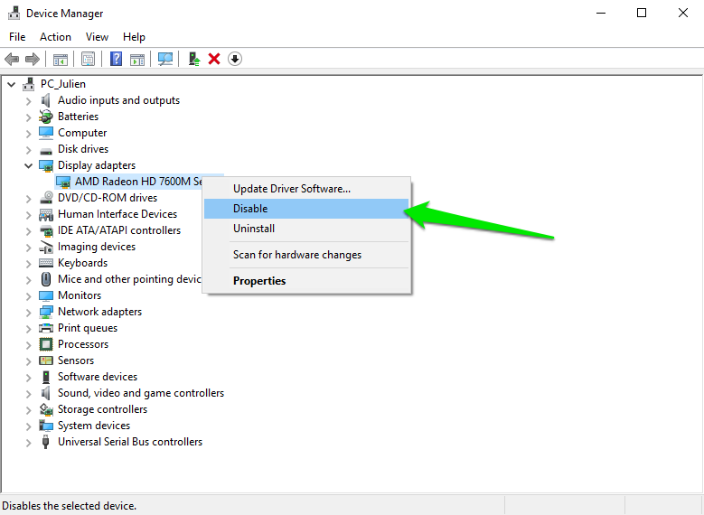
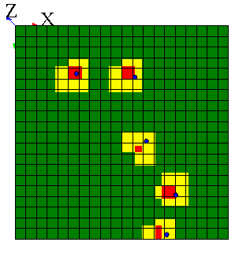

# Known issues

[//]: # (keyword|concept_opengl)
## Crash when using openGL on Windows

If you are using GAMA with Windows, and your video card is a Radeon AMD, then GAMA can crash while running a simulation using OpenGL. To avoid this issue, you have to disable your video card. This will slow down a bit the performances, but at least you will be able to run GAMA without those annoying crashes.

To disable your video card, open the control panel, click on Hardware and Sound / Devices and Printers / Device manager, and then right click on your video card (as shown in the following image)

[//]: # (keyword|concept_grid)
## Grid not displayed right using openGL

When you try to display a grid with opengl, the cells have not a regular shape (as it is shown in the following image)

The reason of this problem is that we can only map a grid of 2^n*2^n cells in the plan. Here are some solutions for this problem :
- Choose a grid with 2^n*2^n dimension (such as 16x16, or 32x32)
- Display the grid in java2D
- Display the grid as _species_, and not as _grid_ (note that the difference in term of performance between displaying a grid as a _grid_ and as a _species_ is not so important for opengl displays. It has originally been done for java2D displays)
