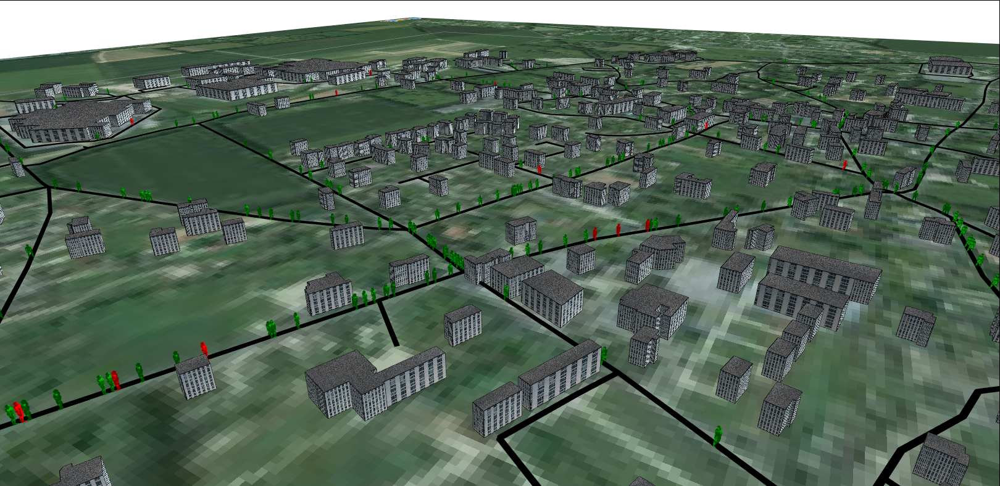

# 5. Definition of 3D displays
This fifth step illustrates how to define 3D displays





## Formulation
  * Define a new 3D aspect for roads.
  * Define a new 3D aspect for buildings
  * Define a new 3D aspect for people
  * Define a new 3D display 

## Model Definition

### species

We define a new aspect for the road species called _geom3D_ that draw the road agent that as a black tube of 2m radius built from its geometry. Note that it is possible to get the list of points composing a geometry by using the _points_ variable of the geometry. 


```
species road {
	//....
	aspect geom3D {
		draw line(shape.points, 2.0) color: #black;
	}
}
```

Concerning the building species, we define an aspect called _geom3D_ that draws the shape of the building with a depth of 20 meters and with using a texture "texture.jpg" for the face and a texture for the roof "roof\_top.png".


```
species building {
	//....
	aspect geom3D {
		draw shape depth: 20 #m border: #black texture:["../includes/roof_top.png","../includes/texture.jpg"];
	}
}
```
At last, we define a new aspect called _geom3D_ for the people species that displays the agent only if it is on a road (target != nil). In this aspect, we use an obj file that contains a 3D object. The use of the _obj\_file_ operator allows to apply an initial rotation to an obj file. In our case, we add a rotation of -90° along the x axis. We specify with the _size_ facet that we want to draw the 3D object inside a bounding box of 5m. As the location of the 3D object is its centroid and as we want to draw the 3D object on the top of the ground, we use the _at_ facet to put an offset along the z axis. We use also the rotate facet to change the orientation of the 3D object according to the heading of the agent. At last, we choose to draw the 3D object in green if the agent is not infected; in red otherwise.


```
species people skills:[moving]{		
	//....
	aspect geom3D {
		if target != nil {
			draw obj_file("../includes/people.obj", 90::{-1,0,0}) size: 5
			at: location + {0,0,7} rotate: heading - 90 color: is_infected ? #red : #green;
		}
	}
}
```

### output

We define a new display called _view3D_ of type _opengl_ with an _ambient\_light_ of 80. Inside this display, we first draw a background image representing the satellite image of the Luneray. Note that GAMA is able to manage world files to georeferenced images. In our case, as a pgw file exists in the includes folder, the satellite image will be well localized in the display. After drawing the background image, we display first the building species with their geom3D aspect, then the road species with their geom3D aspect and finally the people species with their geom3D aspect. Only the people agents will be redrawn at each simulation step.


```
experiment main_experiment type: gui {
	output {
	// monitor and other displays	
		display view3D type: opengl ambient_light: 80 {
			image "../includes/luneray.png" refresh:false; 
			species building aspect:geom3D refresh: false;
			species road aspect: geom3D refresh: false;
			species people aspect: geom3D ; 
		}
	}
}
```
## Complete Model

```

model model4

global {
	int nb_people <- 2147;
	int nb_infected_init <- 5;
	float step <- 5 #mn;
	file roads_shapefile <- file("../includes/roads.shp");
	file buildings_shapefile <- file("../includes/buildings.shp");
	geometry shape <- envelope(roads_shapefile);	
	graph road_network;
	
	
	int nb_people_infected <- nb_infected_init update: people count (each.is_infected);
	int nb_people_not_infected <- nb_people - nb_infected_init update: nb_people - nb_people_infected;
	float infected_rate update: nb_people_infected/nb_people;
	
	
	init{
		create road from: roads_shapefile;
		road_network <- as_edge_graph(road);		
		create building from: buildings_shapefile;
		create people number:nb_people {
			location <- any_location_in(one_of(building));				
		}
		ask nb_infected_init among people {
			is_infected <- true;
		}
	}
}

species people skills:[moving]{		
	float speed <- (2 + rnd(3)) #km/#h;
	bool is_infected <- false;
	point target;
	
	reflex stay when: target = nil {
		if flip(0.05) {
			target <- any_location_in (one_of(building));
		}
	}
		
	reflex move when: target != nil{
		do goto target:target on: road_network;
		if (location = target) {
			target <- nil;
		} 
	}

	reflex infect when: is_infected{
		ask people at_distance 10 #m {
			if flip(0.05) {
				is_infected <- true;
			}
		}
	}
	
	aspect circle {
		draw circle(10) color:is_infected ? #red : #green;
	}
	
	aspect geom3D {
		if target != nil {
			draw obj_file("../includes/people.obj", 90::{-1,0,0}) size: 5
			at: location + {0,0,7} rotate: heading - 90 color: is_infected ? #red : #green;
		}
	}
	
}

species road {
	aspect geom {
		draw shape color: #black;
	}
	aspect geom3D {
		draw line(shape.points, 2.0) color: #black;
	}
}

species building {
	aspect geom {
		draw shape color: #gray;
	}
	aspect geom3D {
		draw shape depth: 20 #m border: #black texture:["../includes/roof_top.png","../includes/texture.jpg"];
	}
}

experiment main type: gui {
	parameter "Nb people infected at init" var: nb_infected_init min: 1 max: 2147;

	output {
		monitor "Infected people rate" value: infected_rate;
		
		display map {
			species road aspect:geom;
			species building aspect:geom;
			species people aspect:circle;			
		}
		
		
		
		display chart_display refresh: every(10 #cycle) {
			chart "Disease spreading" type: series {
				data "susceptible" value: nb_people_not_infected color: #green;
				data "infected" value: nb_people_infected color: #red;
			}
		}
		display view3D type: opengl ambient_light: 80 {
			image "../includes/luneray.png" refresh:false; 
			species building aspect:geom3D refresh: false;
			species road aspect: geom3D refresh: false;
			species people aspect: geom3D ; 
		}
	}
}
```
