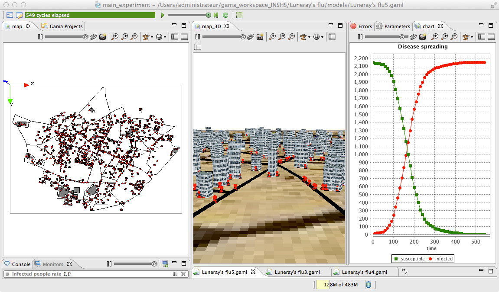

# 5. Definition of 3D displays
This fifth step illustrates how to define 3D displays





## Formulation
  * Define a new 3D aspect for roads.
  * Define a new 3D aspect for buildings
  * Define a new 3D aspect for people
  * Define a new 3D display 

## Model Definition

### species

First, we add a new variable called _display\_shape_ of type _geometry_ for road agent that is a tube of 2m radius built from its geometry. Note that it is possible to get the list of points composing a geometry by using the _points_ variable of the geometry. We define then an aspect called _geom3D_ that draws the previous geometry in black.


```
species road {
	geometry display_shape <- line(shape.points, 2.0);
	
	//....
	aspect geom3D {
		draw display_shape color: #black;
	}
}
```

Concerning the building species, we add a new variable called _height_ of type _float_ that is initialized by a random value between 20 and 40 meters.
We define then an aspect called _geom3D_ that draws the shape of the building with a depth of height and with using a texture ("texture.jpg" that is located inside the includes folder).


```
species building {
	float height <- 20#m + rnd(20) #m;
	//....
	aspect geom3D {
		draw shape depth: height texture:["../includes/texture.jpg"];
	}
}
```
At last, we define a new aspect called _geom3D_ for the people species that draws first a pyramid of 5 meters size, then a sphere of radius 2 meters at a height of 5m (z = 5). Note that it is possible to access the coordinates of a point by using the _x_, _y_ and _z_ variables. In GAMA, a point can be defined by using the format _{x\_value,y\_value,z\_value}_.


```
species people skills:[moving]{		
	//....
	aspect geom3D{
		draw pyramid(5) color: is_infected ? #red : #green;
		draw sphere(2) at: {location.x,location.y,5} color: is_infected ? #red : #green;	
	}
}
```

### output

We define a new display called _map\_3D_ of type _opengl_ with an _ambient\_light_ of 120 that displays first a image ("soil.jpg"), then the road with the _geom3D_ aspect, then the building with the _geom3D_ aspect, and finally the people with the _geom3D_ aspect. All layers except the people's one will not be refreshed (refresh set to false).

```
experiment main_experiment type: gui {
	output {
	// monitor and other displays	
		display map_3D type: opengl ambient_light: 120 {
			image "../includes/soil.jpg" refresh: false;
			species road aspect:geom3D refresh: false;
			species building aspect:geom3D refresh: false;
			species people aspect:geom3D;			
		}
	}
}
```
## Complete Model

```
model SI_city5

global{ 
	int nb_people <- 2147;
	int nb_infected_init <- 5;
	float step <- 1 #mn;
	file roads_shapefile <- file("../includes/roads.shp");
	file buildings_shapefile <- file("../includes/buildings.shp");
	geometry shape <- envelope(roads_shapefile);
	int nb_people_infected <- nb_infected_init update: people count (each.is_infected);
	int nb_people_not_infected <- nb_people - nb_infected_init update: nb_people - nb_people_infected;
	float infected_rate update: nb_people_infected/nb_people;
	
	graph road_network;
	
	init{
		create road from: roads_shapefile;
		road_network <- as_edge_graph(road);
		create building from: buildings_shapefile;
		create people number:nb_people {
			my_house <- one_of(building);
			location <- any_location_in(my_house);
		}
		ask nb_infected_init among people {
			is_infected <- true;
		}
	}
	
	reflex end_simulation when: infected_rate = 1.0 {
		do pause;
	}
}

species people skills:[moving]{		
	float speed <- (2 + rnd(3)) #km/#h;
	bool is_infected <- false;
	building my_house;
	point target;
	bool in_my_house <- true;
	
	reflex stay when: target = nil {
		if flip(in_my_house ? 0.01 : 0.1) {
			building bd_target <- in_my_house ? one_of(building) : my_house;
			target <- any_location_in (bd_target);
			in_my_house <- not in_my_house;
		}
	}
		
	reflex move when: target != nil{
		do goto target:target on: road_network;
		if (location = target) {
			target <- nil;
		} 
	}
	reflex infect when: is_infected{
		ask people at_distance 10 #m {
			if flip(0.05) {
				is_infected <- true;
			}
		}
	}
	aspect circle{
		draw circle(10) color:is_infected ? #red : #green;
	}
	aspect geom3D{
		draw pyramid(5) color: is_infected ? #red : #green;
		draw sphere(2) at: {location.x,location.y,5} color: is_infected ? #red : #green;	
	}
	
}

species road {
	geometry display_shape <- line(shape.points, 2.0);
	
	aspect geom {
		draw shape color: #black;
	}
	aspect geom3D {
		draw display_shape color: #black;
	}
}

species building {
	float height <- 20#m + rnd(20) #m;
	
	aspect geom {
		draw shape color: #gray;
	}
	aspect geom3D {
		draw shape depth: height texture:["../includes/texture.jpg"];
	}
	
}

experiment main_experiment type:gui{
	parameter "Nb people infected at init" var: nb_infected_init min: 1 max: 2147;
	output {
		monitor "Infected people rate" value: infected_rate;
		
		display map type: opengl{
			species road aspect:geom;
			species building aspect:geom;
			species people aspect:circle;			
		}
		
		display map_3D type: opengl ambient_light: 120 {
			image "../includes/soil.jpg" refresh: false;
			species road aspect:geom3D refresh: false;
			species building aspect:geom3D refresh: false;
			species people aspect:geom3D;			
		}
	
		display chart refresh:every(10) {
			chart "Disease spreading" type: series {
				data "susceptible" value: nb_people_not_infected color: #green;
				data "infected" value: nb_people_infected color: #red;
			}
		}
	}
}
```
