[//]: # (startConcept|use_osm_datas)
[//]: # (keyword|concept_osm)
# Manipulate OSM Datas

[//]: # (keyword|concept_load_file)
This section will be presented as a quick tutorial, showing how to proceed to manipulate OSM (Open street map) datas, and load them into GAMA. We will use the software [QGIS](http://www.qgis.org/en/site/) to change the attributes of the OSM file.


From the website [openstreetmap.org](https://www.openstreetmap.org/), we will chose a place (in this example, we will take a neighborhood in New York City). Directly from the website, you can export the chosen area in the osm format.

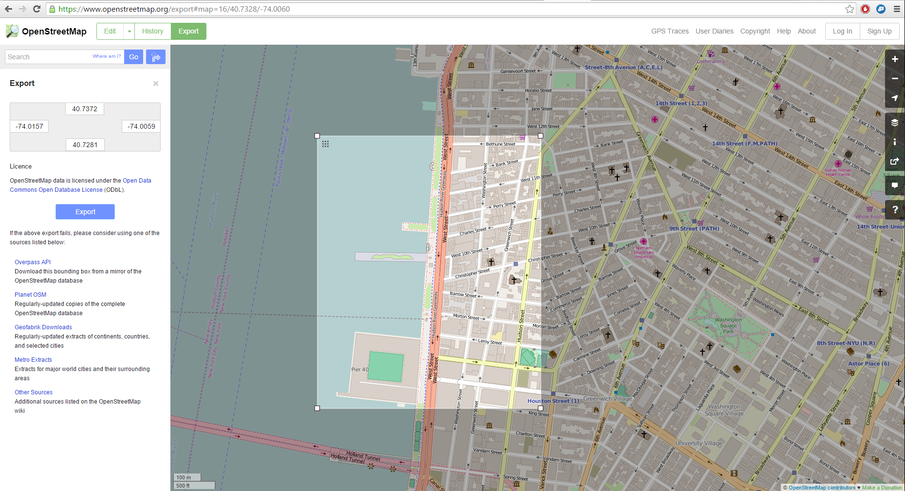

We have now to manipulate the attributes for the exported osm file.
Several software are possible to use, but we will focus on [QGIS](http://www.qgis.org/en/site/), which is totally free and provides a lot of possibilities in term of manipulation of data.

Once you have installed correctly QGIS, launch QGIS Desktop, and start to import the topology from the osm file.

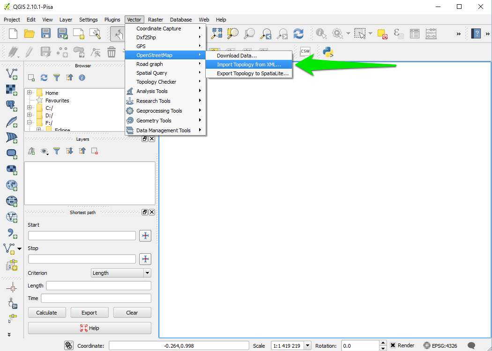

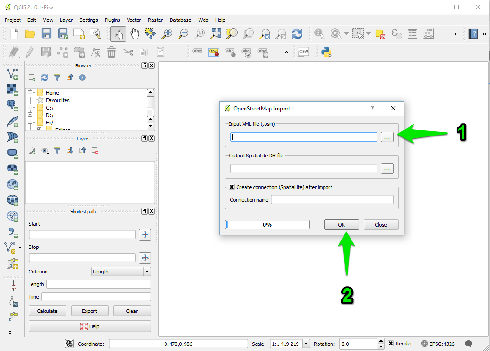

A message indicates that the import was successful. An output file .osm.db is created. You have now to export the topology to SpatiaLite.

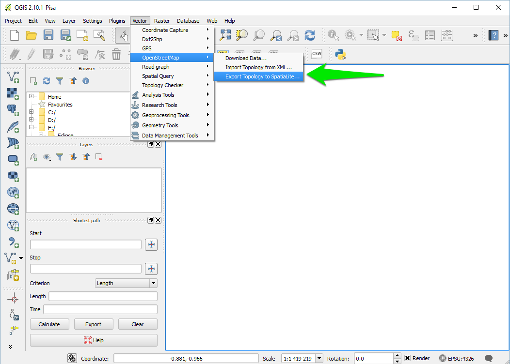

Specify the path for your DataBase file, then choose the export type (in your case, we will choose the type "Polygons (closed ways)"), choose an output layer name. If you want to use the open street maps attributes values, click on "Load from DB", and select the attributes you want to keep. Click OK then.

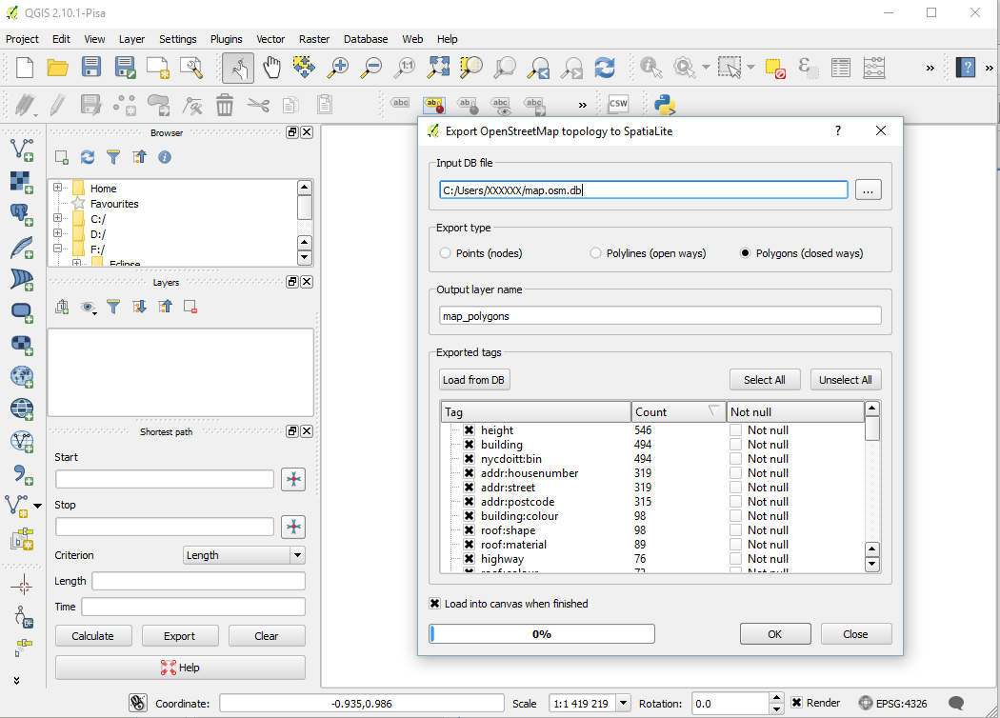

A message indicates that the export was successful, and you have now a new layer created.

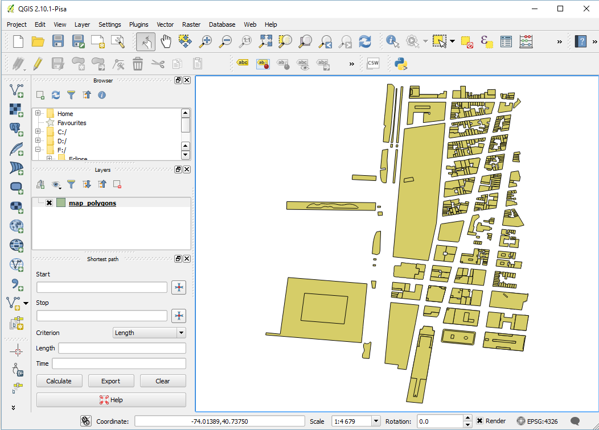

We will now manipulate the attributes of your datafile. Right click on the layer, and select "Open Attribute Table".

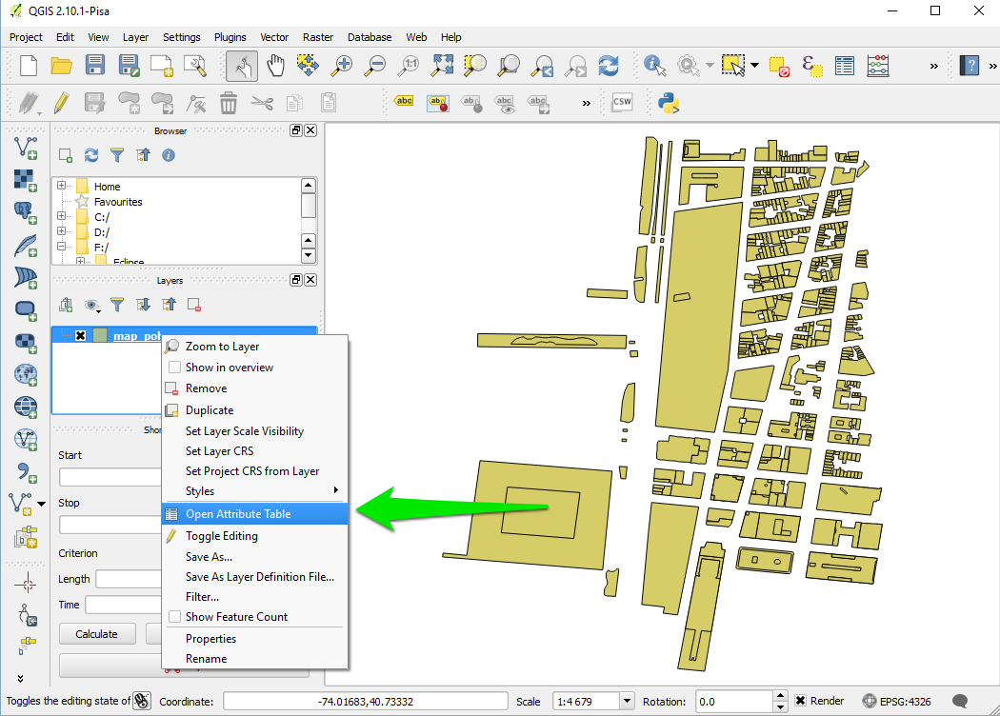

The table of attribute appears. Select the little pencil on the top-left corner of the window to modify the table.

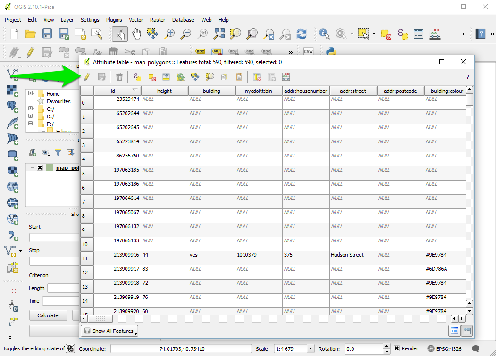

We will add an attribute manually. Click on the button "new column", choose a name and a type (we will choose the type "text").

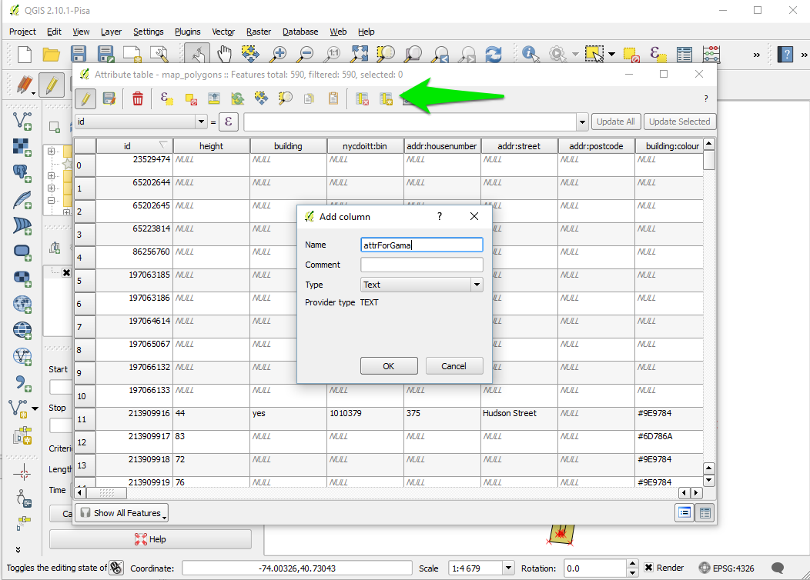

A new column appears at the end of the table. Let's fill some values (for instance blue / red). Once you finishes, click on the "save edit" button.

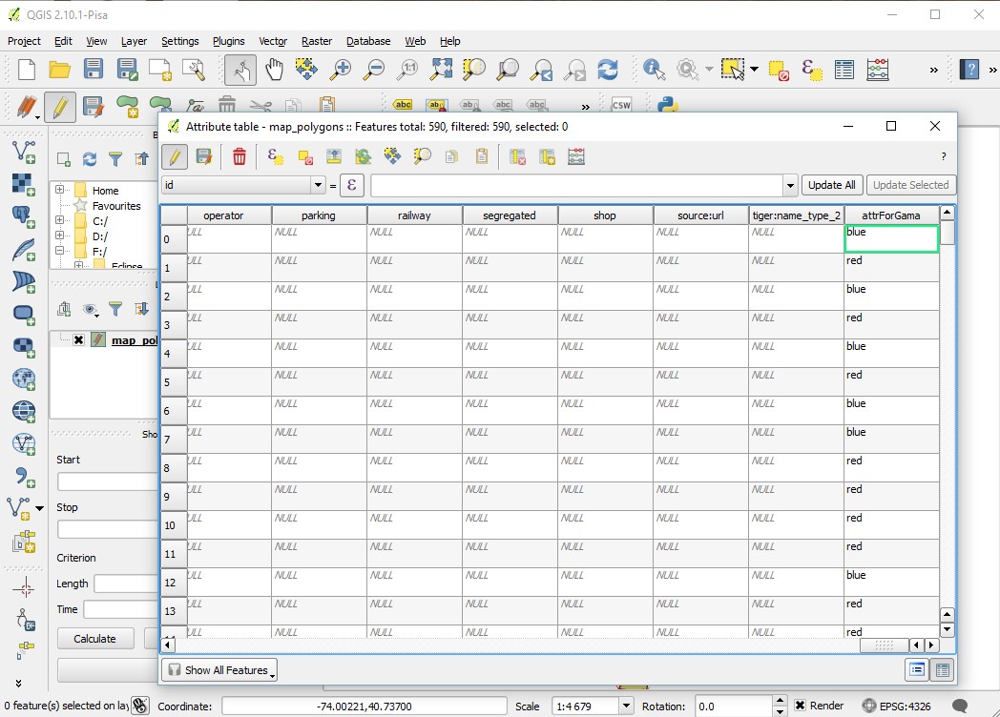

Our file is now ready to be exported. Right click on the layer, and click on "Save As".

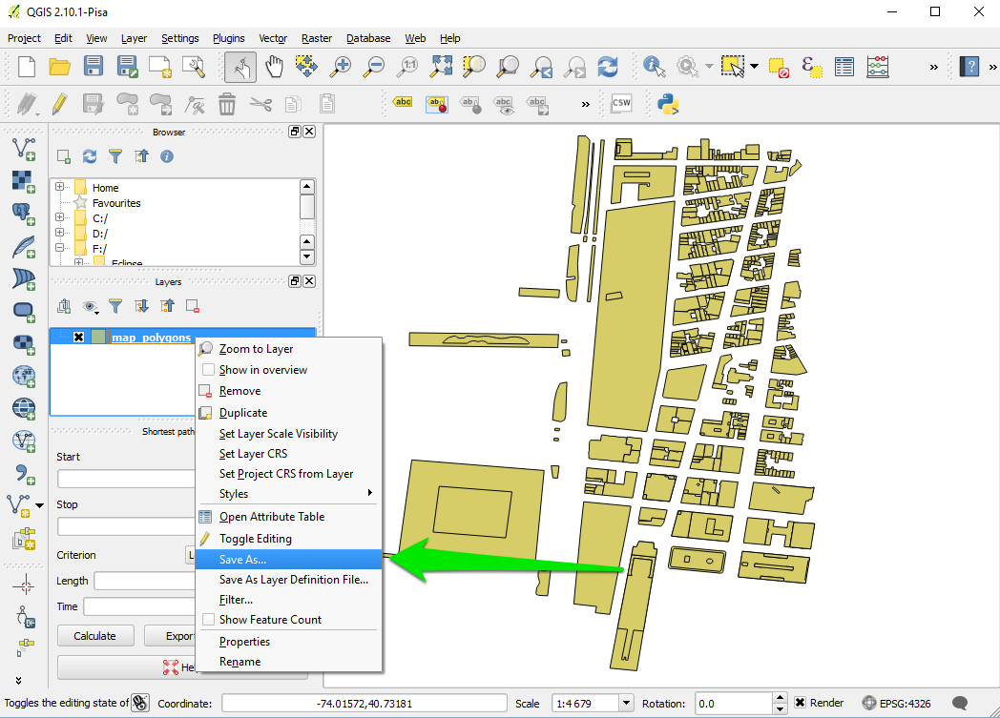

Choose "shapefile" as format, choose a save path and click ok.

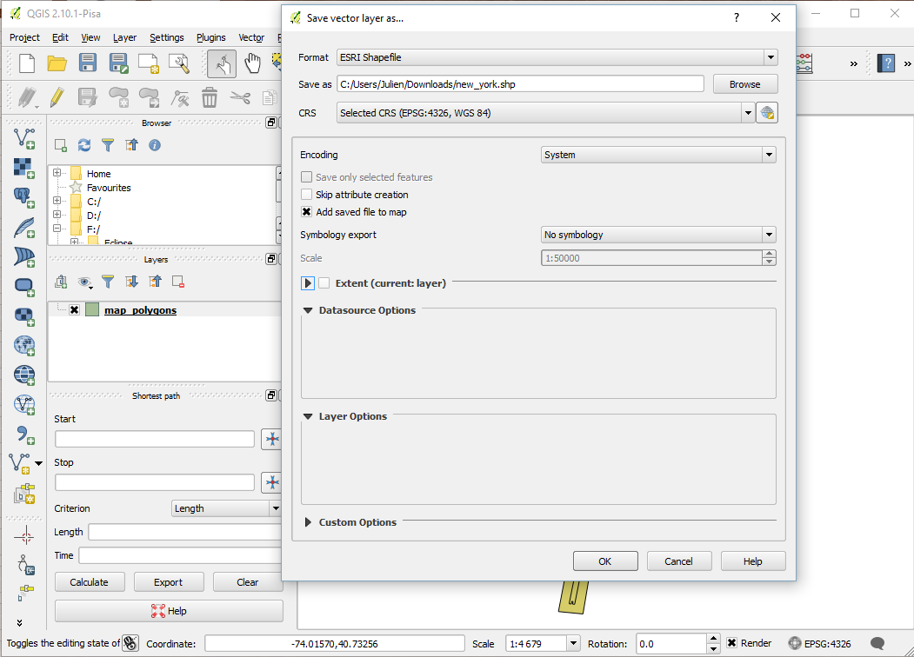

Copy passed all the .shp created in the include folder of your GAMA project. You are now ready to write the model.

[//]: # (keyword|concept_shapefile)
```
model HowToUseOpenStreetMap

global {
	// Global variables related to the Management units	
	file shapeFile <- file('../includes/new_york.shp'); 
	
	//definition of the environment size from the shapefile. 
	//Note that is possible to define it from several files by using: geometry shape <- envelope(envelope(file1) + envelope(file2) + ...);
	geometry shape <- envelope(shapeFile);
	
	init {
		//Creation of elementOfNewYork agents from the shapefile (and reading some of the shapefile attributes)
		create elementOfNewYork from: shapeFile 
			with: [elementId::int(read('id')), elementHeight::int(read('height')), elementColor::string(read('attrForGama'))] ;
    }
}
	
species elementOfNewYork{
	int elementId;
	int elementHeight;
	string elementColor;
	
	aspect basic{
		draw shape color: (elementColor = "blue") ? #blue : ( (elementColor = "red") ? #red : #yellow ) depth: elementHeight;
	}
}	

experiment main type: gui {		
	output {
		display HowToUseOpenStreetMap type:opengl {
	   		species elementOfNewYork aspect: basic; 
		}
	}
}
```

Here is the result, with a special colorization of the different elements regarding to the value of the attribute "attrForGama", and an elevation regarding to the value of the attribute "height".

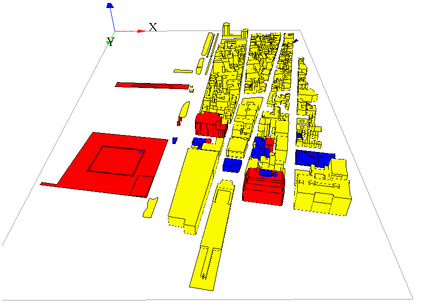

[//]: # (endConcept|use_osm_datas)
