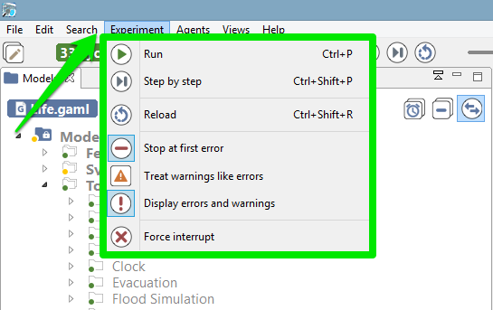
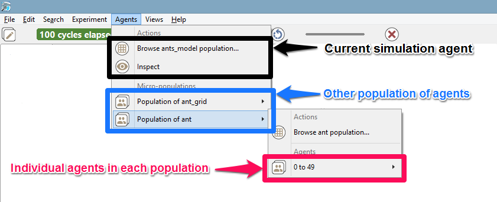
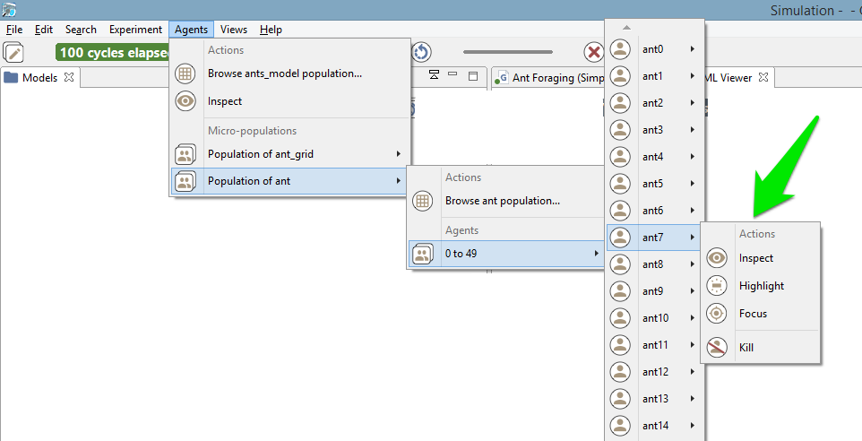
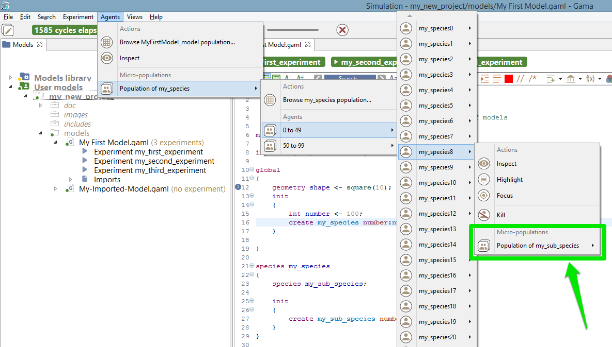
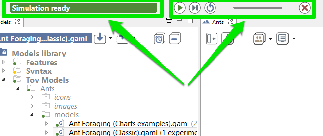
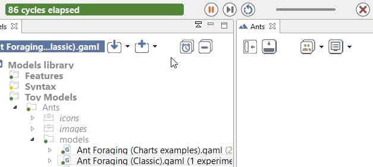
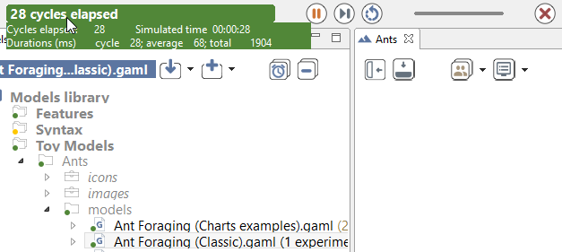
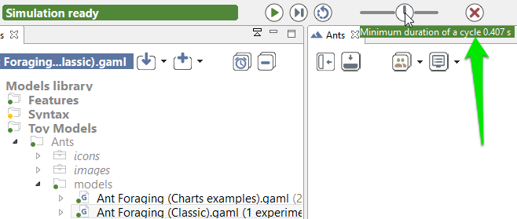

# Menus and Commands

The simulation perspective adds on the user interface a number of new menus and commands (i.e. buttons) that are specific to experiment-related tasks.

## Table of contents 

* [Menus and Commands](#menus-and-commands)
	* [Experiment Menu](#experiment-menu)
	* [Agents Menu](#agents-menu)
	* [General Toolbar](#general-toolbar)

## Experiment Menu
A menu, called "Experiment", allows to control the current experiment. It shares some of its commands with the general toolbar (see [below](#general-toolbar)).

  * **Run/Pause**: allows to run or pause the experiment depending on its current state.
  * **Step by Step**: runs the experiment for one cycle and pauses it after.
  * **Reload**: stops the current experiment, deletes its contents, and reloads it, **taking into account the [parameters values](ParametersView) that might have been changed by the user**.
  * **Stop at first error**: if checked, the current experiment will stop running when an error is issued. The default value can be configured in the [preferences](Preferences).
  * **Treat warnings as errors**: if checked, a warning will be considered as an error (and if the previous item is checked, will stop the experiment). The default value can be configured in the [preferences](Preferences).
  * **Display warnings and errors**: if checked, displays the errors and warnings issued by the experiment. If not, do not display them. The default value can be configured in the [preferences](Preferences).
  * **Force interrupt**: forces the experiment to stop, whatever it is currently doing, purges the memory from it, and switches to the modeling perspective. **Use this command with caution**, as it can have undesirable effects depending on the state of the experiment (for example, if it is reading files, or outputting data, etc.).

## Agents Menu

A second menu is added in the simulation perspective: "Agents". This menu allows for an easy access to the different agents that populate an experiment.

This hierarchical menu is always organized in the same way, whatever the experiment being run. A first level is dedicated to the current simulation agent: it allows to [browse](InspectorsAndMonitors) its population or to inspect the simulation agent itself. Browsing the population will give access to the current experiment agent (the "host" of this population). A second level lists the "micro-populations" present in the simulation agent. And the third level will give access to each individual agent in these populations. This organization is of course recursive: if these agents are themselves hosts of micro-populations, they will be displayed in their individual menu.

Each agent, when selected, will reveal a similar individual menu. This menu will contain a set of predefined actions, [the commands defined by the user for this species](DefiningUserInteraction#define-user-command), if any, and then the micro-populations hosted by this agent, if any. Agents (like the instances of "ant" below) that do not host other agents and whose species has no user commands will have a "simple" individual menu.

These are the 4 actions that will be there most of the time:

  * **Inspect**: open an [inspector](InspectorsAndMonitors) on this agent.
  * **Highlight**: makes this agent the current "highlighted" agent, forcing it to appear "highlighted" in all the displays that might have been defined.
  * **Focus**: this option is not accessible if no displays are defined. Makes the current display zoom on the selected agent (if it is displayed) so that it occupies the whole view.
  * **Kill**: destroys the selected agent and disposes of it. **Use this command with caution**, as it can have undesirable effects if the agent is currently executing its behavior.

If an agent hosts other agents (it is the case in [multi-level architecture](MultiLevelArchitecture)), you can access to the micro-population quite easily: 

If [user commands](DefiningUserInteraction#define-user-command) are defined for a species (for example in the existing model Features/Driving Skill/Road Traffic simple (City)), their individual menu will look like the following:

## General Toolbar

The last piece of user interface specific to the Simulation Perspective is a toolbar, which contains controls and information displays related to the current experiment.

This toolbar is voluntarily minimalist, with three buttons already present in the [experiment menu](#experiment-menu) (namely, "Play/Pause", "Step by Step" and "Reload"), which don't need to be detailed here, and two new controls ("Experiment status" and "Cycle Delay"), which are explained below.

While opening an experiment, the status will display some information about what's going on. For instance, that GAMA is busy instantiating the agents, or opening the displays.

The orange color usually means that, although the experiment is not ready, things are progressing without problems (a red color message is an indication that something went wrong). When the loading of the experiment is finished, GAMA displays the message "Simulation ready" on a green background. If the user runs the simulation, the status changes and displays the number of cycles already elapsed in the simulation currently managed by the experiment.

Hovering over the status produces a more accurate information about the internal clock of the simulation.

From top to bottom of this hover, we find the number of cycles elapsed, the simulated time already elapsed (in the example above, one cycle lasts one second of _simulated time_), the duration of cycle in milliseconds, the average duration of one cycle (computed over the number of cycles elapsed), and the total duration, so far, of the simulation (still in milliseconds).

Although these durations are entirely dependent on the speed of the simulation engine (and, of course, the number of agents, their behaviors, etc.), there is a way to control it partially with the second control, which allows the user to force a minimal duration (in milliseconds) for a cycle, from 0 (its initial position) to 1000. Note that this minimal duration (or delay) will remain the same for the subsequent reloads of the experiment.

In case it is necessary to have more than 1s of delay, it has to be defined, instead, as an attribute of the [experiment](ExperimentBuiltIn).
