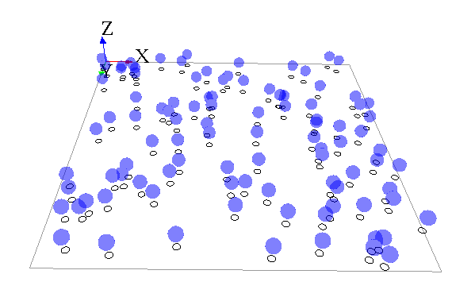

[//]: # (startConcept|mirror_species)
[//]: # (keyword|concept_mirror)
# Mirror species

A mirror species is a species whose population is automatically managed with respect to another species. Whenever an agent is created or destroyed from the other species, an instance of the mirror species is created or destroyed. Each of these 'mirror agents' has access to its reference agent (called its target).
Mirror species can be used in different situations but the one we describe here is more oriented towards visualization purposes.

## Index

* [Declaration](#declaration)
* [Example](#example)

## Declaration

A mirror species can be defined using the `mirrors` keyword as following:

```
species B mirrors: A{
}
```

In this case the species B mirrors the species A.

By default the location of the species B will be random but in many cases, once want to place the mirror agent at the same location of the reference species. This can be achieve by simply adding the following lines in the mirror species : 

```
species B mirrors: A{
    point location <- target.location update: target.location;
}
```

**`target`** is a built-in attribute of a mirror species. It refers to the instance of the species tracked.

In the same spirit any attribute of a reference species can be reach using the same syntax. For instance if the species A has an attribute called `attribute1` of type `int` is is possible to get this attribute from the mirror species B using the following syntax: 

```
int value <- target.attribute1;
```
[//]: # (endConcept|mirror_species)

## Example

To practice a bit with the mirror notion, we will now build a simple model displaying a species A (aspect: white circle) moving randomly, and another species B (aspect: blue sphere) with the species A location on x and y, with an upper value for the z axis.



Here is an example of implementation for this model:

```
model Mirror

global {
  init{
    create A number:100;    
  }
}

species A skills:[moving]{
    reflex update{
        do wander;
    }
    aspect base{
        draw circle(1) color: #white;
    }
}
species B mirrors: A{
    point location <- target.location update: point(target.location.x,target.location.y,target.location.z+5);
    aspect base {
        draw sphere(2) color: #blue;
    }
}

experiment mirroExp type: gui {
    output {
        display superposedView type: opengl{ 
          species A aspect: base;
          species B aspect: base transparency:0.5;
        }
    }
}
```
