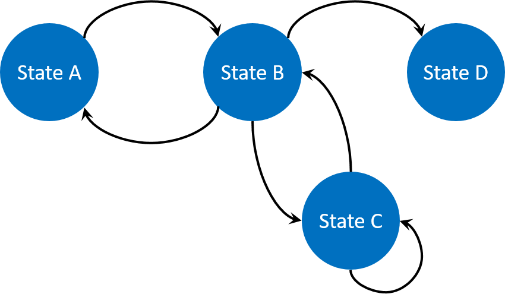

[//]: # (keyword|concept_architecture)
[//]: # (keyword|concept_equation)
# Multi-Paradigm Modeling

[//]: # (keyword|concept_behavior)
Multi-paradigm modeling is a research field focused on how to define a model semantically. From the beginning of this step by step tutorial, our approach is based on [behavior](DefiningActionsAndBehaviors#behaviors) (or reflex), for each agents. In this part, we will see that GAMA provides other ways to implement your model, using several control architectures. Sometime, it will be easier to implement your models choosing other paradigms.

In a first part, we will see how to use some [**control architectures**](ControlArchitecture) which already exist in GAML, such as [finite state machine architecture](ControlArchitecture#finite-state-machine), [task based architecture](ControlArchitecture#task-based) or [user control architecture](#user-control-architecture). In a second part, we will see an other approach, a math approach, through [**equations**](Equations). 
