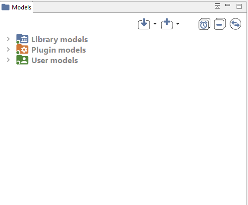
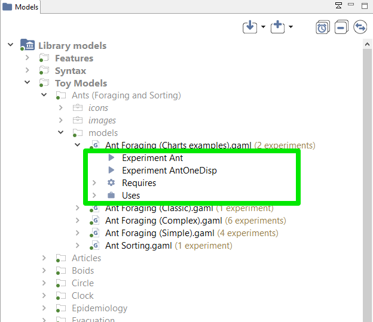
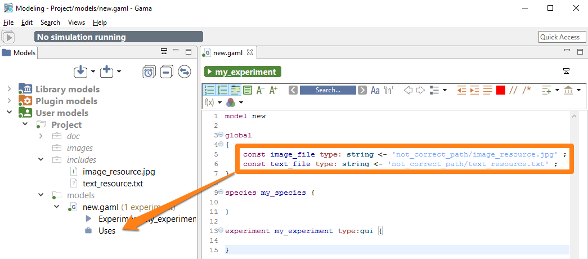
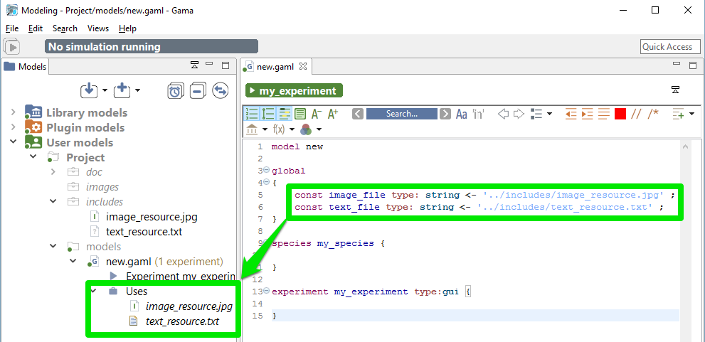

# Navigating in the Workspace

All the models that you edit or run using GAMA are accessible from a central location: the _Navigator_, which is always on the left-hand side of the main window and cannot be closed. This view presents the models currently present in (or linked from) your **workspace**.

## Table of contents 

* [Navigating in the Workspace](#navigating-in-the-workspace)
	* [The Different Categories of Models](#the-different-categories-of-models)
		* [Models library](#models-library)
		* [Plugin models](#plugin-models)
		* [User models](#user-models)
	* [Inspect Models](#inspect-models)
	* [Moving Models Around](#moving-models-around)
	* [Closing and Deleting Projects](#closing-and-deleting-projects)

## The Different Categories of Models

In the _Navigator_, models are organized in three different categories: _Models library_, _Plugin models_, and _User models_. This organization is purely logical and does not reflect where the models are actually stored in the workspace (or elsewhere). Whatever their actual location, model files need to be stored in **projects**, which may contain also other files (called _resources_) necessary for the models to function. A project may of course contain several model files, especially if they are importing each other, if they represent different models on the same topic, or if they share the same resources.

### Models library

This category represents the models that are shipped with each version of GAMA. They do not reside in the workspace, but are considered as _linked_ from it. This link is established every time a new workspace is created. Their actual location is within a plugin (msi.gama.models) of the GAMA application. This category contains four main projects in GAMA 1.6.1, which are further refined in folders and sub-folders that contain model files and resources.

It may happen, in some occasions, that the library of models is not synchronized with the version of GAMA that uses your workspace. This is the case if you use different versions of GAMA to work with the same workspace. In that case, it is required that the library be manually updated. This can be done using the "Update library" item in the contextual menu.

To look up for a particular model in the library, users can use the "Search for file" menu item. A search dialog is then displayed, which allows to look for models by their title (for example, models containing "GIS" in the example below).

### Plugin models

This category represents the models that are related to a specific plugin (additional or integrated by default). The corresponding plugin is shown between parenthesis.

For each projects, you can see the list of plugins needed, and a caption to show you if the plugin is actually installed in your GAMA version or not : green if the plugin is installed, red otherwise.

### User models

This category regroups all the projects that have been [created](GamlEditorGeneralities) or [imported](ImportingModels) in the workspace by the user. Each project is actually a folder that resides in the folder of the workspace (so they can be easily located from within the filesystem). Any modification (addition, removal of files...) made to them in the file system (or using another application) is immediately reflected in the _Navigator_ and vice-versa.

Model files, although it is by no means mandatory, usually reside in a sub-folder of the project called "models".

## Inspect Models

Each models is presented as a node in the navigation workspace, including _Experiment_ buttons and/or _Requires_ node and/or _Uses_ node.

* **Experiment button** : Experiment button are present if your model contains experiments (it is usually the case !). To run the corresponding experiment, just click on it. To learn more about running experiments, jump into this [section](LaunchingExperiments).

* **Require node** : The node _Require_ is present if your model uses some plugins (additional or integrated by default). Each plugin is listed in this node, with a green icon if the plugin is already installed in your GAMA, and a red one if it is not the case. If the plugin you want in not installed, an error will be raised in your model. Please read about [how to install plugins](InstallingPlugins) to learn some more about it.

* **Uses node** : The node _Uses_ is present if your model uses some external resources, *and if the path to the resource is correct* (if the path to the resource is not correct, the resource will not be displayed under _Uses_)

## Moving Models Around
Model files, as well as resources, or even complete projects, can be moved around between the "Models Library"/"Plugin Models" and "Users Models" categories, or within them, directly in the _Navigator_. Drag'n drop operations are supported, as well as copy and paste. For example, the model "Life.gaml", present in the "Models Library", can perfectly be copied and then pasted in a project in the "Users Model". This local copy in the workspace can then be further edited by the user without altering the original one.

## Closing and Deleting Projects
Users can choose to get rid of old projects by either **closing** or **deleting** them. Closing a project means that it will still reside in the workspace (and be still visible, although a bit differently, in the _Navigator_) but its model(s) won't participate to the build process and won't be displayable until the project is opened again.

**Deleting** a project must be invoked when the user wants this project to not appear in the workspace anymore (unless, that is, it is [imported](ImportingModels) again). Invoking this command will effectively make the workspace "forget" about this project, and this can be further doubled with a deletion of the projects resources and models from the filesystem.

