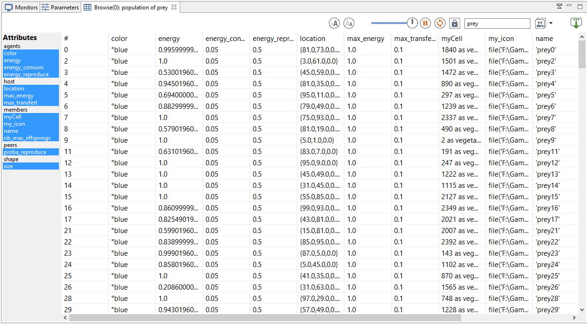

# 4. Inspectors and Monitors
This fourth step Illustrates how to monitor more precisely the simulation. Practically, we will define monitors to follow the evolution of specific variables (or expression) whereas inspector allows to follow the state of a given agent (or a species).


## Formulation
  * Adding of a monitor to follow the evolution of the number of prey agents


## Model Definition

### global variable
We add a new global variable:
  * **nb\_preys** : returns, each time it is called, the current number of (live) prey agents

To do so we use the **->{expression}** facet which returns the value of **expression**, each time it is called..
We use as well the operator **length** that returns the number of elements in a list.

Thus, In the global section, we add the **nb\_preys** global variable:
```
   int nb_preys -> {length (prey)};
```

### monitor
A monitor allows to follow the value of an arbitrary expression in GAML. It has to be defined in an output section. A monitor is defined as follows:
```
      monitor monitor_name value: an_expression refresh:every(nb_steps);
```

With:
  * value: mandatory, its that value will be displayed in the monitor.
  * refresh: bool, optional : if the expression is true, compute (default is true).

In this model, we define a monitor to follow the value of the variable **nb\_preys**:
```
      monitor "number of preys" value: nb_preys;
```

### inspector

Inspectors allow to obtain informations about a species or an agent. There are two kinds of agent information features:
  * Species browser: provides informations about all the agents of a species. Available in the Agents menu.



  * Agent inspector: provides information about one specific agent. Also allows to change the values of its variables during the simulation. Available from the Agents menu, by right\_clicking on a display, in the species inspector or when inspecting another agent. It provides also the possibility to «highlight» the inspected agent.


## Complete Model

```
model prey_predator

global {
	int nb_preys_init <- 200 ;
	float prey_max_energy <- 1.0;
	float prey_max_transfert <- 0.1;
	float prey_energy_consum <- 0.05;
	int nb_preys -> {length (prey)};
	
	init {
		create prey number: nb_preys_init ;
	}
}
species prey {
	float size <- 1.0 ;
	rgb color <- #blue;
	float max_energy <- prey_max_energy ;
	float max_transfert <- prey_max_transfert ;
	float energy_consum <- prey_energy_consum ;
		
	vegetation_cell myCell <- one_of (vegetation_cell) ; 
	float energy <- (rnd(1000) / 1000) * max_energy  update: energy - energy_consum max: max_energy ;
		
	init { 
		location <- myCell.location;
	}
		
	reflex basic_move { 
		myCell <- one_of (myCell.neighbours) ;
		location <- myCell.location ;
	}
	reflex eat when: myCell.food > 0 { 
		float energy_transfert <- min([max_transfert, myCell.food]) ;
		myCell.food <- myCell.food - energy_transfert ;
		energy <- energy + energy_transfert ;
	}
	reflex die when: energy <= 0 {
		do die ;
	}

	aspect base {
		draw circle(size) color: color ;
	}
}

grid vegetation_cell width: 50 height: 50 neighbours: 4 {
	float maxFood <- 1.0 ;
	float foodProd <- (rnd(1000) / 1000) * 0.01 ;
	float food <- (rnd(1000) / 1000) max: maxFood update: food + foodProd ;
	rgb color <- rgb(int(255 * (1 - food)), 255, int(255 * (1 - food))) update: rgb(int(255 * (1 - food)), 255, int(255 *(1 - food))) ;
	list<vegetation_cell> neighbours  <- (self neighbours_at 2);
}

experiment prey_predator type: gui {
	parameter "Initial number of preys: " var: nb_preys_init min: 1 max: 1000 category: "Prey" ;
	parameter "Prey max energy: " var: prey_max_energy category: "Prey" ;
	parameter "Prey max transfert: " var: prey_max_transfert  category: "Prey" ;
	parameter "Prey energy consumption: " var: prey_energy_consum  category: "Prey" ;
	output {
		display main_display {
			grid vegetation_cell lines: #black ;
			species prey aspect: base ;
		}
		monitor "Number of preys" value: nb_preys ;
	}
}
```
