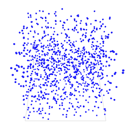

# 1. Basic Model


In this first step, we will see how to define a 3D environment and populate it.


## Formulation
Initialize a 3D world with a population of cells placed randomly in a 3D 100x100x100 cube.
  * Definition of the **cells** species
  * Definition of the **nb\_cells** parameter
  * Creation of **nb\_cells** **cells** agents randomly located in the 3D environment size: 100x100x100.





## Model Definition

In this model we define one species of agent: the **cells** agents. The agents will be just displayed as a blue sphere of radius 1.

```
species cells{                      
  aspect default {
    draw sphere(1) color:#blue;   
  }
}
```

### Global Section

#### Global variable

Definition of a global variable **nb\_cells** of type _int_ representing the number of **cells** agents.

```
global {
   int nb_cells <-100;
}
```

#### Model initialization

Definition of the init block in order to create _nb\_cells_ **cells** agents. By default an agent is created with a random location in x and y, and a z value equal to 0. In our case we want to place the **cells** randomly in the 3D environment so we set a random value for _x_, _y_ and _z_.

```
create cells number: nb_cells {
  location <- {rnd(100), rnd(100), rnd(100)};
}
```


### Experiment

In our model, we define a basic gui experiment called _Tuto3D_ :
```
experiment Tuto3D type: gui {
}
```

#### Input
Definition of a parameter from the the global variable _nb\_cells_ :
```
experiment Tuto3D type: gui {
   parameter "Initial number of cells: " var: nb_cells min: 1 max: 1000 category: "Cells";	
}
```

#### Output

In our model, we define a display to draw the **cells** agents in a 3D environment.
```
output {
  display View1 type:opengl {
    species cells;
  }
}
```


## Complete Model

This model is available in the model library (under Tutorials > 3D) and the GIT version of the model can be found here [Model 01.gaml](https://github.com/gama-platform/gama/tree/master/msi.gama.models/models/Tutorials/3D/models/Model 01.gaml)

```
model Tuto3D

global {
  int nb_cells <-100;	
  init { 
    create cells number: nb_cells { 
      location <- {rnd(100), rnd(100), rnd(100)};       
    } 
  }  
} 
  
species cells{                      
  aspect default {
    draw sphere(1) color:#blue;   
  }
}

experiment Tuto3D  type: gui {
  parameter "Initial number of cells: " var: nb_cells min: 1 max: 1000 category: "Cells" ;	
  output {
    display View1 type:opengl {
      species cells;
    }
  }
}
```
