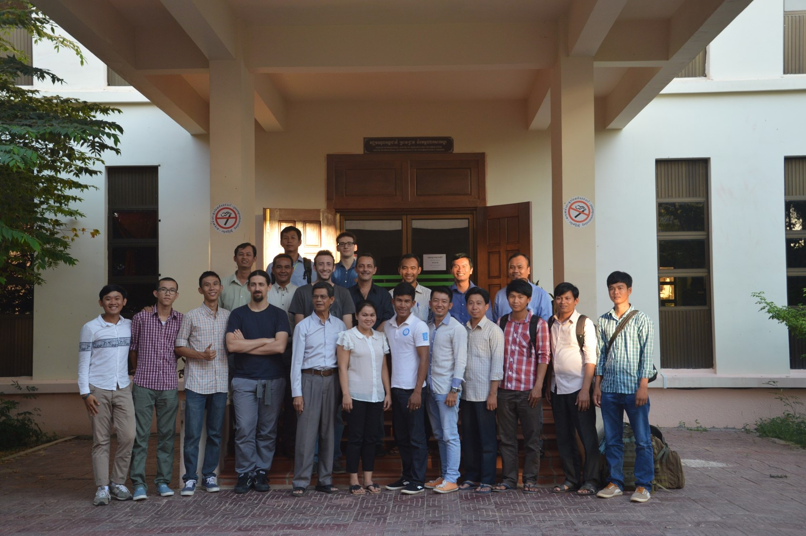
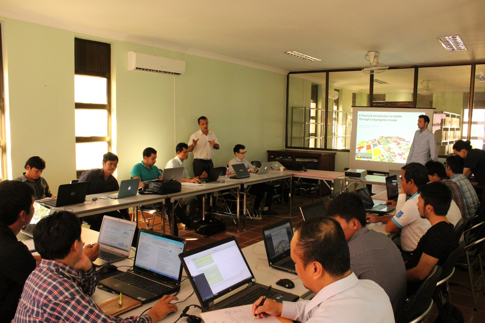
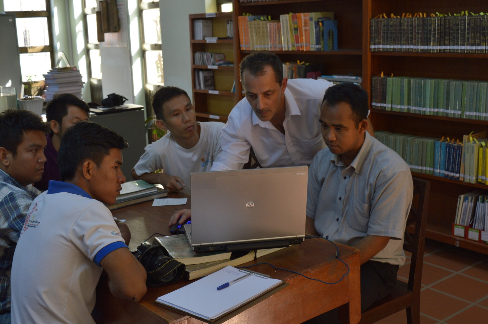

# Training Session

## Modeling for supporting decision in urban management issues

**_7-11 December 2015 - Siem Reap (Cambodia)_**

This training session took place at the Apsara Authorities, where we introduced how to build a model with agent-based approach, using GAMA. In a new and very fast growing city such as Siem Reap, some measures have to be taken to anticipate the future of the city, and modeling is a science that can give some solutions to face those problems.

The training session was divided into 2 parts :
* A theoretical part (3 days) dealing with the following subjects :
  * Urban issues and introduction to Agent-Based Modeling
  * Presentation of the modeling methodology
  * Introduction to GAMA with a model on urban segregation
  * GIS datas and graphs to model urban mobility
  * GIS, Raster datas and graphs to model urban growth
  * Use of experiments to calibrate and explore models
* A practical part (2 days) to build a model about urban mobility in Siem Reap (by groups of 4/5 people)

|||
|---|---|

Trainers : Drogoul Alexis, Gaudou Benoit, Trung Quang, Philippon Damien, Mazars Julien.

[Here the link to download the different projects](notDoneYet) (Gama version : 1.61)

## A Glance at Sustainable Urban Development (JTD)

**_July 2014 - Da lat (Vietnam)_**

The JTD ([Journées de Tam Dao](http://www.tamdaoconf.com/)) is an annual gathering of french-talkers researchers during the summer for one week, dealing with a specific subject related to sustainable development. For this 8th JTD, the topic was about sustainable urban development, and a workshop has been made especially about how to use tools as GAMA to build models in order to explore and understand urban spatial dynamics.

Trainers : Drogoul Alexis, Banos Arnaud, Huỳnh Quang Nghi, Trương Chí Quang, Võ Đức Ân.

Here is the link to download the pdf report of the JTD 2014 : https://drive.google.com/file/d/0B2Go6pohIhQcbERhczZRd253UUU/view.

## The perception and Management of Risk (JTD)

**_July 2013 - Da lat (Vietnam)_**

The JTD ([Journées de Tam Dao](http://www.tamdaoconf.com/)) is an annual gathering of french-talkers researchers during the summer for one week, dealing with a specific subject related to sustainable development. For this 7th JTD, the topic was about the perception and management of risks, and a workshop has been made especially about how to use tools as GAMA to build models in order to understand past crises to better understand the present.

Trainers : Alexis Drogoul, Benoit Gaudou, Nasser Gasmi, Arnaud Grignard, Patrick Taillandier, Olivier Tessier, Võ Đức Ân

Here is the link to download the pdf report of the JTD 2013 : https://drive.google.com/file/d/0B2Go6pohIhQcNXFwVllHd2pFdlk/view.

## Water and its many Issues (JTD)

**_July 2012 - Vietnam_**

The JTD ([Journées de Tam Dao](http://www.tamdaoconf.com/)) is an annual gathering of french-talkers researchers during the summer for one week, dealing with a specific subject related to sustainable development. For this 6th JTD, the topic was about the perception and management of risks, and a workshop has been made especially about how to use tools as GAMA to build models with an agent-based approach.

Trainers : Alexis Drogoul, Benoit Gaudou, Arnaud Grignard, Patrick Taillandier, Vỗ Đức Ân

Here is the link to download the pdf report of the JTD 2012 : https://docs.google.com/file/d/0B2Go6pohIhQcUWRKU2hPelNqQmc/view.
