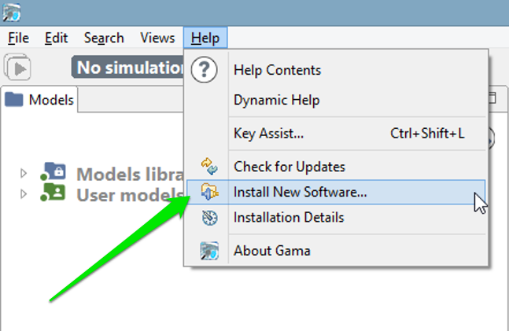
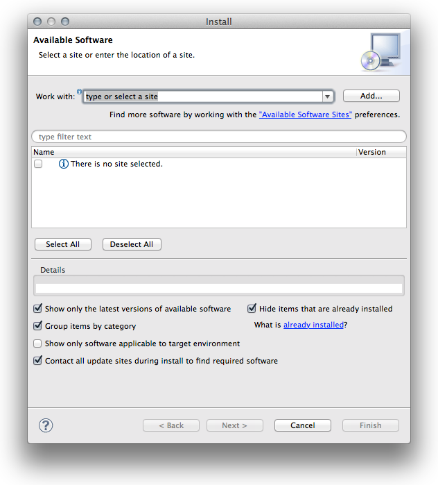
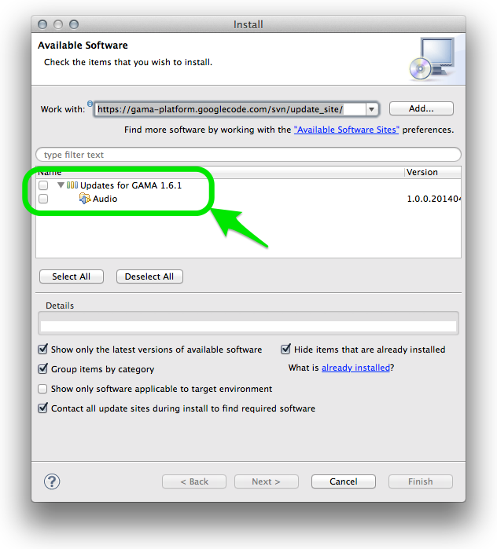
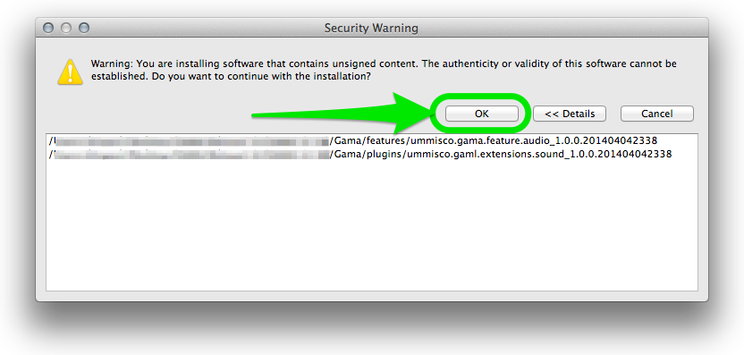

# Updating GAMA

Unless you are using the version of GAMA built from the sources available in the GIT repository of the project (see [here](InstallingGitVersion)), you are normally running a specific **release** of GAMA that sports a given **version number** (e.g. GAMA 1.6.1, GAMA 1.7, etc.). When new features were developed, or when serious issues were fixed, the release you had on your disk, prior to GAMA 1.6.1, could not benefit from them. Since this version, however, GAMA has been enhanced to support a _self\_update_ mechanism, which allows to import from the GAMA update site additional plugins (offering new features) or updated versions of the plugins that constitute the core of GAMA.

## Table of contents 

* [Updating GAMA](#updating-gama)
	* [Manual Update](#manual-update)
	* [Automatic Update](#automatic-update)


## Manual Update
To activate this feature, you have to invoke the "Check for Updates" or "Install New Software..." menu commands in the "Help" menu.

The first one will only check if the existing plugins have any updates available, while the second will, in addition, scan the update site to detect any new plugins that might be added to the current installation.



In general, it is preferable to use the second command, as more options (including that of _desinstalling_ some plugins) are provided. Once invoked, it makes the following dialog appear:



GAMA expects the user to enter a so-called _update site_. You can copy and paste the following line (or choose it from the drop-down menu as this address is built inside GAMA):
```
http://updates.gama-platform.org
```

GAMA will then scan the entire update site, looking both for new plugins (the example below) and updates to existing plugins. The list available in your installation will of course be different from the one displayed here.



Choose the ones you want to install (or update) and click "Next...". A summary page will appear, indicating which plugins will actually be installed (since some plugins might require additional plugins to run properly), followed by a license page that you have to accept. GAMA will then proceed to the installation (that can be cancelled any time) of the plugins chosen.

During the course of the installation, you might receive the following warning, that you can dismiss by clicking "OK".



Once the plugins are installed, GAMA will ask you whether you want to restart or not. It is always safer to do so, so select "Yes" and let it close by itself, register the new plugins and restart.


## Automatic Update
GAMA offers a mechanism to monitor the availability of updates to the plugins already installed. To install this feature, [open the preferences of GAMA](Preferences) and choose the button "Advanced...", which gives access to additional preferences.


In the dialog that appears, navigate to "Install/Update > Automatic Updates". Then, enable the option using the check-box on the top of the dialog and choose the best settings for your workflow. Clicking on "OK" will save these preferences and dismiss the dialog.


From now on, GAMA will continuously support you in having an up-to-date version of the platform, provided you accept the updates.
