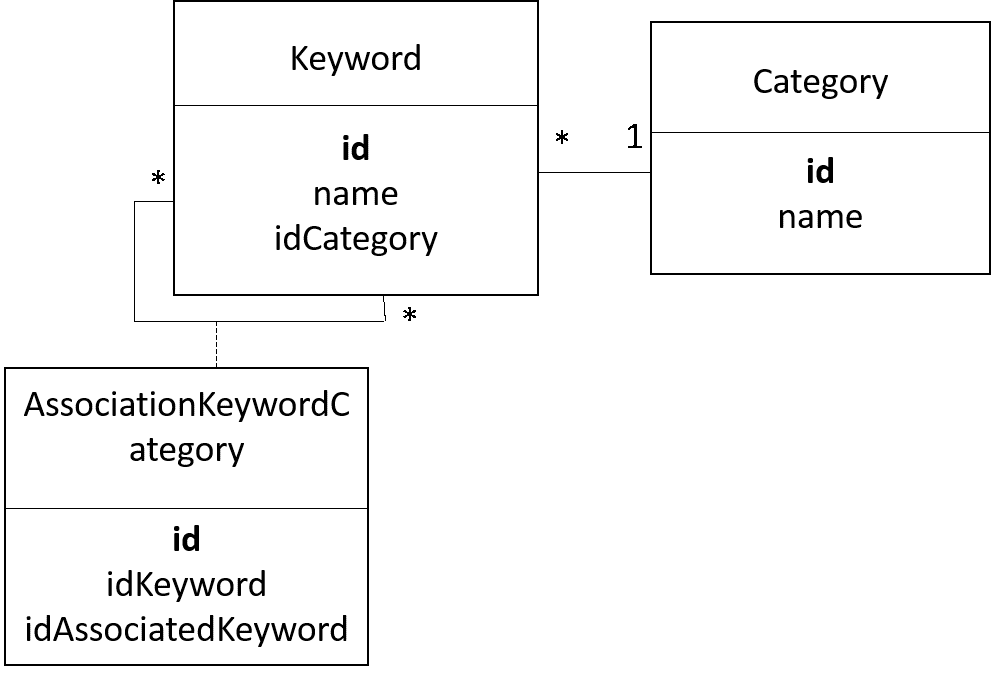
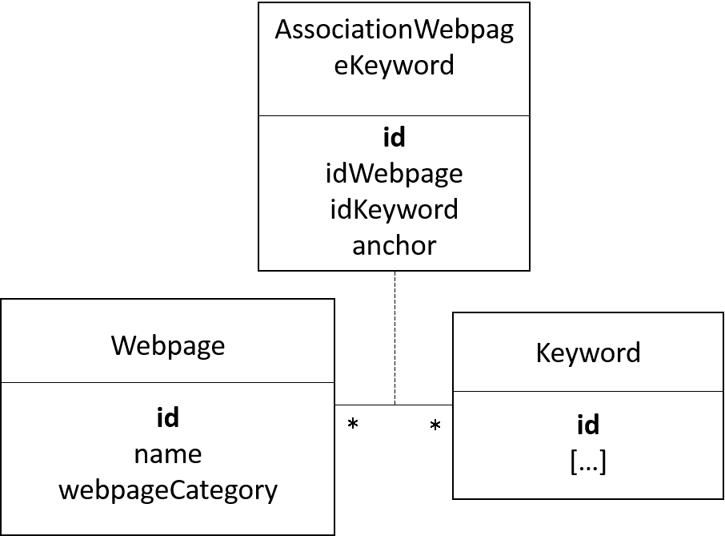

# How to write the Website Content

In this page, we will explain all about the convention we use to write and generate the website content and the wiki content.
Since the release of GAMA 1.7, with the new GAMA website, we have two contents:
* The _wiki_ content is hosted in github, witch directly interpret the markdown format of the files to display them in a proper way. This wiki, since it is a wiki, can be edited by any user. It is then, in constant changes.
* The _website_ content is the content of the real GAMA website. It is a verified and fixed version of the documentation (usually a re-generation of the website content is done when there is a new release of the software)

## Index

* [Requirements](#requirements)
* [gama.wiki tree structure](#gamawiki-tree-structure)
* [Good practices when writing markdown files](#good-practices-when-writing-markdown-files)
  * [Title](#title)
  * [Hypertext Links](#hypertext-links)
  * [Images Links](#images-links)
  * [Insert Metadatas](#insert-metadatas)
* [Website Generation Workflow](#website-generation-workflow)
  * [Website Database](#website-database)
  * [Loading the Database](#loading-the-database)
* [Manage concepts keywords](#manage-concepts-keywords)

## Requirements

To generate automatically the documentation, the GAMA Git version is required. See [Install Git version](InstallingGitVersion) for more details.

Among all the GAMA plugins, only one is related to documentation generation:
* `msi.gama.documentation`: it contains some useful java scripts to help you to write a correct documentation.

In addition, the folder containing the wiki files is required. In the GitHub architecture, the wiki documentation is stored in a separate Git repository `https://github.com/gama-platform/gama.wiki.git`. A local clone of this repository should thus be created:
1. Open the Git perspective:
  * Windows > Open Perspective > Other...
  * Choose `Git`
2. Click on "Clone a Git repository"
  * In **Source Git repository** window: 
    * Fill in the URI label with: `https://github.com/gama-platform/gama.wiki.git`
    * Other fields will be automatically filled in.
  * In **Branch Selection** windows, 
    * check the master branch 
    * Next
  * In **Local Destination** windows,
    * Choose the directory in which the gama Git repository has been cloned
    * Everything else should be unchecked 
    * Finish
3. In the **Git perspective** and the **Git Repositories** view, Right-Click on "Working Directory" inside the `gama.wiki` repository, and choose "Import projects"
  * In the **Select a wizard to use for importing projects** window:
    * "Import existing projects" should be checked
    * "Working Directory" should be selected
  * In **Import Projects** window:
    * **Uncheck « Search for nested project »**
    * Check the project `gama.wiki`
    * Finish
2. Go back to the Java perspective: a `gama.wiki` plugin should have been added.

## gama.wiki tree structure

The "gama.wiki" plugin contains all the wiki content, and almost all the website content. It contains a folder content which contains the following folders:
* Tutorials
  * LearnGAMLStepByStep: contains the linear documentation to learn about the concepts of GAML
  * Recipes: contains short pieces of documentation answering a specific problematic
  * Tutorials: contains applicative tutorials 
* References
  * ModelLibrary: contains the model library (only present in the website) 
  * PlatformDocumentation: contains the documentation dealing with how to use the platform
  * GAMLReferences: contains GAML references
  * PluginDocumentation: contains the documentation of the additional plugins
* Community
  * Projects: contains a presentation of the projects where GAMA is involved (only present in the website)
  * Training: contains a presentation of the training sessions organized by the GAMA team (only present in the website)
* WikiOnly: contains the content only present in the wiki, and not in the website
  * DevelopingExtensions: contains explanations about how to extend the platform
* resources: contains all the additional resources needed (images, pdf...)

For the rest of this document, the highest level of tree structure ("Tutorials"/"References"/"Community"/"WikiOnly") will be named as **tabs**. The level just under will be named as **sections**, and the level under will be named as **sub-section**.
All this content is written using the markdown format.
All the images resources are included in the _resources/images_ folder. They are actually under different sub-folders. From the markdown page, you can call the resource with the relative path `resource/images/sub_folder/image_name.png`.
If a _section_/_sub-section_ contains one of several sub-division, then those sub-divisions will be stored in a folder with the name of the corresponding _section_/_sub-section_, and this _section_/_sub-section_ folder will be associated with a markdown file with the same name (indeed, a _section_/_sub-section_ has its own page).
If a _section_/_sub-section_ has no sub-division, then this _section_/_sub-section_ is simply defined with a markdown file containing the content wanted.

 

Notice that there is some content which is present only in the wiki (the "WikiOnly" content), some content present only in the website (the model library, most of the community content...). In fact, the wiki tree structure is determined by the file _Sidebar, while the website tree structure is determined by the file _WebsiteTreeStructure_.

## Good practices when writing markdown files

### Title

Each markdown files **has to** start with a title in the markdown format (like `# title`). This is this title which will be displayed in the tree structure of the website.

### Hypertext Links

Even if the repository how have a more complexe tree structure, you don't have to (and you must not !) speficy the relative or absolute path to the target page, just naming the page will work : `[text_displayed](the_name_of_the_md_file)`

### Images Links

As already said in the [previous paragraph](#gamawiki-tree-structure), images have to be in an "resources/images/folder_name" folder next to your md file, so that you can write the relative path more easily.

### Insert Metadatas

Metadatas in content files are written as comments, with the following syntax:

```
[//]: # (name_of_the_medatada|value_of_the_metadata)
```

Medatadas are not displayed in the wiki and the website content. For the website generation, metadatas are used in order to build the database, most of all to manage the search engine, and the learning graph.

Here is the list of metadata we use in the content files:

* **keyword** : will write an invisible anchor in this exact place in the website. When the user will do a research about this word, he can access directly to this anchor.

* **startConcept**/**endConcept** : used to delimit a concept. The value of those two metadatas is the name of the concept. All the concepts are listed in the file "DependencyGraph", in the content folder in your wiki repository.

#### keyword

The value of the keyword has to have this structure : keyword_category_keyword_name (indeed, several keywords can have the same name ! The type of the keyword has to be specified).
Here is the list of the several keyword categories : concept, operator, statement, species, architecture, type, constant and skill.
Example of metadata : `[//]: # (keyword|concept_3D)`, or `[//]: # (keyword|operator_int)`.

#### startConcept/endConcept

The value of the keyword have to be one of the values defined in the file learningConcept.xml.

Notice that a _concept_ in the meaning of keyword is not the same as a _concept_ (or _learning concept_) in the learning graph ! 
Please read the part concerning the database to learn more about it.

## Website generation workflow

_This part is not implemented yet, it is under construction._


### The gama.documentation plugin

This plugin is used to [generate GAML documentation automatically in the markdown format](Documentation), and copy paste the content to the wiki folder.
The plugin is also used to generate the model library in the markdown format, with the source code, a quick description, and an image (screenshot). In the same time, the plugin generates a html page (an "abstract") and put it directly in the model folder (in order to be loaded directly from GAMA).

The documentation plugin contains also 2 other scripts which helps to create content:

#### learningGraphDatabaseGenerator

The **learningGraphDatabaseGenerator** script is used to generate the "_nodesDatabase.js_" file, which is read to visualize the learning graph. This script needs the "learningGraph.xml" file as input. Each learning concepts has an id, a name, a very short description, a position (position in x and y in %, between 0 and 1. This value is then multiplied by the **coeff** in the learningGraphDatabaseGenerator), and a list of prerequisite learning concepts. A category of learning concept (also defined in the learningGraph.xml file) has an id, a position (position in x and y), a position for the hallow (position in x and y of the big circle displayed when a category is selected), a size for the hallow, a color, a name, and the list of learningConcept associated.

#### modelLibraryGenerator

The **modelLibraryGenerator** script is used to generate all the markdown files of the model library. This script

* Parse all the models of the model library, and build an "input" xml file for a headless execution (this file is deleted at the end of the execution).
  * By default, this will ask to execute all the experiments for each model, and take a screenshot of the 10th cycle for each display.
  * You can change this default behavior by changing the file "**modelScreenshot.xml**", in the wiki repo (see description below)
* Execute the headless
* Copy-paste all the generated images in the write folder, with the write names.
* Browse a second time all the models, build the md file, including the screenshot computed from the headless execution, and analyzing the header of each model to extract the title, author and tags. Each md files respects the following format : path_from_model_with_underscore_instead_of_slash_without_strange_char + ".md". (ex : "Features/3D/3D Visualization/models/3D camera and trajectories.gaml" becomes "Features_3D_Visualization_models_3D_camera_and_trajectories.md".)

Format of the xml file to "tune up" the screenshot generation :
```
<xmlFile>
  <experiment id="name_of_the_file_without_extention"+" "+"model_name"+" "+"experiment_name">
    <display name="display_name_1" cycle_number="number_of_the_cycle_for_the_screenshot"/>
    <display name="display_name_2" cycle_number="number_of_the_cycle_for_the_screenshot"/>
  </experiment>
</xmlFile>
```

_TODO_

### The gama.wiki repository

This repository contains in on hand the content auto generated by the documentation plugin, and in the other hand a handmade content. All the content is in the markdown format, organized through a [specific tree structure](#gamawiki-tree-structure), sometime containing [metadatas](#metadatas).

### The website repository

This repository contains:
* A copy of the content of the wiki repo (copy/pasted manually to freeze a specific commit of the wiki)
* A Database management system
* A script used to interpret the metadatas from the content, in order to load the database
* Some pages which are not in the wiki repo, and some heavy resources (such as videos)


### Website database


#### Keyword

A **keyword** is a keyword that can be used for search, either manually (the user enters the wanted keyword in the searchbar of the website) or automatically (through the search tab in the navigation panel)
A keyword in attached with a category (among the following names : concept, type, operator, statement, species, architecture, constant, action, attribute, skill, facet).

* A keyword that is a **_concept_** can be linked with other keywords (ex : the keyword "BDI" will be linked with the keywords "eval_when", "get_priority"...)
* A keyword that is a **_facet_** is linked to a **_statement_** or a **_species_** keyword (ex : the keyword "torus" will be linked with the keyword "global").
* A keyword that is an **_action_** or an **_attribute_** is linked either to a **_skill_** keyword (if it is actually an action or an attribute of a skill), an **_architecture_** keyword (if it is an action or a behavior of an architecture), or a **_species_** keyword (if it is a built-in action or attribute).
* A keyword that is a **_statement_** can be linked to an **_architecture_**.

A keyword is composed of:
* **id** (unique id)
* **name** (the word which is searched by the user)
* **idCategory** (id of the category)

A cagegory is composed of:
* **id** (unique id)
* **name** (the name of the category)



#### Alias

An other database is used to join an **alias** to an existing keyword. Ex : the word "alias" will be changed as "die".

An alias is composed of:
* **id** (unique id)
* **name** (name of the alias. ex : "kill")
* **attachedKeywordName** (name of the keyword attached. ex : "die")

Note that an alias does not know the id of the keyword, but only the name of the attached keyword(s). Indeed, the alias "integer" will give the keyword name "int", but several keywords correspond to the keyword name "int" (it can be the type "int", or the cast operator "int")


#### Webpage

A **webpage** can be either a page of the model library, a page of the gaml reference, or an other page of the documentation.

A webpage is composed of:
* **id** (unique id)
* **name** (name of the webpage)
* **webpageCategory** (the name of the category of the webpage, a value among _modelPage_, _docPage_, gamlRefPage_).

The tables **webpage** and **keyword** are linked through an association table. This association table contains also an anchor (an anchor has an unique value) to the wanted paged.



Note that only the keywords which have the category _concept_, _species_, _type_, _operator_, _skill_ and _constant_ can be attached to a webpage. 

The keywords which have the category _action_, _attribute_ and _facet_ forward to the attached keyword.

The keywords which have the category _statement_ are attached to a webpage only if they are not attached to another keyword. If they are attached to another keyword (an _architecture_ keyword), then the _statement_ keyword forward to the attached keyword.

#### LearningConcept

**LearningConcept** is used to build the learning graph (notice that a "learning concept" and a "keyword concept" is not the same thing !)

A LearningConcept is composed with:

* **id** (unique id)
* **name** (name of the learning concept)

A LearningConcept is linked to a webpage through an association table. This table is composed also with two anchors that are used to delimit the position of the learning concept in a page (the beginning position and the ending position).

A LearningConcept can be associated to other LearningConcepts through an association table, used to spefify the "prerequisite concepts".


### Loading the Database

The database is loaded from a gathering of independent files. Some of those files are handmade written, other are generated automatically.

#### Role of the documentation generation script in the construction of the database

As explained in the explication of the [documentation generation pages](Documentation), the documentation generation script is used to generate the gaml references and the model library pages (in the markdown format with metadatas), but also to build two files **category.txt** and **keyword.xml**.

The file **category.txt** is a very simple file, listing the different keyword categories. This file will be used to build the **Category** table.

Format of the file:
```
concept, type, statement, species, architecture, operator, skill, constant, action, attribute, facet
```

The file **keyword.xml** is an xml file that contains all the possible keywords (all except some keywords written manually directly in the documentation pages). The GAML words can be found directly using the code of GAMA. The concept words can be found using the code of GAMA (thanks to the tag "category") and also by using the tags in the header of the model files. This xml file will be used to build the **Keyword** and the **AssociationKeywordCategory** tables.

Format of the file:
```
<keyword id:keywordname_keywordcategory>
  <name>keywordname</name>
  <category>keywordcategory</category>
  <associatedKeywordList>
    <associatedKeyword>keywordId1</associatedKeyword>
    <associatedKeyword>keywordId2</associatedKeyword>
  </associatedKeywordList>
</keyword>
```

Note that:
* The list associatedKeywordList contains only one element for the _facet_ keywords, one of no element for the _action_ or _attribute_ keywords (none when the action/attribute is a built-in), several or no elements for the _concept_ keywords, and none for the other type of keywords.

* The id is build with the value of the attribute "name" and with the value of the attribute "category" for every keywords except the _statement_, _facet_, _action_ and _attribute_ keywords, which need also the value of the associatedKeyword linked. Ex : the id of the facet "torus" will be "facet_torus_statement_global".

#### Preparation of the repository before the generation of the database

After the generation of the markdown content in the wiki repository, two other files have to be built manually : the files **alias.txt** and **learningConcept.xml**.

The **alias.txt** file contains all the connexions between alias and keyword name. It will be used to build the **Alias** table.

Format of the file :
```
aliasName1:remplacedWord1
aliasName2:remplacedWord2
kill:die
```

The **learningConcept.xml** file is used to list the learning concepts, and to connect them to their prerequisite concepts. It will be used to build the **LearningConcept** and the **AssociationLearningConcept** tables.

Format of the file :
```
<learningConcept id:learningConceptName>
  <name>learningConceptName</name>
  <prerequisiteList>
    <prerequisite>learningConcept1</prerequisite>
    <prerequisite>learningConcept2...</prerequisite>
  </prerequisiteList>
</learningConcept>
```
Note that the value of the attribute "name" can be used as an unique id.

#### Role of the website content generation script in the construction of the database

After copy-paste the content to the website folder, a script is used to build the database and to generate website content.

The **Category**, **Alias**, **LearningConcept** and **AssociationLearningConcept** tables are loaded easily from the files **category.txt**, **alias.txt**, and **learningConcept.xml**.

The **Keyword** and **AssociationKeywordCategory** tables are loaded from the **keyword.xml** file. Note that those two tables are not entirely loaded yet, because other keywords can be presents in the header of other files.

The markdown files are converted one by one into html format.

* When a metadata **startConcept**/**endConcept** is found (syntax : [//]: # (beginAnchor|name_of_learning_concept)), the metadata is replaced with an anchor in the page (with an unique id), and the **AssociationWebpageConcept** table is updated.
* When a metadata **keyword** is found (syntax :  [//]: # (keyword|name_of_keyword_category_name_of_keyword)), the metadata is replaced with an anchor in the page (with an unique id), and the **AssociationWebpageKeyword** table is updated (the **Keyword** and **AssociationKeywordCategory** are updated if the keyword does not exist yet in the table).

## Manage concepts keywords

**ALL** the concepts must be declared in the "IConcept" java class. If you want to add a new concept, please check before if your the concept you want to add cannot be remplaced by one of the existing concept. If it is the case, you can add your word as if it was an **alias**, pointing to the existing concept. Note that all the alias are listed in the alias.txt file. If you realy think that the concept has to be added, please add it to the IConcept file, and also to (one or several) of the lists _CONCEPTS_NOT_FOR_GAML_REF_, _CONCEPTS_NOT_FOR_MODEL_LIBRARY_, _CONCEPTS_DEDICATED_TO_SYNTAX_ in the ConceptManager class if needed.

Most of the keywords of the website (used for the search) are managed automatically. But the "concepts" keywords have to be (partially) hand-made managed. You can add the concepts with 3 differents methods :

### In the Documentation
"Documentation" here designs all the content manually written in the wiki. All those pages can contain "concepts" through the metadata format :

`[//]: # (keyword|concept_name_of_concept)`

You can either :
- place those metadatas anywhere in the page if you want to point directly in this part of the page if the user makes a search
- place those metadatas **above the title** : doing this, the "automatic search" (left navigation panel) will be made with this concept. You have to be really sure this concept is the **main** concept of the page to place it there.

### In the Model library
Directly from the gaml files of the model library, you can add the concept you want through the "Tags" in the header of the model.

Exemple :

```
/**
* Name: 3D Display model of differents shapes and a special Object
* Author: 
* Description: Model presenting a 3D display of differents shapes (pyramid, cone, cylinder, sphere and a teapot object) to represent the same agents but with
*       different aspects. Five experiments are possible, one for each of the shapes presented previously. In each experiment, the agents move to create a big circle but flee
*       from their closest neighbour. 
* Tags: 3d, shape, neighbors
*/
```

Note that if you don't want this model to have a page in the website, you can name it starting with the character `_`.

### In the GAML References
You can add a concept to a gaml word by using the syntax `concept = { IConcept.MY_CONCEPT }`.

Exemple :

```
@operator(value = "flip",
	concept = { IConcept.RANDOM }
```

___________________________________________________________


_The following text has been automatically generated from "mainCheckConcepts"_

______________ _last update : 2018/06/29 03:27:38_

**List of concepts to use for model library (except Syntax):**

3d, agent_location, agent_movement, algorithm, architecture, asc, batch, bdi, camera, chart, clustering, color, communication, comodel, comparison, csv, database, date, dem, dgs, diffusion, dxf, edge, elevation, equation, fipa, fsm, geometry, gis, gml, graph, graph_weight, graphic, grid, gui, headless, hydrology, image, inheritance, inspector, light, load_file, math, mirror, monitor, multi_criteria, multi_level, multi_simulation, neighbors, network, nil, node, obj, obstacle, osm, overlay, physics_engine, r, raster, regression, save_file, scheduler, serialize, shape, shapefile, shortest_path, skill, sound, spatial_computation, spatial_relation, spatial_transformation, sport, statistic, svg, system, task_based, test, text, texture, tif, topology, transport, txt, xml

**List of concepts to use exclusively in Syntax models:**

arithmetic, attribute, cast, condition, container, filter, list, logical, loop, map, matrix, string, ternary

**List of concepts to use for GAML worlds:**

3d, action, agent_location, agent_movement, algorithm, architecture, arithmetic, asc, attribute, batch, bdi, behavior, camera, cast, chart, clustering, color, communication, comodel, comparison, condition, constant, container, csv, cycle, database, date, dem, dgs, diffusion, dimension, display, dxf, edge, elevation, equation, experiment, file, filter, fipa, fsm, geometry, gis, gml, graph, graph_weight, graphic, graphic_unit, grid, gui, headless, hydrology, image, inspector, length_unit, light, list, load_file, logical, loop, map, math, matrix, mirror, monitor, multi_criteria, multi_level, multi_simulation, neighbors, network, nil, node, obj, obstacle, optimization, osm, overlay, parameter, physics_engine, point, r, random, random_operator, raster, regression, save_file, scheduler, serialize, shape, shapefile, shortest_path, skill, sound, spatial_computation, spatial_relation, spatial_transformation, species, statistic, string, surface_unit, svg, system, task_based, ternary, test, text, texture, tif, time, time_unit, topology, transport, txt, type, volume_unit, weight_unit, xml

| **Concept name** | **in Doc** | **in GAML Ref** | **in Model Lib** | **TOTAL** |
|:----------------------------|:-------------|:-------------|:-------------|:-------------|
| 3d | 2 | 374 | 39 | 415 |
| action | 3 | 176 | _ | 180 |
| agent_location | 1 | 462 | 0 | 463 |
| agent_movement | 0 | 44 | 23 | 67 |
| algorithm | 1 | 176 | 2 | 179 |
| architecture | 2 | 242 | 1 | 245 |
| arithmetic | 0 | 726 | 0 | 726 |
| asc | 0 | 44 | 2 | 46 |
| attribute | 2 | 132 | _ | 135 |
| autosave | 2 | _ | _ | 2 |
| background | 1 | _ | _ | 1 |
| batch | 3 | 154 | 4 | 161 |
| bdi | 1 | 2332 | 0 | 2333 |
| behavior | 3 | 154 | _ | 157 |
| camera | 1 | 22 | 2 | 25 |
| cast | 1 | 374 | 1 | 376 |
| chart | 0 | 110 | 5 | 115 |
| clustering | 0 | 110 | 3 | 113 |
| color | 1 | 396 | 4 | 401 |
| communication | 0 | 66 | 0 | 66 |
| comodel | 0 | 0 | 8 | 8 |
| comparison | 0 | 132 | 2 | 134 |
| condition | 1 | 154 | 0 | 155 |
| constant | 0 | 286 | _ | 286 |
| container | 1 | 1342 | 1 | 1344 |
| csv | 2 | 88 | 3 | 93 |
| cycle | 2 | 44 | _ | 46 |
| database | 1 | 66 | 17 | 84 |
| date | 1 | 1056 | 2 | 1059 |
| dem | 0 | 0 | 1 | 1 |
| dgs | 0 | 0 | 1 | 1 |
| diffusion | 1 | 22 | 14 | 37 |
| dimension | 2 | 770 | _ | 772 |
| display | 2 | 550 | _ | 554 |
| distribution | 1 | _ | _ | 1 |
| dxf | 0 | 44 | 1 | 45 |
| edge | 1 | 352 | 1 | 354 |
| elevation | 0 | 0 | 7 | 7 |
| enumeration | 1 | _ | _ | 1 |
| equation | 2 | 154 | 15 | 171 |
| experiment | 2 | 44 | _ | 46 |
| facet | 1 | _ | _ | 1 |
| file | 1 | 990 | _ | 993 |
| filter | 1 | 264 | 0 | 265 |
| fipa | 1 | 88 | 11 | 100 |
| fsm | 1 | 0 | 0 | 1 |
| geometry | 2 | 2178 | 0 | 2180 |
| gis | 0 | 110 | 24 | 134 |
| global | 1 | _ | _ | 1 |
| gml | 0 | 44 | 0 | 44 |
| graph | 1 | 1254 | 32 | 1287 |
| graph_weight | 1 | 66 | 0 | 67 |
| graphic | 1 | 220 | 1 | 222 |
| graphic_unit | 1 | 132 | _ | 133 |
| grid | 4 | 198 | 33 | 235 |
| gui | 3 | 198 | 24 | 225 |
| halt | 1 | _ | _ | 1 |
| headless | 0 | 110 | 0 | 110 |
| hydrology | 0 | 0 | 1 | 1 |
| image | 0 | 88 | 0 | 88 |
| import | 1 | _ | _ | 1 |
| inheritance | 1 | _ | 1 | 2 |
| init | 3 | _ | _ | 3 |
| inspector | 1 | 44 | 1 | 46 |
| layer | 1 | _ | _ | 1 |
| length_unit | 0 | 198 | _ | 198 |
| light | 2 | 22 | 4 | 28 |
| list | 0 | 198 | 2 | 200 |
| load_file | 4 | 22 | 18 | 44 |
| logical | 1 | 176 | 0 | 177 |
| loop | 1 | 44 | 2 | 47 |
| map | 0 | 352 | 1 | 353 |
| math | 1 | 902 | 20 | 923 |
| matrix | 2 | 484 | 8 | 494 |
| mirror | 1 | 0 | 2 | 3 |
| model | 1 | _ | _ | 1 |
| monitor | 1 | 22 | 1 | 24 |
| multi_criteria | 0 | 110 | 1 | 111 |
| multi_level | 1 | 66 | 9 | 76 |
| multi_simulation | 1 | 0 | 2 | 3 |
| neighbors | 1 | 110 | 1 | 112 |
| network | 0 | 22 | 0 | 22 |
| nil | 1 | 0 | 0 | 1 |
| node | 1 | 462 | 1 | 464 |
| obj | 0 | 0 | 2 | 2 |
| obstacle | 0 | 22 | 3 | 25 |
| opengl | 3 | _ | _ | 3 |
| operator | 1 | _ | _ | 1 |
| optimization | 3 | 22 | _ | 25 |
| osm | 1 | 44 | 2 | 47 |
| output | 2 | _ | _ | 112 |
| overlay | 0 | 0 | 1 | 1 |
| parameter | 2 | 22 | _ | 24 |
| pause | 1 | _ | _ | 1 |
| permanent | 1 | _ | _ | 1 |
| physics_engine | 0 | 0 | 4 | 4 |
| point | 0 | 638 | _ | 638 |
| probability | 1 | _ | _ | 1 |
| pseudo_variable | 1 | _ | _ | 1 |
| r | 1 | 44 | 0 | 45 |
| random | 3 | 220 | _ | 223 |
| random_operator | 0 | 0 | _ | 0 |
| raster | 0 | 0 | 4 | 4 |
| reflex | 1 | _ | _ | 1 |
| refresh | 2 | _ | _ | 2 |
| regression | 0 | 44 | 1 | 45 |
| save_file | 0 | 44 | 8 | 52 |
| scheduler | 2 | 44 | 0 | 46 |
| serialize | 0 | 0 | 0 | 0 |
| shape | 3 | 462 | 1 | 466 |
| shapefile | 2 | 44 | 34 | 80 |
| shortest_path | 1 | 132 | 4 | 137 |
| skill | 2 | 330 | 42 | 374 |
| sound | 0 | 88 | 0 | 88 |
| spatial_computation | 0 | 1672 | 7 | 1679 |
| spatial_relation | 0 | 704 | 0 | 704 |
| spatial_transformation | 0 | 594 | 2 | 596 |
| species | 1 | 440 | _ | 441 |
| sport | 0 | _ | 2 | 2 |
| statistic | 0 | 1386 | 5 | 1391 |
| string | 0 | 594 | 0 | 594 |
| surface_unit | 0 | 88 | _ | 88 |
| svg | 0 | 44 | 0 | 44 |
| system | 1 | 242 | 0 | 243 |
| task_based | 1 | 88 | 0 | 89 |
| ternary | 1 | 44 | 1 | 46 |
| test | 0 | 132 | 2 | 134 |
| text | 2 | 220 | 0 | 222 |
| texture | 0 | 22 | 3 | 25 |
| tif | 0 | 44 | 1 | 45 |
| time | 2 | 440 | _ | 442 |
| time_unit | 0 | 286 | _ | 286 |
| topology | 3 | 220 | 4 | 227 |
| torus | 1 | _ | _ | 1 |
| transport | 1 | 110 | 6 | 117 |
| txt | 0 | 0 | 1 | 1 |
| type | 0 | 1364 | _ | 1364 |
| update | 1 | _ | _ | 1 |
| volume_unit | 0 | 110 | _ | 110 |
| weight_unit | 0 | 176 | _ | 176 |
| world | 1 | _ | _ | 1 |
| write | 1 | _ | _ | 1 |
| xml | 0 | 88 | 0 | 88 |
